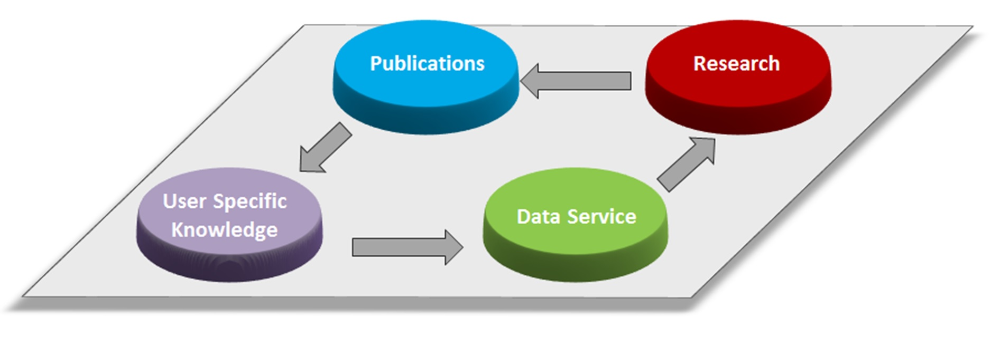
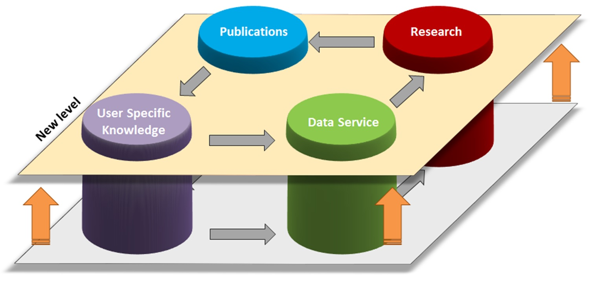

# Chapter 2: Who’s Waldo: Conceptual issues when characterizing data in empirical research

Stefan Bender, Hendrik Doll, Christian Hirsch [^footnote0]

Research Data and Service Centre , Deutsche Bundesbank

[^footnote0]: The authors would like to thank Rafael Beier for helpful comments.We would like to thank Jannick Blaschke for providing the graphs in Section 2.2. The views expressed here do not necessarily reflect the opinion of Deutsche Bundesbank or the Eurosystem.

## Introduction

Policy makers increasingly recognize that informed decision-making requires microdata-backing. Only microdata can uncover interdependencies between entities and document disparate global develop-ments. Making microdata available for independent research is subject to legal requirements that are designed to prevent the disclosure of information concerning an individual person or business entity. At Deutsche Bundesbank, the Research Data and Service Centre (RDSC) is tasked with making microdata available for independent research while simultaneously ensuring statistical confidentiality.

To strengthen effective quantitative research through optimal microdata usage, the RDSC has engaged in a series of projects that are targeted at enhancing user experience. One specific project currently pur-sued by the RDSC is the development of a microdata recommendation system, which is based on how microdata is being used in empirical research. Describing microdata from the usage in publications dis-tinguished this approach from traditional metadata for researchers, which is largely based on how data is produced.

Empirical research papers are an obvious source of information about dataset usage. A useful microdata recommendation system needs to rely on a corpus of dataset usage, as large as possible. Hand-curating such a sufficiently large corpus is prohibitively labor-intensive and error-prone. Therefore, being able to automatically retrieve the necessary information from research papers lays the groundwork for any future implantation of such a recommendation system. The competition is an important first step and proofs data set extraction from research publications to be feasible and scalable.

We present lessons learned from the machine learning competition held to automate the discovery of datasets, associated research methods and fields in social science research publications. In doing so, we show our insights about dataset taxonomies from our experience in a research data center and from designing a machine learning competition. We do this with a background of all authors in social science.
We refer the readers interested in the more technical aspect of the task of extracting dataset citations from publications to later chapters.

Extracting dataset citations from publications is a fairly difficult task because of the variety of dataset ci-tation formats and the absence of training data. Besides empirical research support, the gained infor-mation is the basis to provide value for policy purposes in the G20 context. For example, by providing researchers with information about the use and availability of microdata previously not being available in a systematic way, the results of this competition and the ensuing microdata recommendation system are a step towards reducing data gaps that have been diagnosed in the aftermath of the financial crisis.

On a broader level, the outcome of the competition contributes to the ongoing digitalization efforts of the Deutsche Bundesbank. Extracting relevant information from research papers as an unstructured data source broadens the value of unstructured, underexplored, data. Thus, the project presents a well-defined use-case to turn tacit knowledge into codified knowledge by converting text into relatively well-structured information. As a concrete first institutional implementation of competition results, microdata-based research will be supported by turning unstructured information into a useful source of reference for researchers.

## Insights from a research data centre perspective

### Background

The overriding principle of Bundesbank – and other Central Banks, National Statistical Institutes and Of-ficial International Institutions - when working with micro data is compliance with the statutory secrecy and data protection requirements, and thus maintaining the confidentiality of the information submitted by the reporting agents. European and national legal provisions regulate both the user group and the access channels to micro data, prescribe the required degree of data anonymisation and oblige data providers and data recipients to maintain data confidentiality at all times.

In response to the increased internal and external demand for microdata and the data confidentiality re-quirements, in 2013 the Bundesbank set up the Integrated Microdata - based Information and Analysis System (IMIDIAS) and established the Research Data and Service Centre (RDSC) (for a detailed moti-vation, refer to Kalckreuth, 2014 and Bender and Staab, 2015). The RDSC applies a standardised pro-cedure to generate high-quality datasets that cover a large part of data requests for research purposes. Thereby, the RDSC grants internal and external researchers’ access to selected Bundesbank microdata and serves as an interface between data producers and data users.

Requests to use microdata are first reviewed pursuant to legal requirements. The RDSC provides access to anonymized datasets on banks, securities, investment funds, enterprises and households, all of which can be accessed at dedicated researcher workstations or for most of the Bundesbank’s surveys – as for the Panel on Household Finances (PHF) study – the RDSC offers so called scientific use files. Data access and the underlying legal requirements are described in detail by Schönberg (2018).

In addition, the RDSC provides information and advice to researchers on data selection, data content and analytical approaches. Together with the relevant statistical experts, it ensures that the microdata provided are documented in detail and archived. In doing so, the RDSC works according to globally rec-ognized standards and was accredited as a research data centre (RDC) by the German Data Forum (“Rat für Sozial- und Wirtschaftsdaten”).

To date, metadata in the RDSC is provided to research using structured data reports. They are an es-tablished and well-functioning tool to convey information linearly from the data producers via the RDSC to the data users. To go a step further, efforts are underway in the RDSC to document microdata from the usage side. This relevant source of information has not been considered yet, because necessary in-formation on which datasets are used in which publication has not been broadly available to date. The competition changes this for the first time.

Potential of such data documentation from the usage side is manifold. Examples include newly arriving researchers, who get to see, what other researchers did with the data. At a glance, one can directly see potential for linkages with other micro datasets if others have done it. Data producers benefit from feed-backs on potential data gaps or limitations of the used data (which goes back to the initial institutional motivation for creating a research data center). Thereby a circular information flow is created by allowing feedback loops.

A main principle of the RDSC is to give free access to Bundesbank micro data for independent research. Motives for doing so are to get feedback on the data (use published research results to increase the internal data knowledge) and to strengthen evidence-based policy-making by Bundesbank itself. For fulfilling both of these tasks, the RDSC has to ensure microdata is used effectively by providing excellent services. Implementing potential for structured feedback from researchers back to data production and new research enables an improving empirical knowledge generating process.

### The knowledge generating process of empirical research in the RDSC

The knowledge generating process of empirical research in the RDSC can be organised along the four key dimensions (i) data services, (ii) research, (iii) publication, and (iv) (structured) user specific knowledge.

 

Figure 1: The four dimensions of the knowledge generating process of empirical research in the RDSC

Data Services comprises raw microdata and comprehensive documentation of the data both of which the RDSC compiles together with the data producing units  in Bundesbank. [^footnote1] Furthermore, the data ser-vices dimension also includes the methodological improvement of microdata through e.g. applying rec-ord linkage techniques to facilitate the creation of new datasets for research. Finally, the RDSC also of-fers advisory services to potential and existing microdata users on topics such as e.g. dataset selection or analytical options.

[^footnote1]: Data producers in different departments across Bundesbank compile, e.g. microdata, indicators, or time series.

The second dimension of the knowledge generating process of empirical research in the RDSC is re-search. After the application of a researcher is approved by the RDSC, researchers conduct their re-search project in a secure environment designed to ensure ongoing compliance with internal data policies and external government regulations. For most microdata this requires researchers to be physically present at the premises of the RDSC in order to analyse the data. Furthermore, only strictly anonymised research outcomes may be used outside of the secure environment.

Researchers as users of data services produce research outcomes. These outcomes – after data confi-dentiality clearance – sometimes take the form of publications, which present results to the interested public in a form optimized for human consumption as unstructured text. These publications contain knowledge accumulated by researchers about data usage over time (experience), e.g., knowledge about dataset particularities, which in turn could be utilised to inform the debate on how to improve data services

Examples of user specific knowledge acquired by researchers include:
•	How data is used (e.g. additional data cleaning, variable transformation, combining datasets, us-ing additional information)
•	What purposes data is used for (e.g. topics, methodology, research area)
•	What kinds of analyses or techniques have been tried and are used ultimately
•	What information about data is most valuable to get to the results, respectively which linkage or data enrichment makes renders the data most valuable.

Being able to access structured user-specific knowledge through e.g. a competition enables improving data services by making discovery of data and related projects, people, and publications at Bundesbank more comprehensive and efficient. For example, knowledge harvested from publications may be used to enhance services provided by RDSC by allowing standard datasets to be tailored to the needs of re-searchers. Similarly, data producers benefit from feedback on their data, allowing them to improve data quality.

The challenge is to establish such a feedback loop. If effective feedback is given and used, the microda-ta-based knowledge-generating process restarts with data services, but on a higher level. Better data services in turn allow better research, because available microdata is better described and more effec-tively used. By automatizing the feedback-loop between research, publications, knowledge, and data services, the knowledge generating process can loop faster and augment quicker. We expect this to lead to improvements in the four key dimensions of this process of empirical research in the RDSC.

  

Figure 2: Elevating the knowledge generating process of empirical research in the RDSC to a higher level by enabling a feedback loop to data services.

At the moment, this feedback loop is not present in a systematic way. The aim of the competition is to identify appropriate procedures to close the gap between publication and data services, which would enable transforming knowledge available in publications into generally re-usable knowledge to inform stakeholders (data producers, RDSC, decision makers at Bundesbank). The results of the competition will thus ultimately enable better data services which in turn will make research outcomes more efficient through the channel of a more optimal data usage.

### Added value of structured user-specific knowledge

This section details two applications of obtaining dataset usage information from publications that would add value to the data services provided for the RDSC. First, existing applications can be optimized in a user-centric way which would lead to obtaining refined products (e.g. improved researcher recommen-dations and data documentation). Second, the case for societal investment in free data access can be empirically fortified. Positive externalities (i.e. research as a public good) suggests a less then societally optimal provision of research data and related services. Obtaining a dataset impact factor can then make the case for further investment in microdata provision by concretely showing a dataset’s impact.

The structured user-specific knowledge produced during the competition may be used to inform the de-sign of a dataset proposition system for researchers. By obtaining information on dataset usage in publi-cations, data is for the first time available to construct indices on data set joint usability (and dataset maps to visualize such indices). Such an index connects datasets through actual use by researchers that combined data sets in the past. This enables recommendations, such as, “Researchers, who used dataset A, also used dataset B”.

Going further, the usability index can be expanded into a measure, how well new datasets fit each other. Without needing joint dataset usage in past publications goodness-of-fit measures may be predicted based on dataset usage in the same field, using the same methods or by additional metadata similarity. This can be a valuable accelerator to effectively distribute new datasets in the research community. While both indices can be implemented using only information from the competition, extensions may enhance value to users which are based on other information such as current metadata.

When thinking about user recommendations, the example is set by large online platforms. These online platforms can recommend from two dimensions of information (excluding interaction for simplicity). First, data is available on a large number of observed purchases per customer, which enables statements like “since you like products A and B, you might also like C”. Second, data is present on large numbers of observed customers per product, which enables statements like “users like you also bought”.

In our setting, with the knowledge generating process of empirical research in the RDSC, we consider researchers and datasets. The universe of data users/ researchers is decently large (i.e. the first dimen-sion), but per user, we only observe a limited amount of “dataset consumption” (i.e. the second dimen-sion). Hence, we have a decent chance of recommending based on other users behaviour. However, we have only limited means of predicting a single users future datasets needs based on his past personal “dataset shopping” behaviour.

However, we suspect a simpler underlying behavioural model of “data shopping” compared to shopping through large online platforms, because publishing with one dataset is not a casual purchase. Instead, it implies real commitment relating to being content with the purchase (less cognitive dissonance). Thus, we suspect that, compared to online platforms, less data points per person are needed, in order to make sensible recommendations. Also, in order to gain more of the rare information per user, we can fall back on dataset citations, i.e. “indirect data usage”, as outlined in chapter 3.

A challenge in building a data-driven recommendation system is to make sure that recommended da-tasets are indeed feasible to use, i.e. constitute meaningful recommendations. Thus, besides information about datasets, additional information such as fields and methods is needed to be ingested into the system. This additional information essentially constitutes additional links between datasets that helps better align datasets. This is especially true in the finance domain where linking microdata is a common feature in empirical research.

Second, the RDSC as part of a public institution has a responsibility towards its principals i.e. society. Granting data access free of charge for researchers should be backed by empirically measurable bene-fits of such data provision. Benefits from data usage can justify societal investment in free data access. However, measuring societal benefits through data access is not obvious at first glance. One possible starting point of approximating societal benefits of data access can be to measure the creation of knowledge [^footnote2] created by specific datasets.

[^footnote2]: In our model, we have called this knowledge user specific knowledge. Here the knowledge is in that sense specific, that it can be used to fulfil the task of Bundesbank in a better way

One can argue that added value of providing administrative microdata is the marginal benefit relative to the second-best comparable commercial database, if such a database exists. Also, one can argue that a dataset, which enables causal evidence, adds more value to societal knowledge, compared to previously available datasets, from which only correlations could be deduced if an important goal is to inform the policy debate. However, both of these methods require identifying which empirical result from a publica-tion can be attributed to which dataset.

## Lessons learned from competition

### Related literature

Extracting dataset citations from publications is a fairly difficult task because of the variety of dataset ci-tation formats and the absence of training data (for a recent overview of data retrieval see Koesten et al., 2019). Boland et al (2012) propose a weakly supervised approach, using a pattern induction method for the detection of study references in full texts. They use a corpus of 259 publications from the Social Science Open Access Repository (SSOAR). They use a bootstrapping approach, starting with a small corpus of manually created training instances. The resulting system InfoLink now informs SSOAR.

Boland and Mathiak (2015) describe dataset extraction as a twofold task, finding dataset citation string and following entity resolution (match the string to the correct entity/ DOI). Concerning entity resolution, they report the difficulty of broad survey dataset citations that ignore data variability (such as years, ver-sions, questionnaire variants, etc.), motivating a dataset taxonomy. Named dataset citations are often underspecified allowing identification of the survey but not of the precise dataset (which of multiple sub-samples, aggregation levels, survey modes, etc.).

Zhang et al (2016) also use a bootstrapping approach to extract dataset citations from 116 computer science journals publications. Ghavimi et al. (2016) use a similar approach for social science papers finding datasets with well-documented metadata. According to them, only 25% of all dataset citations are given in the references, highlighting the unstructured citation culture for datasets. We advance from these with an environment with less available dataset metadata and a corpus of publications from a va-riety of fields for our purposes. To tackle this, we continue with a larger hand-curated annotated corpus.

Metadata schemas for datasets are available, such as DataCite metadata schema and the da|ra metadata schema, which complies with the DataCite schema (Helbig et al. 2014). They offer dataset taxonomies and standardized citation propositions, however their categories do not optimally support automatic search and extraction, if no unique dataset identification (such as a DOI) is used. In the con-text of central banks that provide microdata, recent progress has been made in the context of INEXDA. A metadata standard (in line with DataCite) has been developed (Bender et al. 2018) and datasets pro-vided by the RDSC are all DOI registered.

Improving dataset citation is high on the scientific agenda in recent years. This notably includes promot-ing widespread usage of persistent and unique dataset identifiers. As available datasets spread across a large number of databases, identification of datasets is important for reproducibility and to credit data creation efforts to incentivize data creation and publication (Lagoze and Vilhuber 2017, McMurry et al. 2017, Mooney and Newton 2012). If unique and persistent dataset identification in publications were available, Ball and Duke (2011) raise the idea of dataset impact factors with such information.

### Dataset mentions

This section presents lessons that we learned throughout the duration of the competition. We organise this section around the three sets of information that where the main focus of the competition: datasets mentions, research fields, and (statistical) methods used. We begin by describing our a priori expectation of what a dataset is. We did not delve into definitions of a dataset but rather considered it sufficiently defined for our purposes (as empirical social scientists and for the competition).

Since our approach depends on getting to know the user-perspective, we thought it plausible to let usage in empirical papers define a dataset for the purpose of the competition. Having a background in working at a large provider of financial data, we had a vague idea that all datasets would look like those the RDSC provides access to, which consist mostly of collections of structured data in matrix or database form. These datasets typically are defined by a name and with a well-defined scope, thus allowing clear citation, probably including a unique dataset identifier (such as a Digital Object Identifier, DOI).

#### Lesson #1: datasets fall into two broad categories

Since the corpus of publication used for the competition spanned different domains (like healthcare, ed-ucation, and others), we quickly realized that our dataset image had an econocentric bias. In social sci-ence, we learned, datasets can be categorized into two broad categories for the purposes of extraction. First, there are named datasets, i.e. well defined, usually large-scale and publicized datasets (e.g. Com-pustat).

Generally, named dataset mentions are short strings in the publications, have commonly used abbrevia-tions (e.g. MMSR), and often containing institution name or name of commercial data vendor. Some-times (rarely, but increasingly) these datasets can be identified by a unique digital object identifier (DOI). These datasets are usually well-defined in scope and time, with formal documentation available. While data is usually collected with a specific purpose in mind, such datasets are be used across multiple pa-pers and research domains.

The second dataset category is what we call created datasets. By created dataset we understand da-tasets usually collected or built by authors of a publication for the purpose of analysing one specific re-search question. Often, created data comes in the form of small-scale surveys, (structured) interviews, or randomized controlled trials, RCTs. Such data normally does not have a trademark name, but instead one or multiple paragraph descriptions in the publication. Dataset information is blended together with information on data collection and sampling methods. Data reference at its most condensed form then comes in a structure like “we interview a given number of participants in a given region suffering from a given disease and code responses in the following way”.

In contrast to named datasets, created datasets usually are not referred to by a specific string or com-monly used abbreviation. Data collection is usually paper specific, and the universe of existing datasets are not easily searchable. This makes it hard for text mining algorithms to correctly extract strings refer-ring to dataset entities. Specific created datasets are harder to use for follow-up research, and reproduc-ibility is given only if publishers provide data together with the paper. Therefore, the lack of unique iden-tification and search terms renders data collection potentially redundant and dataset spread not optimal.

#### Lesson #2: Fractions of dataset category are domain specific

Throughout the competition duration it became clear that the fraction of named and created datasets varies across social science domains. Since different fields of social sciences rely on different identifica-tion techniques and differing potentials for conducting RCTs, the predominantly used data sources natu-rally vary. This has important repercussions for designing a competition, since algorithm performance and later recommendation system performance varies with the input corpus and the application field.

The number of datasets used per empirical paper (linked data) also varies across research areas. This number is also dependent on named vs. created datasets. In fields with widespread use of multiple da-tasets at once, the added value of recommending additional useful data might be expected to be higher than in fields that create study-specific data every time. Conversely, one could argue that the marginal utility of adding additional datasets is decreasing.

The optimal way forward is to start a data recommendation system for research field with higher ex-pected marginal utility from additional datasets. In our view, these are research areas with widespread usage of named datasets. Named datasets are constructed without the concrete research question in mind. That is why information to answer a particular research question often has to be obtained from more than one data source and is particularly true in empirical economic and finance research.

#### Lesson #3: Unique identification of datasets remains an issue

From the distinction above, one could make the argument that named datasets are easier to identify than created datasets. However, this is not the case, because the same dataset name can refer to multiple subsamples or waves of same datasets, and it is unclear where to make distinctions between dataset entities. This makes it difficult to identify the mentions referring to the same data points. Issues are, just to name a few, different time periods or subsamples, different states of data and states of knowledge, computational data pre-processing or enrichment steps. These identification issues render the current task of entity resolution of extracted dataset mentions complicated.

Unique dataset identification carries significant repercussions for reproducibility purposes, where identi-fying the exact data used for a study is paramount. For reproducibility purposes, the current solution to this dataset identification problem is the direct data upload to the publisher together with the publication. This is neither storage-efficient for large datasets nor feasible in the case of confidential microdata. A more flexible way to solve this issue is to assign unique identifiers (DOIs) to the datasets.

With a DOI (identifying the exact time frame, sampling universe, data version, wave, aggregations, state of knowledge, etc.), datasets are identified and quantitative research using confidential microdata is re-producible. To make lives easier, DOIs also drastically facilitate the automatized extraction of well-defined datasets from publications (comparable to largely standardized citations of other publications, allowing easy retrieval of publication networks, etc.).

Summarizing, if we successfully identify datasets and solve the issue of entity resolution, we can link and propose created datasets and thereby enable further research with such data, which takes up a notable fraction of publications in certain fields. While this task is harder than for named datasets, the potential for improvement remains larger as of today. For created datasets, too, DOI usage would be desirable; however encouragement or enforcement to use DOIs is harder in this case, because of a larger target group – authors instead of a limited number of data stewards. Even in case of widespread DOI usage for named datasets, the competition algorithms yield valuable results through the created datasets extraction in order to allow referencing and making available datasets used in the past for further analysis.

#### Lesson #4: Datasets mentions could indicate used for analysis vs. cited

After a discussion about dataset types and usage in fields, the last lesson that we learned about datasets concerns the mention of datasets in publications. These mentions come in two types. First, datasets used for empirical analysis and second, cited datasets in the literature review or references. Dataset citations (without empirical usage) can generally occur in the literature review section, even in theoretical, methodological papers, e.g. a given paper might report summary statistics based on datasets (“Author Y uses Compustat to…”). Sometimes differences between cited and used datasets are only semantic in nature. In well-written papers, the difference is usually fairly easy to distinguish for humans, but less clear for algorithms.

A key lesson we learned, is to think ahead of time, what the informational need is for the use-case at hand, used or cited datasets. Note that in an optimal setting, if information were available on the universe of datasets used for analysis in papers and on all publication citations, dataset citations would be redundant. This comes from the fact that a dataset citation in one publication is based on a dataset used for analysis in another publication and can be linked via available literature citations.

While literature citations are mostly standardized within research domains and are relatively straightfor-ward to extract (hence publication networks / publications maps exist), information on used datasets in papers remains incomplete (even after the competition). Because of this, for the competition, we asked for used and cited datasets. It is important to note, that extracted dataset citations are always incomplete, since some authors report aggregate statistics from a different paper, but not the data behind (“Smith et al show…”).

If well separated, through extracted dataset citations, one obtains a “dataset map”, thus the “closeness of datasets”, and network measures such as centrality distinguishing important datasets (“nodes”). Through extracted empirical dataset usage on the other hand, one obtains relevant information for our purposes, namely information relating to dataset similarity and joint usage possibilities from the user perspective. However, for our envisioned recommendation system, usage of cited data (“indirect” data usage) is a valuable feature, since it yields more limited data on dataset “purchases” of a user.

As training data for the algorithms it is important to include theoretical literature, essays, etc. in the corpus of publications. Obviously, this is helpful for algorithms to correctly identify true negatives, i.e. correctly identifying theoretical papers. For this task, distinguishing between cited and used datasets becomes relevant once again, because clearly separating theoretical papers that merely cite data from empirical papers depend on such a distinction.

### Fields and Methods

The competition also asked participants to extract information about research fields and methods used in the publication. We want to gather this information from the user side, because data producers and annotators do not necessarily foresee all usage potential for their data and the point of our envisioned system is to increase user value. One such idea is to construct dataset similarity indices from the usage side, information is relevant not only on existing joint usage by others (“people like you often used dataset Y, too” – hence dataset extraction), but also on new dataset or linkage potentials (“this might also interest you based on your preferences”). For this, information is necessary on the context, how datasets are used.

#### Lesson #5: Think before you act: define fields and methods

To obtain the most relevant categories of research fields, we did not provide any thesauri to the compe-tition, on purpose. The rationale behind this was to see the unhindered creativity of teams, which availa-ble information sources they would use or not use (e.g. reference datasets, Wikipedia, archive.org, other repositories, thesauri, statistical clustering techniques, etc.). On the other hand, thesauri limit the cata-logue of potentially identifiable fields and methods, thus prohibiting new methods and fields to be identi-fied in fast-changing modern research areas. Also thesauri might disturb algorithm performance, since algorithm might be forced to categorize topics and fields to older or less exact categories than necessary.

However, using thesauri does have well-known advantages, as any librarian will confirm. These ad-vantages include easy clustering of similar fields and methods and a manageable category set of predic-tions. For field predictions, we generally face a fine line between too broad predictions (safe, but unin-formative) and too narrow predictions (narrow, but potentially wrong). A potential way out is backward induction here – we can present differently aggregated predictions for fields to users and get feedback from them (let users rank usability – “Was this helpful to you?”).

Concerning our definition of methods for the purpose of the competition, two questions arise. The first is the definition of statistical methods (i.e. inclusion of sampling methods, qualitative methods, etc.). Sec-ondly, there are multiple statistical methods in a publication (besides the main causal analysis, there can be methods reported for data preparation, sampling, baseline results, robustness checks, descriptive statistics, etc.) and issues of potential weighting of importance of these.

For useful new recommendations to be provided to researchers, we decide to include in statistical methods all methods that describe potential for a merge of datasets / joint usability, hence to include all the above listed. We consider a broad definition of methods, not only including high-level statistical methods, such as ordinary least squares, but also including the observed unit, time period or even re-gression equations. If two papers then use different datasets in the same field using the same methods, there is a relatively high likelihood that those datasets can be linked or used together to create new in-sights.

### Discussion

Several decades ago, publication citation networks were constructed and to our knowledge no such un-dertaking has yet been done for datasets. This comes from the fact that no curated training data corpus is readily available in decent quality. Since no such data is available, we manually annotate papers for the competition and now propose to go forward with this in a larger scale.

We would have no need for this competition in a world with universal dataset identifier usage (such as DOIs). In such a scenario unique identification and standardized citations of datasets would be readily available. Since DOIs only now and slowly gain widespread application for datasets in social science, our task is a 1:n mapping of publications to datasets without unique identifiers. For scientific papers many journals already provide DOIs for papers.

There are ongoing efforts by journals to have all used data published for reproducibility reasons. Incen-tivizing researchers to provide unique identification of datasets used in papers is a logical next step. This will ensure reproducibility for confidential microdata and facilitate our use-cases. In the meantime, we show a way forward to learn from the current state of information and analytically use presently available information.

The competition highlights that datasets can be categorized in different dimensions for the purposes of extracting dataset mentions from publications. We propose a binary distinction of datasets into named as opposed to created datasets. As named datasets, we consider formal, large datasets by commercial or official institutions, often referenced in relatively standardized forms as commonly used abbreviations. Created datasets are those created for the specific purpose of one research question in mind. They are generally described in less standardized paragraphs. Usage of named versus created datasets varies across research areas.

Also varying across research areas is the number of datasets used per empirical paper. This number al-so depends on the spread of formal, named datasets as opposed to created datasets for single studies. In fields with widespread use of multiple datasets at once (linked data), the added value of recommending additional useful data might be expected to be higher than in fields that create study-specific data every time. Conversely, one could argue that the marginal utility of adding additional datasets is decreasing. The optimal way forward is to start a data recommendation system for research field with higher expected marginal utility from additional datasets.

## Conclusions

In this competition, we asked teams to extract datasets, fields and methods from a corpus of hand-annotated research publications. The value of the extracted information lies in informing a user-centric dataset recommendation system and thereby enabling optimal and timely spread of available datasets throughout the research community. Furthermore, such information allows us to compute dataset impact factors by obtaining data-driven information on which datasets underlie high-quality research outputs. This in turn is a proxy for societal benefits of data provision by research data centres, thus motivating in-vestment in data access infrastructure.

We introduce a circular model of the knowledge generating process, which increases in levels. From da-ta services, research is conducted, publications are published and user-specific knowledge is generated. Having such knowledge on dataset usage, data services in turn can be improved. Thereby the circle repeats on a higher level. The current competition works on strengthening the knowledge pillar as well as the transmission mechanisms from publications to knowledge to improved data services. [^Footnote3]

[^Footnote3]: For the future, ongoing effort is needed to support all four “corners of the circle” / “pillars of the level model”. The current competition strengthens the arrow from publication to knowledge and structures gained knowledge to improve data services. To support the data services pillar – for example -, digital RDC environments with facilitated access processes like a “data stewardship module” will in our view improve data access.

Automatic processing of generated knowledge in publications becomes increasingly available with mod-ern text analysis tools. Extracting such information is important, because timely and optimal usage of gained results increases the speed, by which findings can be incorporated into data services and thereby next-level research is enabled in turn. To further improve automatic processing, minimum standards for dataset taxonomy are needed. Harmonized metadata schemas for data sets – like the INEXDA metadata schema for central banks and statistical offices (compliant with and building upon DataCite) – offer such an approach.

The competition showcased that information extraction of the necessary information for such systems is possible. The delivered prototype algorithms prove this claim. With the proof of concept, there is a more substantiated case for investing in a larger hand-curated training corpus of annotated research papers. On the road towards a user-centric dataset recommendation and metadata system, the competition forced us to clarify organizational needs and methodological aspects.

For the way forward, it is important to note the importance of the research area on the strategic path to-wards a unified user-centric microdata recommendation system. The choice of the research domain will greatly influence algorithm performance. Since human effort in creating training data is expensive, one should deliberately pick research domains to start with. This arises because text extraction algorithms (and humans) struggle with informally described created datasets. The low-hanging fruits of prototyping dataset recommendation systems, usability indices etc. are easier to implement for research areas with a largely formalized dataset citation culture (however ultimately potential for benefits may well be larger in other research areas).

## References

-	Ball, A., and M. Duke (2011): How to cite datasets and link to publications. Digital Curation Centre.
-	Bender, S., Hausstein, B., & C. Hirsch (2018). An Introduction to INEXDA’s Metadata Schema. Technical Report 2018-02, Deutsche Bundesbank, Research Data and Service Centre.
-	Bender, S. and P. Staab (2015). The Bundesbank’s Research Data and Service Center (RDSC), Gateway to treasures of microdata on the German financial system. IFC Bulletin 41 (2015).
-	Boland, K., Ritze D., Eckert, K., & B. Mathiak (2012): Identifying references to datasets in publica-tions. Theory and Practice of Digital Libraries, pp. 150-161. Springer Berlin Heidelberg, http://doi.org/10.1007/978-3-642-33290-6_17
-	Ghavimi, B., Mayr, P., Vahdati, S., & C. Lange (2016). Identifying and improving dataset references in social sciences full texts. arXiv preprint arXiv:1603.01774.
-	Helbig K., Hausstein B., Koch U., Meichsner J., & A. Kempf (2014): da|ra Metadata Schema. Gesis Technical Reports 2014/17, DOI:10.4232/10.mdsdoc.3.1
-	Von Kalckreuth, U. (2014). A Research Data and Service Centre (RDSC) at the Deutsche Bundes-bank–a draft concept. IFC-Bulletin No 37, Irving-Fisher Comittee on Central Bank Statistics.
-	Koesten, L., Mayr, P., Groth, P., Simperl, E., & M. de Rijke (2019): Report on the DATA: SEARCH'18 workshop-Searching Data on the Web. ACM SIGIR Forum (Vol. 52, No. 1, pp. 117-124). ACM.
-	Boland, K. & B. Mathiak (2015). Challenges in Matching Dataset Citation Strings to Datasets in Social Science. D-Lib Magazine 21, 1/2.
-	McMurry, J. A., Juty, N., Blomberg, N., Burdett, T., Conlin, T., Conte, N., & A. Gonzalez-Beltran, A. (2017). Identifiers for the 21st century: How to design, provision, and reuse persistent identifiers to maximize utility and impact of life science data. PLoS biology, 15(6), e2001414.
-	Mooney, H, & M. P. Newton (2012): The anatomy of a data citation: Discovery, reuse, and credit.  eP1035-eP1035.
-	Schönberg, T. (2018): Data Access to Micro Data of the Deutsche Bundesbank. Bundesbank Tech-nical Report 2018-01.
-	Vilhuber, L. & C. Lagoze (2017): Making Confidential Data Part of Reproducible Research. Chance
-	Zhang, Q., Cheng, Q., Huang, Y., & W. Lu (2016). A bootstrapping-based method to automatically identify data-usage statements in publications. Journal of Data and Information Science, 1(1), 69-85.
