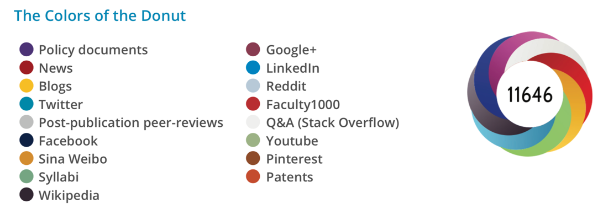
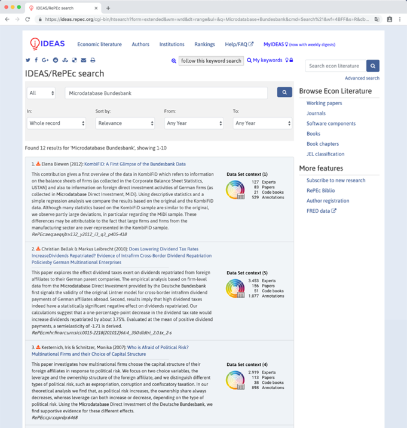
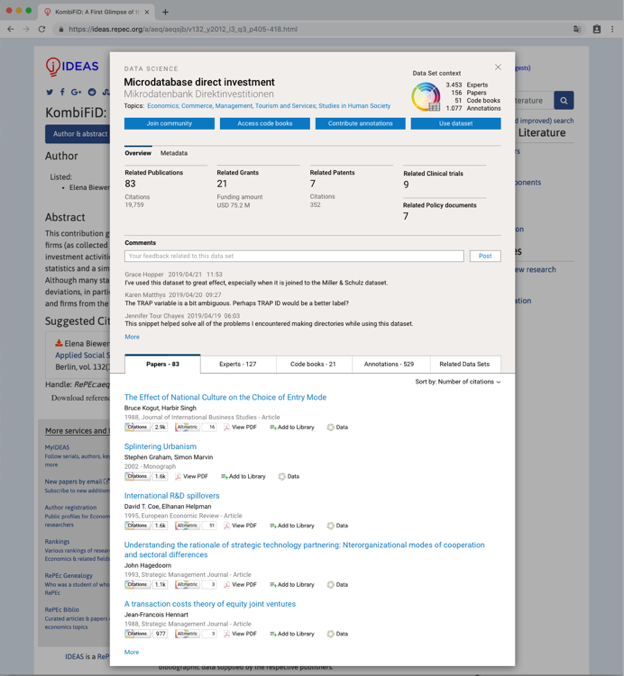

# Chapter 3: Enriching context and enhancing engagement around datasets

Christian Herzog^1,a^, Daniel W Hook^1,2,3,b^, Mark Hahnel^1,c^, Stacy
Konkiel^1,d^, and Duane E. Williams^1,e^

^1^Digital Science, London, N1 9XW, UK

^2^Department of Physics, Washington University in St Louis, St Louis,
Missouri, USA

^3^Centre for Complexity Science, Imperial College London, London, SW7
2AZ, UK

(^a^[[https://orcid.org/0000-0002-9983-0033]{.underline}](https://orcid.org/0000-0002-9983-0033),
^b^[[https://orcid.org/0000-0001-9746-1193]{.underline}](https://orcid.org/0000-0001-9746-1193),
^c^[[https://orcid.org/0000-0003-4741-0309]{.underline}](https://orcid.org/0000-0003-4741-0309),
^d^[<https://orcid.org/0000-0002-0546-8257>]{.underline}
^e^[[https://orcid.org/0000-0002-2111-3413]{.underline}](https://orcid.org/0000-0002-2111-3413))

## Introduction

The relationship between research, researchers and data is changing.
Data has always played a critical role in scientific research, but in
recent years it has taken centre stage not only for the sciences but
also the social sciences, and it also now plays a significantly
increased role in the humanities. This change is being driven by two key
factors: First, the volume of research data that we have available is
growing rapidly; and, second, our ability to process and analyse these
data is growing as computers become faster and algorithms become more
powerful. While many researchers welcome having more data to work with,
the challenges in this new data-rich research world are not trivial.

The volumes of data that researchers have had to work with have been
steadily on the rise for many years. Big Science projects such as those
run by CERN have led the way in creating international infrastructures
for sharing, processing and analysing large datasets. In a very real
sense, the Internet itself is the result of the need for a global
infrastructure to support science. Grid computing is another piece of
infrastructure that was developed to support large international
collaborations. Looking at the research world from a high enough vantage
point and focusing on these large projects, however, misses the
challenges generated by a second wave of advances.

While many researchers now have large volumes of data, the technologies
developed to support the cutting-edge research projects of more than 20
years ago have become commoditised and are available to many researchers
at a fraction of their original cost: storage is cheap and data transfer
is fast. Technological issues are not, for the most part, at the centre
of today's challenges for our increasingly data-centric research world.
Rather it is infrastructure of a different sort that now needs to be
developed to support the research requirements of today.

In this short article, we discuss the needs of today's research system
for investment in two critical pieces of infrastructure that have not
kept pace with their technological counterparts mentioned above. These
missing pieces are information infrastructure and cultural
infrastructure. Both of these challenges are addressed in Digital
Science's Rich Context project. Through this project, our aim is to
provide 'enriched' information infrastructure around datasets. This
information includes details of the approach to data stewardship,
context of usage, code applied to the dataset in its production, as well
as code applied to the data to derive further results or translate it
for practical uses. All these factors add critical elements to the
research infrastructure. The cultural infrastructure involves creating
the incentives, triggers and frameworks that encourage the dataset
stewards, experts and users to contribute to these critical information
elements.

## Information Infrastructure

It is important to understand that any successful information
infrastructure for research data will necessarily be deeply linked with
the culture of research. For clarity of presentation, we have decided to
present the challenges of the current information infrastructure and
those of our current cultural norms separately. However, at each stage
it is clear that each influences the other.

Information infrastructure can be defined as the collection of processes
and artefacts that are foundational to today's scholarly communications.
A simplified model of scholarly communications would have artefacts like
journals, journal articles, article metadata and citations. The
processes are peer review and scholarly search.

The members of the Royal Society did not have today's world in mind when
creating *Philosophical Transactions*, the first ever scientific
journal, 350 years ago. The infrastructures that have built up around
research publication since that time are powerful and persistent through
their ubiquity. Until very recently, we expected articles to be grouped
into journals, and published on a particular date. We expect there to be
a version of record that is in some sense the definitive record of a
piece of research.

But heavy use of data in a research problem, or data shared
collaboratively among colleagues across a research field, changes the
dynamic around the research record. Fields that use data increasingly
publish those data as a distinct output from a research article. Data
has become a principal research output, but lacks the infrastructure
that we have built up around the journal article (some experiments like
"data journals" have had only limited success, given that a static and
"flat" article is not a natural fit for publishing most data).

A dataset can change with time for many reasons: data may be added over
time, corrections may be issued, and so on. In these cases, it may be
appropriate to "version" the dataset (by issuing a persistent identifier
for a point-in-time snapshot for the dataset, allowing subsequent
changes to receive their own "versions"). But changes to a dataset may
have a knock-on effect on the interpretation of the data and may
fundamentally alter the research result that was originally reported.
Moreover, in many fields "Big Data" is so central that it not only puts
pressure on the community to establish an acceptable model of data
publication, but also puts significant stress on how we read, interpret,
and review research as a whole.

Many datasets are now so vast that we lack the ability as humans to
consume them in an easy way. Visualisation technologies and other tools
that allow us to interact with and sample data dynamically have received
significant attention in recent years, and have helped with the
interpretation of data in online environments. But it is simply
impossible to reduce some types of data to a single figure or printable
table, as would be the case for "traditional" journal publishing. By
attempting to do so, we miss the essence of the data and risk failing to
communicate data-driven conclusions accurately. This limitation of
current publication formats (e.g. static PDF files for articles) is an
issue that relates to the reproducibility crisis of modern research.

Peer review is another process that must change to account for data as a
"first class" research object. Historically, peer reviewers have ensured
that a piece of research is well-communicated and correct. This level of
peer review is difficult to apply in the context of research data. If
data is being published as a primary output, then it may be possible to
perform a kind of peer review by applying some statistical tests to a
sample of the data, or by using some other appropriate technique.
However, it is no longer practical in most cases to set up a parallel
experiment to reproduce data, as had been the case in years past. Across
all contexts there are good reasons for these challenges: the experiment
may be too costly to repeat, or the conditions of the original data
collection may not be replicable (for example, surveying stress levels
of the populace during a specific political event). In addition, ethical
considerations such as the anonymity of those being surveyed may make
certain types of data difficult to review. Thus, we must develop robust
and accepted approaches to peer review, not only for data itself but
also for those publications that are heavily based on data.

A number of publishing innovations have made journal articles more
discoverable and accessible in recent years, such as preprint servers,
DOIs, centralized search engines like Google Scholar and Dimensions,
etc., however, these do not translate directly across to research data.
Part of the reason for this is that there is a standard structure for an
academic article (e.g. abstracts, keywords, etc), which is specifically
designed around communication to humans. Solutions designed for data to
date still have a long way to go in that regard. For example, the core
fields required to create a valid DataCite record are identifier,
creator, title, publisher, publication year and resource type[^1]. All
other data fields are optional (e.g. location, funder, subject,
contributors) due to the fundamental uncertainty in what might
constitute research data in the future. This flexibility limits how data
can be discovered. It has taken some years for Web of Science, Google
and others to introduce functionality to search for datasets in their
discovery systems.

Clearly, technological infrastructure for data\--or lack thereof\--has
huge implications for the discovery, peer review, citation practices,
interpretation, and availability of data. These challenges are
interconnected with challenges we face when thinking about the cultural
infrastructure for data, as well.

## Cultural Infrastructure

There are two main aspects to cultural infrastructure: incentives and
capability. Both of these aspects are strong drivers in how researchers
engage with research data, and their behaviours relating to sharing it
with others and making it available to external scrutiny.

Academics do not typically take up research careers for financial gain.
Rather, they choose to dedicate their lives to understanding a specific
problem partially in the hopes of discovering something that will make
them "successful" by some measure. Success, of course, can be understood
by looking at incentives for researchers. Researchers in many fields are
promoted by publishing in specific high-impact journals, leading to
funding success. Once you have demonstrated capability in this respect,
there is a virtuous cycle. More funding leads to a greater chance of
further publications in the "right" journals, which leads to more
funding.

There are no such incentives here for sharing data. In this context,
parting with the data that underpins your research gives rise to two
concerns. Firstly, that someone may find an error in your work and
discredit what you have done. Secondly, that someone else may not share
their own data but will gladly reuse yours if you make it available,
especially in fields where success is based on having more data to
analyse. That may be the difference between having a career where you
are well funded, promoted and have the ability to do research in the way
that you want, and having to leave the field.

A further level of inequity exists in which data-related jobs are valued
by the Academy. If a researcher happens to be particularly talented in
working with data curation, data analysis or data processing, there is
no track for recognising these talents. They are unlikely to be a first
author on a publication in a major journal due to their data wrangling
talents, and hence they have less of a chance of career progression than
researchers who take a more traditional "publish or perish" path with
their work as described above.

This set of perverse incentives means that people with the capability to
handle data are often incentivised to leave research. Hence, not only do
we have a problem of incentives in sharing and communicating data, but
we also have a problem in retaining people who have the capability that
we need to structure data so that it can be shared and built upon.

Capability for sharing data is the second aspect of the cultural
challenge that academia continues to wrestle with. Making data available
to others is generally accepted as a key part of the research
communication process. However, there are certain established norms
around when the data should be shared, and to what depth it is
shared[^2]; for example, in fields where human subjects research is
prevalent, there is a much more conservative attitude towards open data
than in fields like astronomy where data sharing is widely practiced,
given that data can be collected by only a handful of observatories and
telescopes worldwide.

In fields that are more applied, ensuring that data generated as a
result of a commercial relationship is protected is crucial. In such
fields, academics often have a better understanding of copyright,
intellectual property rights and licences[^3]. But outside of this
context, there is a general lack of understanding of these issues and
hence data are often not shared over concerns for a perceived legal
barrier.

Other concerns are ethical---for example, should these data be shared if
it might infringe the rights of the subjects of the research?
Researchers are beginning to become aware that, through the use of
algorithms, some data is not as well anonymised as it may first
appear[^4]. Anonymisation of data is a research field in and of
itself[^5].

Other concerns are simply practical---how do I make my data available in
a way that is meaningful to others? The work associated with making a
dataset generically machine-readable is challenging for many
researchers, who tend not to be experts in data handling. The work
associated with making a dataset human-understandable, reproducible and
fully contextualised is often significant. However, governments and
foundations have not necessarily prioritised these activities in their
grant programs (though this is changing)[^6]^,^[^7].

## Enriching context

While we at Digital Science cannot solve all the issues raised here, the
points discussed do offer a blueprint for a generalised approach to
handling and thinking about research data and what it means to be a
researcher in the current research paradigm. We believe that a
significant step in changing the perception of data and those who handle
data is to increase the contextuality of research data.

There are two important pieces of infrastructure that need to be
introduced. Firstly, a version of CredIT for research data[^8], whereby
all contributors to a dataset's feeding and care over time are
recognized, valued, and encoded in machine-readable ways^.^ Such a
system would be crucial in providing incentives towards data sharing,
both making it possible to recognize "data wranglers" who could advance
their career in-turn, and also by making it much easier for universities
to track and reward those who are contributing towards the kinds of open
access that are often discussed in university mission statements and
faculty council decrees. The second piece of crucial infrastructure
needed is, a set of tools that allow research data to be discovered and
contextualised. In this section, we will focus on the latter challenge.

When we built Dimensions, the ability to contextualise any piece of
research was a strong driver for our work[^9]. The idea that all
research happens in a particular place at a particular time, carried out
by a set of people, some of whom may be affiliated with a research
institution, gives a set of metadata that allows us the "weak context"
of a piece of research. By "weak context" we mean that the context being
provided gives no deep understanding of the context of an article to a
non-expert and is essentially indistinguishable from standard metadata.
But with modern data mining approaches, it is possible to add a "strong
context".

Strong contextualisation of research should provide a user with rich
information about the research including funding, other research
produced as part of the larger project (e.g. related publications,
clinical trials, etc), and details of the research that was built on top
of it. This information should also fit into, trends and graphical
representations that offer a more complete, more rapid understanding of
how research fits into the larger field, related fields, or the context
of the publishing journal or supporting institution. For example, for a
research article, we should be able to quickly understand how many
researchers are in a related field, whether the field is growing, how
old the field is, how much funding has been deployed in the field, which
countries have provided that funding, whether the field has begun the
translation to application through patents or clinical trials, or
whether it has been used as a basis for the formulation of policy.

Context can also be offered in the data that we provide to understand
the reach and influence of research.

Alternative metrics ("altmetrics") are data from the social web that run
orthogonal to classic citation measures, which can be seen to add
significant context to an article -- extending our understanding of how
different cohorts of potential users of the research are engaging with
it. For example, we can use altmetrics to understand if an article is
being mentioned in the news, in which geographical regions it is being
noticed, whether it is being used as part of a teaching syllabus, and
many other kinds of public and non-traditional scholarly engagement.
These data can then be visualized in creative ways to add instant
additional context to engagement with a research article (see Fig. 1).

*Figure 1: Different types of context tracked by Altmetric.com for any
research output.  
(Reproduced by permission of Altmetric.com)*

How datasets are used in research more broadly is another important
piece of context that many data search engines lack. This is where the
Rich Context project comes in. During the Rich Context project, we
explored using Dimensions' freely available public interface as a
destination for researchers who seek context around datasets.

Such context for research data and its impacts could be offered in the
form of in-app badges and other "signposts" that connect data with its
larger context. Such a contextualizing badge could include not only the
number of citations that the dataset has received, but also whether the
data has been versioned (through Figshare's repository metadata),
discussed online (through Altmetric data), and what kind of tools and
insights have been built on top of the data (through rich mining of
full-text and citation data available in the ReadCube reference
management corpus and in Dimensions).

Correctly developed and accepted by the community, this type of
information can make a contribution to solving many of the problems
highlighted in this article. If the correct contextual facets can be
developed, then recognition would be easier to assign to those who have
contributed to the process of creating and maintaining datasets. With
greater context around them, datasets become easier to locate,
understand and value. This in turn could lead to a broader evaluative
environment and more engagement from academics.

Engagement across academia, however, is not uniform. Mechanisms need to
be provided to engage data science-focused researchers from whom more
details of their tools, scripts and codebooks could be drawn, adding
further value to research data. At the same time, engagement tools need
to allow data scientists to leverage this information so that it is
valuable to them when they are the consumers of search results. These
are subtly different use cases from those of standard researchers. By
mining ever more open research systems wherein data is being analyzed
(e.g. Gigantum, Github, etc), we can start to integrate these other
crucial engagement contexts as well.

*Figure 2: Mock-up of a research data badge helping to contextualise a
set of search results.*

*Figure 3: Mock-up of a research data badge helping to contextualise a
specific dataset.*

In Figures 2 and 3, we have mocked up some early thinking for how a
contextualized research data badge could look. This visualisation is
based on insights from the Rich Context project and uses data that could
be mined from articles that use a specific dataset. In particular, we
have suggested four initial facets of context that both data
science-focused researchers and others could find helpful when viewing a
dataset:

-   **Experts** **who have made use of the data**, sourced from
    references made to the dataset in a professional context such as an
    industry whitepaper or policy document

-   **Academics** that **cite the data**, mined from citation of the
    dataset or ancillary data in the peer reviewed literature

-   **End users of the data**, sourced from code book references
    included in public code repositories

-   **Enhancements of the data**, vis-à-vis annotations and comments
    made on the data in public forums.

In summary, we believe that, if deployed across the many environments in
which researchers discover data (including and beyond Dimensions), the
thinking behind the Rich Context project can overcome current
infrastructural challenges to significantly extend the contextualisation
of datasets. The number and variety of datasets in use in academia will
certainly expand in the future, and we can only see data becoming even
more central to contemporary research efforts. As such, it is critical
to invest in robust infrastructures, not only to support the production
and sharing of these data, but also to change the culture and evaluative
environment around research data. It is only through initiatives such as
these that we will be able to solve the vast and complex sociotechnical
challenges that face academia today.

[^1]: Support.datacite.org. (2019). *DataCite Metadata Schema 4.0*.
    \[online\] Available at: https://support.datacite.org/docs/schema-40
    \[Accessed 1 Jul. 2019\].

[^2]: Linek SB, Fecher B, Friesike S, Hebing M (2017) Data sharing as
    social dilemma: Influence of the researcher's personality. PLOS ONE
    12(8): e0183216. doi: 10.1371/journal.pone.0183216

[^3]: Treadway, J., Hahnel, M., Leonelli, S., Penny, D., et al.
    (2016) The State of Open Data Report. \[Online\]. Available from:
    doi:10.6084/m9.figshare.4036398.v1 \[Accessed: 1 July 2019\].

[^4]: Siddle, J. (2019). *I Know Where You Were Last Summer: London\'s
    public bike data is telling everyone where you\'ve been*. \[online\]
    Vartree.blogspot.com. Available at:
    https://vartree.blogspot.com/2014/04/i-know-where-you-were-last-summer.html
    \[Accessed 1 Jul. 2019\].

[^5]: Li, N., Li, T. and Venkatasubramanian, S. (2007). t-Closeness:
    Privacy Beyond k-Anonymity and l-Diversity. *2007 IEEE 23rd
    International Conference on Data Engineering*.

[^6]: Rdmtoolkit.jisc.ac.uk. (2019). *Research Data Management Toolkit
    \| Jisc*. \[online\] Available at:
    https://rdmtoolkit.jisc.ac.uk/plan-and-design/data-management-planning/
    \[Accessed 1 Jul. 2019\].

[^7]: Nnlm.gov. (2019). *Data Management Plan \| NNLM*. \[online\]
    Available at: https://nnlm.gov/data/data-management-plan \[Accessed
    1 Jul. 2019\].

[^8]: Allen, L., Brand, A., Scott, J., Hlava, M., Altman, M., (2014)
    Nature 508, 312--313. doi:10.1038/508312a.

[^9]: Hook, D.W., Herzog, C. and Porter, S.j. (2018) Front. Res. Metr.
    Anal. doi:10.3389/frma.2018.00023
