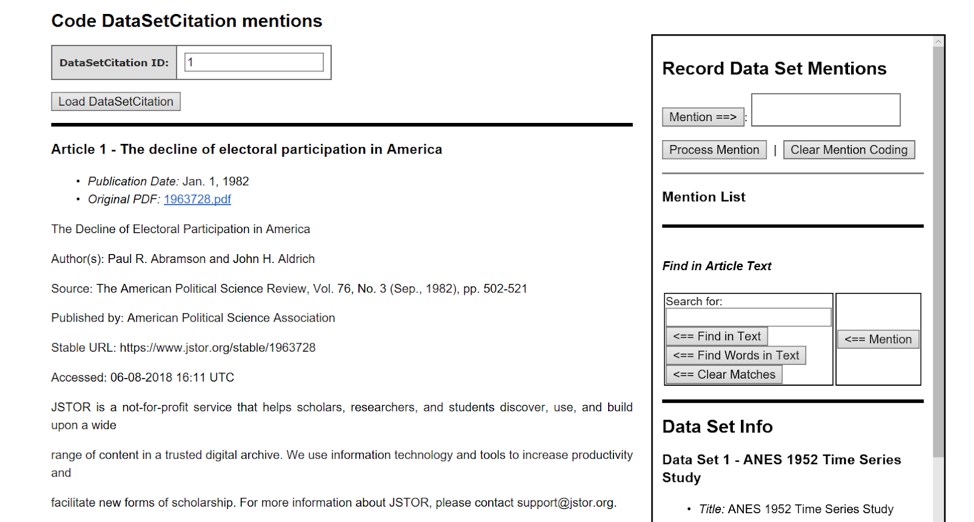
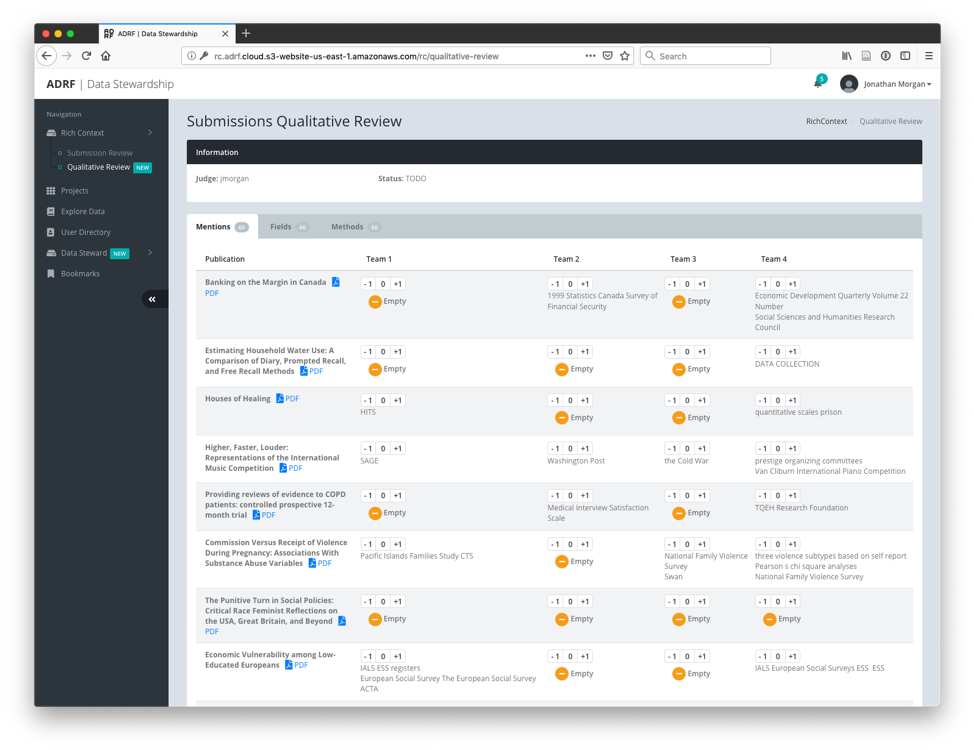
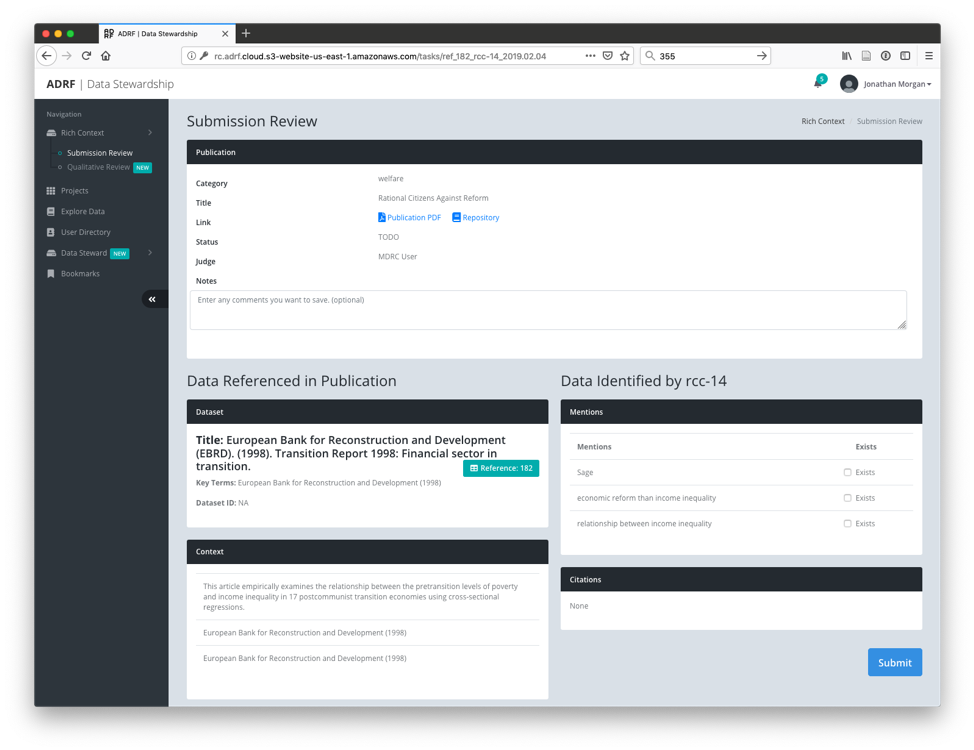

# Chapter 5 - Competition Design

**Andrew Gordon, Ekaterina Levitskaya, Jonathan Morgan, Paco Nathan and
Sophie Rand - New York University**

We hosted a competition to address the problem of automating information
extraction from publications. The goal of the competition was to develop
and identify the best text analysis and machine learning techniques to
find datasets in empirical scientific publications and use that
information to discover relationships between data sets, researchers,
publications, research methods, and fields. The results were expected to
help to create a rich context for empirical research -- and build new
metrics to describe data use. This is an open-source project, and we
sought to generate models that could be continuously improved upon
through engagement with the research community.

This paper describes how the competition was designed and discusses the
lessons learned.

Competition Design

The design approach followed the successful approach developed in the
Natural Language Processing (NLP) domain, which developed a series of
competition patterns for inspiring disparate groups of researchers to
help to carry out information tasks against text data. These include
more basic competitions where data is provided to groups and they are
allowed to train and then submit a number of runs of their models
against a subset of evaluation data[^1]. We were also inspired by the
design of the 2015 PatentsView Inventor Disambiguation Technical
Workshop[^2].

Competition Design in Phases

The competition had two phases. In each of the two phases, competing
teams were given text and metadata for 5,000 publications and single set
of metadata on 10,348 data sets of interest, shared between the two
phases, for use in training and testing their models. Separate
5,000-publication samples were provided for each phase. The corpus[^3]
included data maintained by Deutsche Bundesbank and the set of public
data sets hosted by the Inter-university Consortium for Political and
Social Research (ICPSR). In addition, a single 100-publication
development fold was provided separate from the training and testing
data to serve as a test for packaging of each team's model, and as a
quick test of their model and the quality of its output. After the first
phase, the phase 1 holdout was also provided to phase 2 competitors to
serve as additional training and testing data.

All publication text provided to teams was either open access (freely
available) or licensed from the publisher for use in the contest. For
each publication, participants were provided with PDF and plain text
versions of each publication together with basic metadata. Copyright and
licensing around research publications limited what publications could
be accessed, licensed, and distributed for the competition, and so our
universe of publications was limited to publications that were either
open access, or published by Sage Publications.

At the end of each phase, competing teams packaged their models into a
docker container. Then these containers were run on AWS by the
competition organizers, evaluating the holdout data to generate
predictions that were used to evaluate the teams.

Phase 1
-------

In the first phase, each publication was labeled to indicate which of
the datasets from the master list were referenced within and what
specific text was used to refer to each dataset. The teams used this
data to train and tune algorithms to detect mentions of data in
publication text and, when a data set in our list is mentioned, tie each
mention to the appropriate data set.

The annotated portion of the two sets of publications were drawn from a
set of publications provided by Bundesbank that referenced their data
and the publications captured in the ICPSR catalog, which had been
manually annotated as having used a particular data set for analysis.
These publications were collected in a database application designed to
facilitate a mix of human and automated content analysis of
publications. They were then filtered into two sets: those that were
open access, and so could be shared publicly, and those that were not
open access, but that were available from our publisher partner (Sage
Publications, or "Sage"). Of the 5,100 total publications with annotated
data citations provided to phase 1 participants, the 2,550 publications
in the train-test corpus (2,500) and development fold (50) were randomly
selected from the open access set, so they could be distributed freely
to all participants. The 2,500 in the holdout were randomly selected
from the remainder of the open access set plus those available from
Sage. The un-annotated publications used in phase 1 were all published
by Sage: the 2,550 non-annotated publications in the train-test corpus
(2,500) and development fold (50) were open access publications from
Sage journals. The 2,500 un-annotated publications used in the holdout
evaluation corpus were sampled from across Sage Publications' journal
holdings including non-open access journals.

Both the train-test publications and the holdout publications were
broken into 2,500 publications each that used one or more of the data
sets of interest for analysis, as compiled by ICPSR and Bundesbank
staff, and 2,500 publications that had not been annotated and had been
filtered to not contain data. The data set citations were captured in a
separate data set citations JSON file. The citations for the phase 1
train-test publications were provided to competition teams to use as
training data, while the citations in the phase 1 holdout were used to
test the quality of each team's model in phase 1, and given to teams as
additional training data in phase 2.

Each team was allowed up to 2 test runs against the evaluation corpus
before final submission. The final models of each group were evaluated
against the holdout corpus, along with a random qualitative review of
the mentions, methods, and fields detected by the team's model.
Submissions were primarily scored on the accuracy of techniques, the
quality of documentation and code, the efficiency of the algorithm, and
the quality and novelty of the methods and research fields inferred for
each of the publications.

Four finalist teams were then selected to participate in the second
phase, the teams from: Allen Institute for Artificial Intelligence,
United States; GESIS at the University of Mannheim, Germany; Paderborn
University, Germany; and KAIST in South Korea.

Phase 2
-------

In the second phase, finalists were provided with a new training corpus
of 5000 unlabeled publications and asked to discover which of the
datasets from the first phase's data catalog were used in each
publication, as well as infer associated research methods and fields. As
in the first phase, teams were scored on the accuracy of their
techniques, the quality of their documentation and code, the efficiency
of their algorithm, and the quality and novelty of the methods and
research fields inferred for each of the publications.

We worked with Sage to find publications in six key topic areas of
interest for partners and future projects (Education, Health care,
Agriculture, Finance, Criminal justice, and Welfare). For 28,769
matches, Sage provided PDFs for each and we parsed the text (see details
below), removing any that did not parse, or that resulted in file sizes
smaller than 20KB, reducing the size of the sample to 25,888. We looked
at publication year and type to see if we needed to filter out older
publications or non-academic publications, but there were few enough of
each class (644 pre-2000 publications and 3,115 non-research articles)
that we decided we'd keep all in to preserve as much potential for
heterogeneity as possible. From these 25,888 publications, we then
randomly selected a total of 10,000 with the goal to keep the
distribution across the 6 topic areas equal (so 1666 randomly selected
in 2 topic areas, 1667 randomly selected in the other 4). Then, we split
the phase 2 corpus to give half to participants and keep half back for
evaluation, maintaining equal distribution between the topic areas
within each set of 5,000 publications.

Operational Issues

Converting PDF files
--------------------

Plain text provided for each publication was derived from that
publication's PDF file by the competition organizers. It was not
intended to be a gold standard, but to serve as an option in case a team
preferred not to allocate resources to PDF parsing. Articles were
converted from PDF to text using the open source "pdftotext"
application. There are multiple drawbacks with this approach, such as
losing many artifacts from PDF formatting, converting multi-column
layouts to output text, and losing tables and chart information.
Competition participants were encouraged to try their own conversion
process if this text did not meet their needs, and if so we asked them
to supply documentation so we could build a set of PDF processing
strategies to reuse in the future.

Data Sets
---------

Competitors were provided with two sets of data related to detecting
data sets: 1) a catalog of all of the data sets of interest that models
were tasked with finding in publications, including basic metadata for
all and a list of verbatim mention text snippets for those that were
cited in the train-test data; and 2) a subset of these data sets that
were actually specifically annotated as having been used for analysis in
a given publication.

The data set catalog, provided to participants in the JSON file
data\_sets.json, contained metadata for all public datasets in the ICPSR
data repository and a subset of public data sets available from Deutsche
Bundesbank. It includes all data sets cited in the train-test and
evaluation corpora, plus many others not cited in either.

A major challenge with the corpus development was that ICPSR captured
when a given data set was used in analysis within a particular
publication, but did not capture how that determination was made. To
provide better data for participants, we implemented a human content
analysis protocol to capture mention text for each data set-publication
pair included in our train-test corpus. Since we manually created this
data, given limited time and resources, we initially only did this work
for data sets that the teams would be using for training and testing in
phase 1. The list of data sets cited in a particular publication is also
not exhaustive, because the ICPSR staff only tagged datasets that were
ICPSR data and used in analysis.

### Data Set Mention Annotation Process

A long term goal is to facilitate the building of generalized models
that are not overly dependent on the use of formal titles of data sets.
We aim for models that know of and use the language of discussing and
using data to recognize where data is discussed in a particular article
and then identify which data sets. The ICPSR data contains many explicit
ties between publications and data sets that would have been hard to
come by otherwise, but the lack of any indication of which parts of the
publication indicated the citation relationship made it difficult to
identify the linguistic context within the publication that captured the
relationship.

To make it easier for participants in the competition to efficiently and
systematically engage with the language used to discuss data, we
developed a content analysis protocol and accompanying web-based coding
application so human coders could examine all of the data set citations
in our train-test corpus and capture mention text for each. This
required human workers to examine each data set citation in the context
of its publication (there were X citations in 2500 training
publications) to identify and mark locations in the text where each data
set was referenced.

Because of the manual effort required, we only did this for the 2,500
train-test publications that referenced data provided to the teams. We
did not manually annotate mention text in the 2,500 publications in the
phase 1 holdout, and this made that data a little less useful for teams
when it was given to them in phase 2.

Our team of coders was spread across the United States, and so we used a
web-based application with a central database store to allow our
distributed team of coders to work in parallel. The basic unit of work
was a publication-data set pair (so a given publication would be
examined as many times as it had different data sets cited within it).

The ICPSR data set repository is very fine-grained in definition of a
data set, so each year of an ongoing survey, for example, might have its
own data set. To save time, we eventually created the concept of a data
set family for these types of data sets and assigned coding for any one
instance in a family to all other instances from that family within a
given publication. So, for example, multiple years of the same survey or
longitudinal data collection were related to each other in a family, and
then coding for one year within a paper was used for all other years
cited in that paper.

The general process was as follows:

each user was assigned a list of citations to code.

Once the user logged in to the coding tool, they were presented with a
list of the coding tasks assigned to them that included a status of
each, so they could track which they had already completed, and a link
for each to the coding page.

Once the user loads a particular citation for coding, they are presented
with the following coding page, and are asked to follow the coding
instructions in the codebook/documentation for the annotation tool[^4]

{width="6.5in"
height="3.486111111111111in"}

*Figure 1. Interface showing a publication and its related mention
capturing.*

Coders were instructed to find terms that relate to mentions of the
dataset and avoid general synonyms of those terms (for example, tagging
"ANS survey" instead of only "survey"). If the phrase provides
additional information about collection of the dataset, the mention is
tagged twice. For example, in the case of "ANS survey
collected/conducted by X", "ANS survey" is captured first, and then "ANS
survey collected/conducted by X". At the same time, we tried to avoid
including too much descriptive information of the dataset. The task is
just to code the specific mentions of a particular dataset, including
alternate names (e.g. abbreviations, etc.), rather than trying to
capture full text in which the data set is discussed.

In total, a team of 5 coders, with a background in text analytics for
policy research and computational linguistics, completed the task. The
results were then used to re-render data\_sets.json and the
data\_set\_citations.json file for the phase 1 train-test data to
include mentions.

This combined protocol and tool were developed in-house both because of
time considerations and because some of the off-the-shelf text
annotators and Qualitative Analysis tools such as lighttag.io,
tag.works, NVivo, Atlas.ti, MAXQDA did not handle distributed workflows.

Methods and Fields
------------------

For the task of detecting methods and fields for a given publication,
our goals were broader than simply providing a vocabulary for each and
asking the teams to classify publications against them. We want to
encourage development of models that not only can figure out when a
given publication is a part of an existing field or uses an existing
method, but that also understand enough about fields and methods such
that they can be used to detect new fields and methods as they emerge,
and can then be used to look back through time for traces of these new
fields and methods to track their growth and evolution.

We did not give any formal set of either methods or fields that
participants needed to train models to classify from. Instead, we
provided examples of taxonomies of methods and fields that Sage
Publications uses to classify their publications, and we directed
participants to use them as an example, but to try to make models that
would be more creative and potentially able to find new, emerging, or
novel fields rather than just fit a publication to a term from a
predefined taxonomy. This decision to forego use of an existing taxonomy
showed the complexity of the problem of understanding fields and methods
well enough to detect them based on linguistic context. Some teams
limited themselves to the vocabularies we defined, and the results were
uninspiring. Some teams tried to detect based on text, but ended up with
a lot of noise and few relevant terms.

In addition, we also learned that there is complexity in "methods" that
lumping all methods together did not account for: methods could mean
many things, and we started to find sub-categories that we wish we had
broken this into: statistical methods, analysis methods, data collection
and creation methods, etc.

For future work, for each of these types of information, we intend to
first work to decide what exactly we mean by "fields" and "methods",
then find or develop one or more taxonomies to precisely capture what we
mean. Once we have these taxonomies, we'll focus separately on building
models to classify publications to them, and making models to extend and
update them.

Developing a submission process
-------------------------------

The submission process was designed to make it as straightforward and
easy as possible for a team to package their model for submission,
including minimizing the understanding needed to use technologies chosen
for packaging and deployment and having a built-in way to automatically
run the model over the dev fold to validate processing of standard input
formats and creation of required output formats. We also wanted to
minimize the installation and configuration work needed on part of
competition organizers to replicate computing environments as part of
model submission process and maximize our ability to see and be able to
test how each submission environment is set up, and so avoid accepting a
blackbox that could contain anything (including malicious code or
sneaky/clever tricks). The git repository[^5] was integral to our
framework, but was not used directly by participants. Its code
repository was solely used as a home for the code, scripts, and files
that made up our submission framework.

Participants were instructed to work within the "project" folder in
their work folder, get their code working first on their local machine,
then set up a docker container using the provided example files and get
the model running there, to isolate problems with docker from problems
with their model. Participants were allowed 2 test submissions before
the final submission, and most groups took us up on those test
submissions in phases 1 and 2. All groups were able to work within the
"code.sh" and "project.py" files in "project" to get their model to run,
so no further customizations were needed.

Running a Submitted Model
-------------------------

Once a model was submitted, the competition organizers followed a
standard script for running the model and processing its output for
analysis. Throughout this process, the evaluator communicated any
problems with the participant team and worked with the team to address
problems and turn around a new version of the model as quickly as
possible. If a team's model performed poorly on the standard size
machine, we also would sometimes try different sizes of server to give
them an idea of whether their problem was related to needing more
compute power, or was a limitation of their approach independent of
available resources.

Evaluation

In both phases of the competition, we evaluated raw mentions, research
fields, and research methods separate from citation of named data sets.

Phase 1 Evaluation
------------------

### Mentions, Methods and Fields

In phase 1, expert social science judges evaluated mentions, methods,
and fields in two ways: 1) we randomly selected 10 publications to
manually examine each team's output against, and made notes of good and
bad for each team, then ranked the teams within each publication; and 2)
we generated distributions of all values found across all publications
within each type of value, counted the occurrences of each, compared the
distributions across teams, and ranked the teams based on how their
distributions compared. To create overall rankings, the judges met,
compared notes and individual rankings, and then agreed on an overall
ranking of the teams.

### Data Set Citations

To evaluate data set citations in phase 1, we used the ICPSR citation
data as our evaluation baseline for creating a confusion matrix based on
how each team's citation findings compared to ICPSR's baseline, and we
calculated precision, recall, and F1 scores from the confusion matrix to
compare across teams. To create the confusion matrix for each team, we
started with a list of all of the data set-publication pairs found
either in ICPSR's baseline or the team's output. We created found-or-not
(1 or 0) vectors for every publication-data set pair for the baseline,
and for the team. Then, for each data set-publication pair, we compared
the values between the baseline vector and the team vector to decide how
to update the confusion matrix for that pair: if a team agreed with
ICPSR on presence of a data set, that was counted as a true positive
(TP). If the team found a data set that ICPSR did not, that was counted
as a false positive (FP). If a team missed a data set ICPSR indicated
was present, it was counted as a false negative (FN). We did not develop
a way to capture true negatives since the metrics we used to evaluate
did not require it. In addition, as part of the processing to create the
overall confusion matrix, we created per-publication confusion matrices
for each publication, so we could track average false positives and
false negatives per publication, and highlight publications that were
higher than the average, for more detailed evaluation.

We also deferred figuring out "mentioned" vs. "used in analysis" in our
initial competition, to make the initial task more manageable. This
decision, combined with the traits of the ICPSR data, caused substantial
noise in the phase 1 precision/recall/F1 scores. For example, even
models that figured out that a longitudinal data set was present
sometimes got many false positives and false negatives because they got
the years wrong, and models that correctly found ICPSR data sets used in
discussion had those counted as false positives because ICPSR had only
captured data sets used in analysis.

Phase 2 Evaluation
------------------

### Mentions, Methods and Fields

In evaluating phase 2, we kept the division between mentions, fields,
and methods and citations, but we refined our evaluation methods based
on what we'd learned in the first phase. We kept the basic strategy of:
1) comparing the values created by each team's model in the context of a
set of selected publications and 2) reviewing the overall distributions
of values for each team.

We expanded the number of publications across which we compared values
to make the sample reviewed more representative, though, and created a
web-based tool to help judges deal with the added work from more
publications to review. We also selected publications differently for
data mentions from fields and methods, choosing publications with
different levels of agreement between the teams on whether data was
present or not, to start to evaluate the different model's ability to
detect data at all, in addition to comparing the results when they
thought a publication contained data.

For fields and methods (and data set citations), we selected 20
publications for each of our 6 topic areas of interest (Education,
Health care, Agriculture, Finance, Criminal justice, and Welfare) with a
few extras (2 extra in finance and 1 extra in criminal justice), for a
total of 123 publications to compare values across. Within the 20
publications per topic area, we worked through a random selection of
articles picking publications to add to our sample to fill out a rough
ratio within each topic area of 5:4:1 between publications with titled
data sets (5); data described, but not titled (4); and no data (1).

To make it easier for the judges to work through this increased number
of publications, we also created a tool that collected the output for
each team side-by-side per publication along with a link to each
publication's PDF, and had a place for the judge to score each team's
output for a given publication from among "--1", "0", and "1". Once
judges scored all output, we then created rankings based on the sum of
each team's scores.

{width="6.5in" height="5.0in"}

For manual evaluation of data set mentions, we used the same tool
described above, but we chose a different sample of 60 publications
based on agreement between the output of the different participant team
models as to whether publications had data mentions. We then asked a
separate pair of qualitative judges to use the tool to compare and
evaluate the data set mentions generated by the teams across these
publications.

### Data Set Citations

Our analysis of data set citations in phase 2 required a more
substantial rethinking since we did not have any starting point for
presence or absence of data like the ICPSR corpus. We implemented a
method of creating a confusion matrix that could be used to generate
precision, recall, and F1 scores more closely aligned with the task we'd
assigned the teams to implement - finding mentions of data and data sets
within publications.

To implement this, we started with the sample of 123 publications used
for evaluating mentions and fields above and:

Captured all "data references" within each of those publications using a
new human coding protocol. This included external titled data sets
either discussed or used in analysis, external data without a title that
was discussed or used in analysis, and data created by the researcher
for a given study.

For each data reference, we compared all mentions and citations created
by each team for the publication to the information on the data
reference within that publication and marked any that were "related" to
the data reference.

Finally, we used the list of references as a baseline and built a
confusion matrix based on whether each team had found mentions or
citations "related" to each of the data references, along with a "false
positive" record where the baseline was always 0 and the team was
assigned a 1 if they had one or more mentions or citations that were not
"related" to any data reference.

To capture data references in our sample of publications, we created a
basic protocol for an initial round of data creation then evaluated the
results throughout the rest of the process. We used a single data
reference coder to encourage consistency in output. We tried to capture
detailed context on each reference in order to make it easier for
reviewers of this data to evaluate the quality of each data reference
and to give more context for judges deciding if mentions and citations
for a given team were "related" to a given data reference.

After the data references were captured, a team of coders then looked at
each data reference related to the selected publications for each team
to see if data set citations and mentions by the team were "related" to
the data reference. The coders, subject matter experts in the different
key topic areas, looked at each "data reference" in publications in
their area of expertise. For each, they evaluated it against the
mentions and citations output by the model of each team that found
mentions or citations in the selected publication. For each
reference-team pair, the coder flagged any mentions or citations they
deemed "related to" the current data reference[^6].

{width="6.5in" height="5.0in"}As one
would expect, while we got coders on the same page, each had subtly
different ideas about what was or was not "related to". To remove some
of this variability from our final data, we then had a sole experienced
researcher who understood what we were trying to do review all coding
and, when he saw coding that obviously did not fit his understanding,
either: revise to fit his understanding of "related to"; or flag as one
he was unsure of and note his thoughts. This experienced researcher also
served as a final reviewer of the data references that were collected,
marking any that did not actually refer to data as needing to be removed
from our final analysis. Finally, the protocol designer reviewed all
removed data references, corrections, and ambiguities flagged for
additional review, and made a final set of corrections.

Scoring the Results
-------------------

To create a "related to" confusion matrix for each team, we started with
a list of all of the data references that our final reviewers indicated
should be included in our analysis (165 total). We created found-or-not
(1 or 0) vectors with a value for every reference set to 1 for the
baseline, and then set based on our coding for each team. For each
publication, we also included a false positive item that was always 0
for the baseline, and that was set to 1 for a given team if they had any
mentions or citations that were not "related to" a data reference from
that publication.

We did not develop a way to capture true negatives since the metrics we
used to evaluate did not require it.

Lessons learned

The docker-based model submission process worked well for competition,
but subsequent use of the models by Digital Science and Bundesbank has
shown that more precise design of how the models work within their
docker container and the APIs they provide is necessary if packaged
models are to be be used to produce reusable APIs. For example, to be
readily able to be used within an existing environment, the model needs
to be able to be invoked from a simple unit of code (a python function,
for example), rather than needing to spin up an instance of a container
each time you want results.

To facilitate re-use, we need much more detailed specification of how
the participants should implement their models. For example:

If a submission is implementing multiple tasks, each should be broken
into its own separate API so it can be used separately (so separate
services for mention detection, field detection, and data detection).

We need to better specify how we expect the models to be re-trained, in
particular elements of the model we expect to be easily changed and
which we expect would require a full retraining to tune. For example, we
hoped to be able to easily switch out the data sets of interest that are
detected specifically without needing to retrain on a full corpus
referring to those data sets, but we didn't mention this, and none of
the models worked this way.

We also learned that that while the data for the competition was an
excellent starting point, it has some drawbacks. The base ICPSR data did
not include mention text. It only identified ICPSR data that were used
for analysis. Hence, for the majority of data sets, the only text
available for characterizing a data set was the title and a paragraph of
description with no examples of how the data would be discussed within a
publication. A further drawback was that while data signatures of
interest in the real world might just be clusters of key terms without a
formal title, the competition data did not have that information.

We consider the competition design to have been effective. We got a good
number of participants, the resulting models were interesting and some
of the solutions were novel and surprisingly effective given their
novelty, and discussions after the competition lead to collaborations
between pairs of sponsors and participants and collective work on making
a gold standard corpus that could be used to develop better models in
the future (a great step toward higher quality models). The models also
ended up being re-usable as they are, though in a limited scope, and
Bundesbank has been able to run them and get output of high enough
quality that it is useful to them.

There remains substantial work needed to move this effort forward,
however. The next iteration of the competition is tentatively scheduled
to begin at the end of 2020, and in this round, we are exploring options
for building out a better corpus that combine manual, automated and
crowd-sourced means of annotating data. We are working on a more
standardized and carefully designed model packaging framework, to
facilitate re-use. We are also working on more detailed specifications
of model requirements (ability to retrain on data sets of interest
without needing a whole new corpus of train-test data, for example).

*Jonathan Morgan designed and implemented the data annotation and
evaluation strategies and the first draft of our model packaging
framework. Andrew Gordon sampled and prepared the corpus for processing
and for distribution to participants. Ekaterina Levitskaya helped with
the design of refinement of coding protocols and did a substantial
amount of the data annotation. Jonathan and Andrew worked together to
collect and run submissions for the competition and summarize the output
for the judges.*

[^1]: Soboroff, I. M., Ounis, I., Lin, J., & Macdonald, C. (2013).
    Overview of the TREC--2012 Microblog Track. NIST Special Publication
    500--298: The Twenty-First Text REtrieval Conference Proceedings
    (TREC 2012), 2012, 20. Retrieved from
    [[https://www.nist.gov/publications/overview-trec--2012-microblog-track]{.underline}](https://www.nist.gov/publications/overview-trec%E2%80%932012-microblog-track)

[^2]: See
    [[http://www.patentsview.org/community/workshop-2015]{.underline}](http://www.patentsview.org/community/workshop-2015)

[^3]: For details about the metadata provided for each type of data, see
    [[https://github.com/Coleridge-Initiative/rich-context-competition/wiki/Dataset-Description]{.underline}](https://github.com/Coleridge-Initiative/rich-context-competition/wiki/Dataset-Description)

[^4]: For more details, including an FAQ that provides guidance on
    specific issues that arose during coding, e.g., how to handle data
    sets that span multiple years, see the content analysis protocol
    [[https://docs.google.com/document/d/1xuZL\_-z1re6TO3Sv8\_9tdFk7z6ovyqTwDVgc1bYO3Ag/edit?usp=sharing]{.underline}](https://docs.google.com/document/d/1xuZL_-z1re6TO3Sv8_9tdFk7z6ovyqTwDVgc1bYO3Ag/edit?usp=sharing)

[^5]: [[https://github.com/Coleridge-Initiative/rich-context-competition]{.underline}](https://github.com/Coleridge-Initiative/rich-context-competition)

[^6]: The protocol is described in
    [[https://docs.google.com/document/d/1Hi13N6gfiRz9nfwCoUQrey8v\_ozY7fKHMtHV4GgX2ys/edit]{.underline}](https://docs.google.com/document/d/1Hi13N6gfiRz9nfwCoUQrey8v_ozY7fKHMtHV4GgX2ys/edit)
