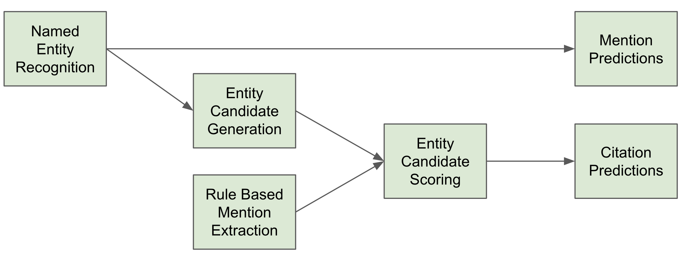

# Chapter 6 - Finding datasets in publications: The Allen Institute for Artificial Intelligence approach

## The AI2 Submission at The Rich Context Competition

---
author:
- |
    Daniel King, Waleed Ammar, Iz Beltagy, Christine Betts  
    **Suchin Gururangan and Madeleine van Zuylen**  
      
    Allen Institute for Artificial Intelligence, Seattle, WA, USA  
    daniel  @allenai.org  
bibliography:
- 'acl2015.bib'
title: The AI2 Submission at The Rich Context Competition
---

## [Introduction](#sec:intro)

The Allen Institute for Artificial Intelligence (AI2) is a non-profit
research institute founded by Paul G. Allen with the goal of advancing
artificial intelligence research for the common good. One of the major
undertakings at AI2 is to develop an equitable, unbiased software
platform (Semantic Scholar)[^1] for finding relevant information in the
scientific literature. Semantic Scholar extracts meaningful structures
in a paper (e.g., images, entities, relationships) and links them to
other artifacts when possible (e.g., knowledge bases, GitHub
repositories), hence our interest in the rich context competition (RCC).
In particular, we participated in the RCC in order to explore methods
for extracting and linking datasets used in papers. At the time of this
writing, Semantic Scholar comprehensively covers the computer science
and biomedical literature, and we plan to expand our coverage in 2019 to
other scientific areas, including social sciences.

In the following sections, we describe our approach to the three tasks
of the RCC competition:
1. extracting the datasets used in publications,
2. predicting the field of research of publications
3. extracting the methods used in publications

## [Methods](#sec:methods)

[Dataset Extraction and Linking](#sec:datasets_methods)
------------------------------

This task focuses on identifying datasets used in a scientific paper.
Datasets which are merely mentioned but not used in the research paper
are not of interest. This task has two sub-tasks:

1.  Citation prediction: extraction and linking to a provided knowledge
    base of *known datasets*, and

2.  Mention prediction: extraction of both *known and unknown* dataset
    mentions.

### Provided Data ###

The provided knowledge base of known datasets includes approximately 10K
datasets used in social science research. The high textual similarity between
different datasets in the knowledge base informs our approach for linking dataset
mentions to their dataset in the knowledge base. Approximately 10% of the datasets in the
knowledge base were linked one or more times in the provided corpus of
5K papers. To attempt to generalize mention discovery beyond those present in the knowledge base, we train a Named Entity Recognition model on the noisy annotations provided by the labeled mentions in the knowledge base.

{width="13cm"}

We provide a high-level overview of our approach in Figure
[\[fig:datasets\]](#fig:datasets){reference-type="ref"
reference="fig:datasets"}. First, we use a named entity recognition
(NER) model to predict dataset mentions. For each mention, we generate a
list of candidate datasets from the knowledge base. We also developed a
rule based extraction system which searches for dataset mentions seen in
the training set, adding the corresponding dataset IDs in the training
set annotations as candidates. We then use a binary classifier to
predict which of these candidates is a correct dataset extraction.

Next, we describe each of the sub-components in more detail.

### Mention and Candidate Generation ###

We first constructed a set of rule based candidate citations by exact
string matching mentions and dataset names from the provided knowledge
base. We found this to have high recall on the provided development fold
and our own development fold that we created. However, after our test
submission, it became clear that there were many datasets in the actual
test set that did not have mentions in the provided knowledge base.

To address this limitation, we developed an NER model to predict
additional dataset mentions. For NER, we use a bi-LSTM model with a CRF
decoding layer, similar to [@Peters2018DEEPCW], and implemented using
the AllenNLP framework.[^2] In order to train the NER model, we
automatically generate mention labels by string matching mentions in the
provided annotations against the full text of a paper. This results in
noisy labeled data, because it was not possible to find all correct
mentions this way (e.g., some dataset mentions were not annotated), and
the same string can appear multiple times in the paper, while only some
are correct examples of dataset usage.

We limit the percentage of negative examples (i.e., sentences with no
mentions) used in training to 50%, and use 40 words as the maximum
sentence length. We use 50-dimensional Glove word embeddings
[@Pennington2014GloveGV], 16-dimensional character embeddings with 64
CNN filters of sizes (2, 3, 4). The CNN character encoder outputs
128-dimensional vectors. We optimize model parameters using ADAM
[@Kingma2014AdamAM] with a learning rate of 0.001.

In order to generate linking candidates for the NER mentions, we score
each candidate dataset based on TF-IDF weighted token overlap between the mention
text and the dataset title. For a given mention, many dataset titles can
have a non-zero overlap score, so we take the top 30 scoring candidates
for each mention as the linking candidates for that mention.

### Candidate Linking ###

The linking model takes as input a dataset mention, its context, and one
of the candidate datasets in the knowledge base, and outputs a binary
label. We use a gradient boosted trees classifier using the XGBoost
implementation.[^3] The model takes as input the following features: prior probability of
entity, prior probability of entity given mention, prior probability of
mention given entity, whether a year appears in the mention context and
in the dataset title, mention length, mention sentence length, whether
the mention is an acronym, estimated section title of the mention,
overlap between mention context and dataset keywords provided in the
knowledge base, and the TF-IDF weighted token overlap. We note that it
is possible to predict zero, one or multiple dataset IDs for the same
mention, and each dataset candidate is scored independently.

[Research Area Prediction](#sec:areas_methods)
------------------------

### Data ###

The second task of the competition is to predict research areas of a
paper. The task does not specify the set of research areas of interest,
nor is training data provided for the task. After manual inspection of a
subset of the papers in the provided test set, the SAGE taxonomy of
research, and the Microsoft Academic Graph (MAG) [@Shen2018AWS], we
decided to use a subset of the fields of study in MAG as labels. In
particular, we included all fields related to social science or papers
from the provided training corpus. However, since the abstract and full
text of papers are not provided in MAG, we only use the paper titles for
training our model. The training data we ended up with included
approximately 75K paper titles along with their fields of study as
specified in two levels of the MAG hierarchy. We held out about 10% of
the titles for development data. The coarse level (L0) has 7 fields
while the more granular one (L1) has 32. Fields associated with less
than 100 papers were excluded.

### Methods ###

For each level, we trained a bi-directional LSTM which reads the paper
title and predicts one of the fields in this level. We additionally
incorporate ELMo embeddings [@Peters2018DEEPCW] to improve performance.
In the final submission, we always predict the most likely field from
the L0 classifier, and only report the most likely field from the L1
classifier if it exceeds a certain threshold. It takes approximately 1.5
and 3.5 hours for the L0 and L1 classifiers to converge, respectively.

[Research Method Extraction](#sec:methods_methods)
--------------------------

### Data ###

The third task in the competition is to extract the scientific methods
used in the research paper. Since no training data was provided, we
started by inspecting a subset of the provided papers to get a better
understanding of what kind of methods are used in social science and how
they are referred to within papers.

### Methods ###

Based on the inspection, we designed regular expressions which capture
common contextual patterns as well as the list of provided SAGE methods.
In order to score candidates, we used a background corpus to estimate
the salience of candidate methods in a paper. Two additional strategies
were attempted but proved unsuccessful: a weakly-supervised model for
named entity recognition, and using open information extraction (openIE)
to further generalize the list of candidate methods.

## [Results](#sec:results)

[Dataset Extraction and Linking](#sec:datasets_results)
------------------------------

First, we report the results of our NER model in Table
[\[tab:ner\_results\]](#tab:ner_results){reference-type="ref"
reference="tab:ner_results"}. Since it is easy for the model to memorize
the dataset mentions seen at training time, we created disjoint train,
development, and test sets based on the paper--dataset annotations
provided for the competition. In particular, we sort datasets by the
number of papers they appear in, then process one dataset at a time. For
each dataset, we choose one of the train, development, or test splits at
random and add the dataset to it, along with all papers which mention that dataset. When there is a
conflict, (e.g., a paper *p* has already been added to the
train split when processing an earlier dataset *d1*, but it is
also associated with a later dataset *d2*), the later dataset
*d2* along with all papers associated with it are added to the
same split as *d1*. For any further conflicts, we prefer to
put papers in the development split over the train split, and the test
split over the development split.

We also experimented with adding ELMo embeddings [@Peters2018DEEPCW],
but it significantly slowed down training and decoding which would have
disqualified our submission due to the runtime requirements of the
competition. As a result, we decided not to include ELMo embeddings in
our final model.

|            | prec.   | recall  |  F1    |
| ---------- | ------- | ------- | ------ |
| dev set    | 53.4    | 50.3    | 51.8   |
| test set   | 50.7    | 41.8    | 45.8   |

NER precision, recall and F1 performance (%) on the development and
test sets.

|                                   | prec.   | recall   |  F1  |
| --------------------------------- | ------- | -------- | ---- |
| baseline                          | 28.7    | 58.0     | 38.4 |
| \+ p(d $\mid$ m), p(m $\mid$ d)   | 39.6    | 42.0     | 40.7 |
| \+ year matching                  | 35.1    | 57.0     | 43.5 |
| \+ aggregated mentions, tuning, and other features | 72.5 | 45.0 | 55.5 |
| \+ dev set examples               | 77.0    | 47.0     | 58.3 |
| \+ NER mentions                   | 56.3    | 62.0     | 59.0 |

End-to-end precision, recall and F1 performance (%) for citation
prediction on the development set provided in phase 1 of the
competition.

|                   | prec.   | recall   |  F1    |
| ----------------- | ------- | -------- | ------ |
| phase 1 holdout   | 35.7    | 19.6     | 25.3   |
| phase 2 holdout   | 39.6    | 18.8     | 25.5   |

End-to-end precision, recall, and F1 performance (%) for dataset
prediction on the phase 1 and phase 2 holdout sets. Note that the
phase 1 holdout results are for citation prediction, while the phase 2 holdout results are for mention prediction.

We report the end-to-end performance of our approach (on the development
set provided by the organizers in the first phase) in Table
??? . This is the performance after using the
linking classifier to predict which candidate mention--dataset pairs are
correct extractions. We note that the development set provided in phase
1 ended up having significantly more overlap with the training data than
the actual test set did. As a result, the numbers reported in Table
???
are not indicative of test set performance.
End to end performance from our phase 2 submission can be seen in Table
???. This performance is reflective of our
focus on the linking component of this task. Aside from the competition
development set, we also used a random portion of the training set as an
additional development set. The initial model only uses a dataset
frequency feature, which gives a baseline performance of 38.4 F1. Adding
p(d $\mid$ m) and p(m $\mid$ d), which are the probability of entity
given mention and probability of mention given entity improves the
performance ($\Delta = 2.3$ F1). Year matching helps disambiguate
between different datasets in the same series, which was found to be a
major source of errors in earlier models ($\Delta = 2.8$ F1).
Aggregating mentions for a given dataset, adding mention and sentence
length features, adding an is acronym feature, and further
hyper-parameter tuning improve the results ($\Delta = 12.5$ F1). Adding
examples in the development set while training the model results in
further improvements ($\Delta = 2.8$ F1). Finally, adding the NER-based
mentions significantly improves recall at the cost of lower precision,
with a positive net effect on F1 score ($\Delta = 0.7$ F1).

Two clear limitations of our model are its difficulty in generalizing to unseen datasets, and its inability to effectively distinguish between datasets that are used in a publication and datasets that are merely reference. These limitations are the main causes of the low recall (due to difficulty generalizing to unseen datasets) and low precision (due to difficulty distinguishing between used datasets and referenced datasets).

[Research Area Prediction](#sec:areas_results)
------------------------

To select a model, we performed a 100 trial random search across model
hyper-parameters, evaluated on a held out development set of papers from
the Microsoft Academic Graph. Our final model contained 512 hidden
dimensions, 2 layers and 0.5 dropout prior to classification. The top
performing classifier achieved 84.4% accuracy on our development set on
L0 fields, and 65.2% accuracy on our development set on L1 fields. The main limitation of using MAG for this problem is that our model cannot find new fields of research, and is limited to those provided by MAG. Additionally, our method performs classification based only on the titles of papers, while there are other pieces of information about the paper that would be useful for classifying the field of research.

[Research Method Extraction](#sec:methods_results)
--------------------------

We evaluated performance by manually evaluating the output of our
extractor for a subset of 50 papers from the provided test set to
compute precision. Since evaluating recall requires a careful
annotation, we resorted to using yield as an alternative metric. Our
final submission for method extraction has 95% precision and yield of
1.5 methods per paper on the manually inspected subset of papers. Similarly to research area prediction, the main limiation here is the difficulty our model has finding new methods, as it is limited to the SAGE ontology and a few hand-crafted patterns.

## [Future Work and Lessons Learned](#sec:future_work)

We now provide some possible directions of improvement for each
component of our submission. For dataset extraction, the most promising
avenue of improvement is to improve the NER model, and the most
promising avenue to improve the NER model is to collect less noisy data.
We effectively have distantly supervised training data for the NER
model, and the first thing to try would be directly annotating papers
with dataset mentions to provide a clearer signal for the NER model. For
research area prediction, it would help to include signals beyond just
the paper title for predicting the field of study. The difficulty here
is finding labeled training data that includes richer signals like
abstract text and paper keywords. For method prediction, exploring
the use of open information extraction is a potential avenue
of future research. Additionally, it would be helpful to clarify what
exactly is meant by a method, as it is currently unclear what a
successful method extraction looks like.
The main lesson learned is that, when presented with noisy, distantly supervised, real-world data, to produce a production-quality system, it becomes very important to (1) have a high-confidence evaluation dataset, and (2) look for other data sources that are similar enough to the task at hand to be useful. Taking steps towards both of these objectives are promising avenues of future work.

## [Conclusion](#sec:conclusion)

This report summarizes the AI2 submission at the RCC competition. We
identify dataset mentions by combining the predictions of an NER model
and a rule-based system, use TF-IDF to identify candidates for a given
mention, and use a gradient boosted trees classifier to predict a binary
label for each candidate mention--dataset pair. To identify research
fields of a paper, we train two multi-class classifiers, one for each of
the top two levels in the MAG hierarchy for fields of study. Finally, to extract research methods, we
use a rule-based system utilizing a dictionary and common patterns,
followed by a scoring function which takes into account the prominence
of a candidate in foreground and background corpora.

## [Acknowledgments](#sec:acknowledgements)

We would like to thank the competition organizers for their tireless
efforts in preparing the data, answering all our questions, doing the
evaluations, and providing feedback. We also would like to thank Zhihong
(Iris) Shen for helping us use the MAG data.

## [Appendix](#sec:appendix)

The code for the submission can be found [here](https://github.com/allenai/coleridge-rich-context-ai2). There is a README with additional documentation at this github repo.

[^1]: [www.semanticscholar.org](www.semanticscholar.org)

[^2]: <https://github.com/allenai/allennlp/blob/master/allennlp/models/crf_tagger.py>

[^3]: <https://xgboost.readthedocs.io/en/latest/>
