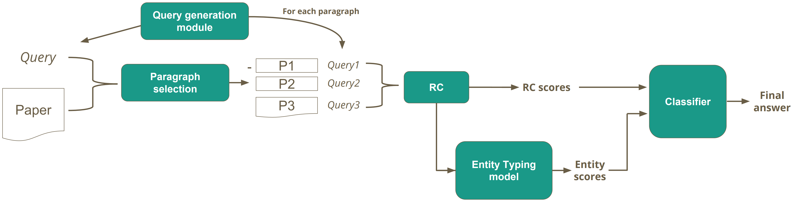
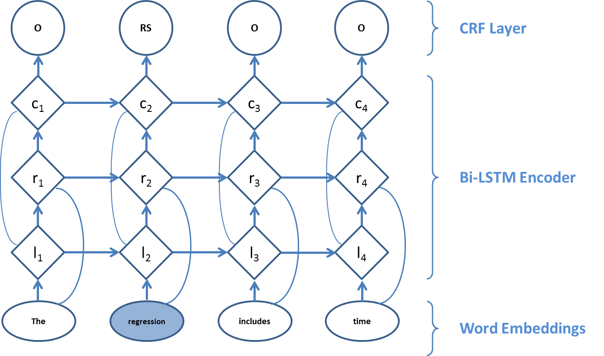

# Chapter 7 - Finding datasets in publications: The KAIST approach

---
author:
- |
    Giwon Hong  
    IR & NLP Lab  
    KAIST  
    Daejeon, South Korea  
    gch02518  @kaist.ac.kr  
    Minh-Son Cao  
    IR & NLP Lab  
    KAIST  
    Daejeon, South Korea  
    minhson  @kaist.ac.kr  
    Haritz Puerto-San-Roman  
    IR & NLP Lab  
    KAIST  
    Daejeon, South Korea  
    haritzpuerto94  @kaist.ac.kr  
    Sung-Hyon Myaeng  
    IR & NLP Lab  
    KAIST  
    Daejeon, South Korea  
    myaeng@kaist.ac.kr  
bibliography:
- 'bibliography.bib'
title: Rich Text Competition
---

## Non technical overview

Our approach for retrieving datasets is to generate our own questions about dataset names and use a machine learning technique to train the model for solving question answering task. In other words, questions suitable for finding dataset names such as "What is the dataset used in this paper?," are generated and the question answering model is trained to find the answers to those questions from the papers. Furthermore, the resulting answers from the model are filtered by types of each word. For example, if an answer contains words with organization or agency types, then this answer is likely to include the actual dataset names.

For the research fields retrieval, we first crawled Wikipedia articles that correspond to the list of research fields. Then, we retrieved the research fields of the papers by measuring the similarity between the papers and the crawled Wikipedia documents. For example, we crawled the Wikipedia article "economic history" which corresponds to the research field "economic history." If the similarity between a paper and the article "economic history" is high enough, it is determined that the paper belongs to a research field "economic history." For the similarity measurement, the TF-IDF similarity is used, which is the similarity measurement based on the term frequency and document frequency.

For the research methods retrieval, we train a model that recognizes named entities through a machine learning technique. More specifically, we considered the research methods as named entities and train a model to retrieve the named entities. For example, for a research method called "bivariate analysis", this research method is considered as a named entity by the trained model and therefore, retrieved by the model.

## Literature Review

Although *Information Retrieval* is a well-established research field, only a few attempts have focused on the task of dataset extraction form publications. [@ghavimi2016identifying] tried it using heuristics and dictionaries but their heuristics have some problems. Firstly, they give too much weight to acronyms. For example, *NYPD (New York Police Department)* is detected as a dataset name.
Furthermore, they also give too much weight to the publication year of the datasets because they assumed dataset names are usually followed by the publication year but that may only work on Social Sciences publications. For example, Computer Science datasets do not appear followed by the publication year so this heuristic cannot detect all kind of dataset mentions.

## What did you do

In this section, we will explain about the models we used for datasets retrieval, research fields retrieval, and research methods retrieval.

Datasets Retrieval
------------------

Our approach to solving the dataset retrieval task is reading comprehension (RC) with query generation and entity typing. An RC model is applied to the given publications with our own query generation module. Then, the result from the RC model is filtered with an entity typing module. Figure 1 shows our overall approach for dataset retrieval. In following subsections RC model, query generation, and entity typing are explained in detail.

*Figure 1: Overall architecture for dataset retrieval*

### Document QA

Reading comprehension models are neural networks that find answers for given queries according to a text. Answers must appear explicitly in the text. Since the dataset retrieval task is about finding explicit dataset mentions from publications, RC models are suitable for this task.

The RC model used in this work is Document QA [@clark2017simple]. It uses Bi-GRU, bi-attention, and self-attention mechanism. In addition, Document QA performs a paragraph selection that pre-filters and selects the *k* most relevant paragraphs through TF-IDF similarity between the query and paragraphs. We observed that datasets are usually mentioned together in some specific paragraphs of the publications. Therefore, this model is appropriate for this task thanks to its paragraph selection stage.

### Query generation module

In order to apply an RC model, such as Document QA, to the dataset retrieval task, queries that are suitable for finding the datasets are required. However, defining a general query for retrieving datasets is difficult, since the dataset mentions appear in various forms like surveys, datasets, or studies. Therefore, we devised a query generation module with some important query terms to generate multiple specific queries instead of one general query.

To generate important query terms, we used a query generation model that creates queries given answers proposed by [@yuan2017machine]. Thanks to this model, we could obtain a list of queries to retrieve datasets from the training set. After that, we extracted query terms that are frequent in the list of queries and at the same time are not frequent in non-dataset-mention sentences. Because of this, these query terms have discrimination power for retrieving dataset mentions since 1) queries are generated to extract mentions and 2) the query terms do not appear in the sentences without dataset mentions.

This list of query terms is used to generate a general query concatenating query terms. This query is used for the paragraph selection stage of Document QA, as shown in Figure 1. After this stage, the query generation module generates queries for each paragraph by string matching, in order to create specific queries for each paragraph.

### Ultra-Fine Entity Typing

Ultra-Fine Entity Typing [@Choi:2018:ACL] can predict a set of free-from phrases like *criminal* or *skyscraper* given a sentence with an entity mention. For example, in the sentence: *Bob robbed John and he was arrested shortly afterward*, Bob is of type *criminal*. In our task, candidate answers proposed by Document QA and their context are input to Ultra-Fine Entity Typing. Although this system can predict 10k different entity types in which *dataset* is included, after a few experiments we observed that most of the dataset names are recognized as some specific entity types such as *organization* and *agency*. Since these entity types are consistent, we decided that this could be a feature for our candidate answer classifier.

### Candidate Answer Classifier

Using the score given by the RC model for each candidate answer and the entity types given by Ultra-Fine Entity Typing for each candidate answer, a neural network classifier that filters the candidate answers of Document QA was used. We discovered that a candidate answer with a high score given by Document QA and whose entity type is *organization* or something similar is considerably likely to be a correct dataset name. Due to this pattern, we were able to create neural network classifier to filter out candidate answers.

The classifier has the following architecture:

1.  Input size: 10332 (10331 labels from Ultra-Fine Entity Typing and the Document QA score)

2.  1 hidden layer with 50 neurons

3.  Output size: 2

The training set consists of 25172 examples and the test set of 6293 examples. Adam optimizer was used and cross entropy was used as loss function.

Research Fields Retrieval
-------------------------

Our approach to obtaining the research fields is based on TF-IDF similarity with Wikipedia articles. First, a set of Wikipedia articles about different research fields using the library MediaWiki for Python was obtained. The list of research fields provided the Coleridge Initiative for the Rich Context Competition was used to crawl Wikipedia. This list has three levels of hierarchy as the example in Figure 2.

![Research fields hierarchy[]{label="fig:researchfieldshiearchy"}](combined_images/fieldshierarchy2.png)*Figure 2: Research fields hierarchy*

The leaf nodes of that hierarchy were searched in Wikipedia to retrieve specific research fields instead of general ones. For example, we were aiming to retrieve *Neurosurgery* instead of *Medicine*.

Then, using Scikit-learn [@scikit-learn], a TF-IDF matrix of all the publications and Wikipedia articles of research fields were computed and the research field and all its superior nodes in the hierarchy associated with the most similar article were returned along with the similarity in the range \[0,1\]. The overall architecture can be seen in Figure 3.

![Overall architecture for research fields retrieval[]{label="fig:researchfields"}](combined_images/researchfields2.png)*Figure 3:  Overall architecture for research fields retrieval*

Research Methods Retrieval
--------------------------

For the research methods retrieval task, we modeled it as an named-entity recognition (NER) problem. Research methods are considered to be a named entities and because of this, they can be tagged as research method label (RS) instead of common NER labels such as: *location*, *people*, etc. Figure 4 shows the main architecture of the model proposed by [@lample2016neural] and used in this task.

*Figure 4: Paragraph selection for DocQA in research method retrieval*

The representation of a word using the model is obtained considering its context. We have the assumption that research methods have dependencies and constraints with words that appear in their surrounding context. Therefore, the conditional random field [@lafferty2001conditional] layer in this model is suitable for detecting research methods by jointly tagging the whole sentence, instead of independently tagging each word.

In this task, research method phrases which appeared in the training set were marked. Then, we represented the data in CoNLL 2003 format [@tjong2003introduction], using IOB tag (Inside, Outside, Beginning). Every token is labeled as B-RS if the token is the beginning of a research method, I-RS if it is inside a research method but not the first token, or O if otherwise. We used this type of data to train the model which could detect research methods in publications.

## What worked and what didn’t

We tried different ideas to extract dataset names. Firstly, we tried to extract the dataset name using some hand-crafted queries in the QA model. But we noticed that these manually generated queries do not have sufficient discriminative power. Therefore, we tried to generate a general query with enough discriminative power to retrieve datasets names. To this end, we converted the sentences containing the dataset into queries, and then clustered the converted queries to get some generalized queries. However, we found that each of the resulting clusters did not reflect generalized queries. Hence, we had to create specific queries for each publication as explained in the previous section.

We also tried to use the section names as a feature of the paragraph selection part in the Document QA. However, the use of section name has rather degraded the overall performance. In our analysis, this seems to be due to the noise that occurred when extracting the section name, since we relied on some heuristics to extract them.

The use of entity typing worked well to remove the wrong candidate answers proposed by the reading comprehension model. Thanks to this filtering by entity types, we were able to improve the recall using the query generation module without sacrificing the precision.

Our approach to retrieve research fields worked well as will be shown in the next section.

Finally, our first idea to retrieve research methods was based on identifying their context words by using the frequency of those words. However, this approach did not achieve good results due to the lack of discriminative power of the most common words that co-occur with the research methods. Therefore, we tried to model it as an NER problem, where we consider each research method that appeared in a paper as a named-entity. By modeling the problem in this way, we can use existing NER models to extract research methods from papers. However, this approach also performed poorly.

## Summary of your results and caveats

Due to the difficulty of performing a quantitative analysis on a not extensively labeled dataset, a qualitative analysis was made. Several random publications were chosen and manually labeled by us to check the quality of our model and discover the strong and weak points.

Datasets Retrieval
------------------

To analyze the effects of the query generation module and entity typing module, we performed analyses on 100 phase 1 dev set with 3 different settings:

1.  Document QA only

2.  Document QA + query generation module

3.  Document QA + query generation module + entity typing module

### Document QA only

Figure 5 shows the results from 3 publications of phase 1 dev set with Document QA only. Compared to the other settings, Document QA only setting retrieves answers (dataset mentions) with high quality. However, the number of retrieved answers is notably small. For example, the result from *153.txt* publication was empty as in Figure 5. In fact, our model using this setting can retrieve only 260 answers (predictions) from 100 publications of phase 1 dev set.

![Results from Document QA only[]{label="fig:docqaonly"}](combined_images/phase1.png)*Figure 5: Results from Document QA only*

These results with fewer answers were expected, due to the difficulty of defining general queries as explained in section [*Question Generation Module*](#query-generation-module). Without a query generation module, our query was not representative enough to retrieve various forms and types of the dataset mentions.

### Document QA + query generation module

Figure 6 shows the results from 3 publications of phase 1 dev set with Document QA and query generation module. Because of the latter, our dataset retrieval model could retrieve a large number of answers. For example, the result from *153.txt* publication contains a large number of answers with correct answers such as *financial services FDI data* or *Micro Database Direct investment*. Therefore, we believe that the query generation module improves recall of the entire dataset retrieval model. Actually, our model using this setting can retrieve more than 2,000 answers (predictions) from 100 publications of phase 1 dev set.

However, compared to the Document QA only setting, there is a considerable number of noise. For example, in Figure 6, *empirical, Table 1, Section 4* and etc., are not dataset mentions.

![Results from Document QA + query generation module[]{label="fig:docqaquery"}](combined_images/phase1+querygen.png)*Figure 6: Results from Document QA + query generation module*

We believed that the reason of these noises is the several query terms potentially retrieve wrong answers. For example, we have a query term *\"study\"* to retrieve dataset mentions such as *\"ANES 1952 Time Series Study\"*. However, this term can also retrieve noises such as *\"empirical study\"*. These kinds of query terms are still needed to retrieve various forms and types of dataset mentions but clearly generate some noises.

### Document QA + query generation module + entity typing module

Figure 7 shows the results from 3 publications of phase 1 dev set with Document QA, query generation module, and entity typing module. Thanks to the entity typing module, we can see that most of the noises from the query generation module have disappeared. Although a few right answers such as *\"FDI data\"* was filtered out and a few wrong answers such as *\"4.2.1 Micro Data\"* was not, overall precision is adequately improved by entity typing module. In addition, our model in this setting could retrieve 526 answers (predictions) from 100 publications of phase 1 dev set.

![Results from Document QA + query generation module + entity typing module[]{label="fig:docqaqueryentity"}](combined_images/phase1+querygen+entitytyping.png)*Figure 7: Results from Document QA + query generation module + entity typing module*

Research Fields Retrieval
-------------------------

We randomly selected 20 publications from the training set of phase 1, since our model does not require any training. The model was able to correctly predict 11. The strongest point is that the model is able to predict research fields which are significantly specific such as *Home health nursing management*. Among the weak points of the model, it has problems when two research fields are similar or share subtopics. Moreover, sometimes it fails due to the fact that it tries to retrieve excessively specific fields while more general ones would be suitable.

Research Methods Retrieval
--------------------------

20 random publications were selected from the training set of phase 2 and labeled and our results are not as expected. The model is able to find proper research methods for 12 publications out of 20. For example, the model detects one of the research methods appeared in publication with id 15359 which is *Factor analysis*. However, the results contain a notable amount of noise. For example, the document with id 10751, the model retrieves several wrong answers like *Reviews describe*, *Composite materials*, *Detailed databases*, etc.

## Lessons learned and what would you do differently

After the completion of this project, we realized that some steps could have been in a different way and led to better results. For example, we focused a lot on the model creation, however, we think that we should have spent more time on the analysis of the dataset to extract all its potential and search for additional datasets since some of the provided datasets contain noise.

In addition, since Document QA is good for prototyping, it was a good idea to use it at the beginning to check that our hypothesis of modeling dataset retrieval as a QA task was right. However, at some point during the project, we should have changed it to another model with a state of the art performance.

Also, in the QA model, we are currently using symbolic queries. But since we are generating our own queries, we could define and generate queries with a distributed representation. It would be more generic and model-matching queries. Furthermore, for research fields, we should have tried other ranking methods like BM25, a ranking function used by search engines whose performance is better than TF-IDF.

Finally, for research methods, we should have analyzed more the dataset to use more suitable techniques like unsupervised NER instead of supervised NER.

## What comes next

This work is the very first step of the Coleridge Initiative to build an "Amazon.com" for data users and data producers. The next step is to construct a system that recommends datasets to researchers. We have a hypothesis that datasets depend on research fields and vice versa. For example, in the research field *Question Answering*, a subfield of *Natural Language Processing* and *Computer Science*, the most commonly used dataset is SQuAD [@rajpurkar2016squad]. Therefore, according to our hypothesis, two publications using SQuAD are presumably to be in the same field, *Question Answering*. Based on this hypothesis, we intend to build hierarchical clusters of publications with the same research field. This way, a cluster will have publications with the same research field and similar datasets. As an example, the QA cluster will have papers about QA and those papers will use similar datasets like SQuAD and TriviaQA [@joshi2017triviaqa]. With these clusters, the system will be able to recommend datasets to data users. For example, if a publication is in the *Question Answering* field, the proposed system would be able to recommend the authors SQuAD and TriviaQA. Moreover, it would be able to recommend to data producers fields with a lack of datasets.

In addition, we also need to improve the performance of the models we built. For example, since we used a pre-trained model in Document QA we think we could not exploit the whole potential of this system, so we would like to train our own model using a training set of publications.

## Acknowledgements

This work was supported by the Institute of Information & Communications Technology Planning & Evaluation (IITP) grant funded by the Korean Government (MSIT) (No. 2013-0-00179, Development of Core Technology for Context-aware Deep-Symbolic Hybrid Learning and Construction of Language Resources) and Next-Generation Information Computing Development Program through the National Research Foundation of Korea (NRF) funded by the Ministry of Science, ICT (2017M3C4A7065962).

## Appendix: Description of the code and documentation

The technical documentation of the code is provided in the GitHub repository of the project https://github.com/HaritzPuerto/RCC/tree/master/project
