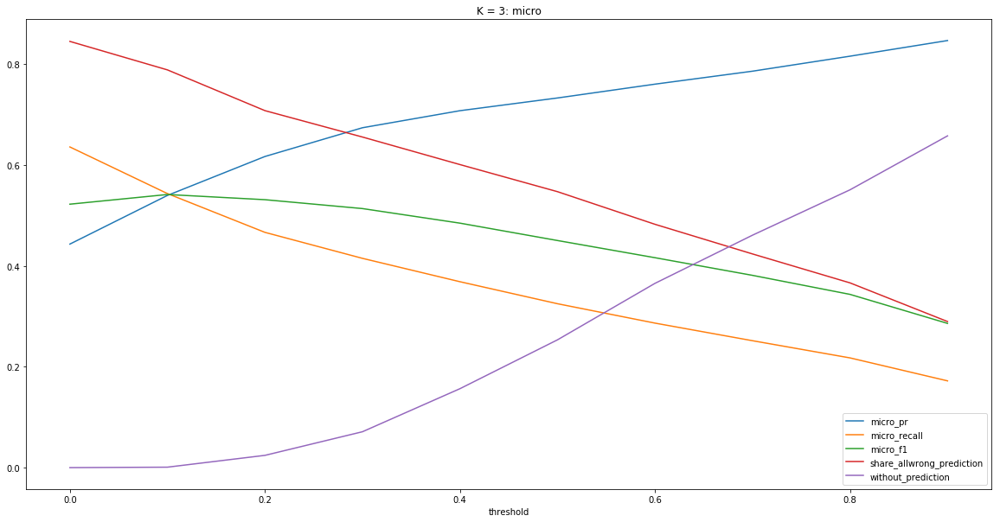

# Chapter 8: GESIS

Wolfgang Otto, Andrea Zielinski, Behnam Ghavimim, Dimitar Dimitrov, Narges Tavakolpoursaleh

## Introduction

Scientists and analysts often face the problem of finding interesting research datasets and identifying who else used the data, in which research fields, and how the data has been analyzed from a methodological perspective.

-   GESIS description

-   Why the competition is interesting for us?

-   One of gesis missions: Support Social Scientists in all steps of the research cycle.

-   Allready work in this area ((Boland et al., 2012))

This chapter describe our approaches, techniques and used additional data used for our partitipation to the Rich Context Competition (RCC).

### General Approach and Software Components

The central tasks in the RCC is the extraction of dataset mentions from text. Nevertheless, we considered the discovery of research methods and research fields equally important. To this end, we decided to follow a module-based approach and developed tools that can be used separately but also as parts of a data processing pipeline. Figure \[figure:pipeline\] shows an overview of the software modules developed for the RCC competition, including their dependencies. Here, the upper three modules (gray) describe the pre-processing steps (cf. Section \[sec:prepro\]). The lower four modules (blue) are used to generate the output in a pre-specified format. The pre-processing step consists of extracting metadata and pure text from PDF documents. The extraction itself is done using the Cermine Tool[1] which returns a Journal Article Tag Suite[2] (Jats) XML document. Then, in a second step, text, metadata and references are extracted. The output of the pre-processing is then used by the software modules responsible for tackling the individual sub-tasks, i.e., discovering research datasets (cf. Section \[sec:dataset-extraction\]), methods (cf. Section \[section:research\_method\_extraction\]) and fields (cf. Section \[section:field\_classification\]).

### First Phase Feedback

After the first phase, each team received feedback from the organizers of the RCC. The feedback is twofold and consists of a quantitative and qualitative evaluation. Unfortunately, our team did not perform very well regarding precision and recall. In contrast to this, our approach has been found convincing regarding the quality of results. The qualitative feedback result from a random sample of ten documents that are given to four judges. Judges are then asked to manually extract dataset mentions and calculate the overlap between their dataset extractions and the output of our algorithm. Other factors that judges took into consideration are specificity, uniqueness and multiple occurrences of dataset mentions. As for the extraction of research methods and fields no ground truth has been provided, these tasks were evaluated against the judges’ expert knowledge. Similarly to the extraction of dataset mentions, specificity and uniqueness have been considered for these two tasks. The feedback our team received acknowledged the fact that no ground truth has been provided and our efforts regarding the extraction of research methods and fields.

## Data and Pre-processing

This section describes the external data sources we used as well as our pre-processing steps.

### External Data Sources

For developing our algorithms, we also utilized two external data sources. For the discovery of research methods and fields, we resort to data from Social Science Open Access Repository[3] (SSOAR). SSOAR is maintained at GESIS – Leibniz Institute for the Social Sciences collects and archives literature of relevance to the social sciences. In SSOAR, full texts are indexed using controlled social science vocabulary (Thesaurus[4], Classification[5]) and are assigned rich metadata. SSOAR offers documents in various languages. The corpus of English language publications that can be used for purposes of the competition consists of a total of 13,175 documents. All SSOAR documents can be accessed through the OAI-PMH[6] interface. Another external source that we used for discovery of research methods is the ACL Anthology Reference Corpus (Bird et al., 2008). ACL ARC is a corpus of scholarly publications about computational linguistics. The corpus consists of a total of 22,878 articles.

### Pre-processing

Although the organizers of the RCC, offered plain texts for the publication, we decided to build our own pre-process pipeline. The pipeline uses the Cermine Tool to extract information from PDF documents. The main benefit of using this tool is the structured metadata output including better disambiguation of sections and paragraphs in the publications. The output XML file uses the Journal Article Tag Suite[7]. For the competition, there are only two interesting elements of the Jats XML format, i.e., &lt;front&gt; and &lt;body&gt;. The &lt;front&gt; element contains the metadata of the publication, whereas the &lt;body&gt; contains the publication text. Another advantage of Cermine is that the hyphenation and segmentation of paragraphs are carried out automatically. As a last step of the pre-processing, we remove all linebreaks from the publication text and output a list of metadata fields and values as shown in Table \[tab:example-paragraph\] for each publication paragraph.

|                   | Example Text Field Data         |
|:------------------|:--------------------------------|
| publication\_id   | 12744                           |
| label             | paragraph\_text                 |
| text              | A careful reading of text, word |
|                   | for word, was ...               |
| section\_title    | Data Analysis                   |
| annotations       | \[{’start’: 270, ’end’: 295,    |
|                   | ’type’: ’bibref’, ...           |
| section\_nr       | \[3, 2\]                        |
| text\_field\_nr   | 31                              |
| para\_in\_section | 1                               |

\[tab:example-paragraph\]

## Dataset Extraction

### Task Description

In scientific literature, datasets are specified to indicate, e.g., the data on which a analysis is performed, a certain finding or a claim is based on. In this competition, we focus on (i) extracting and (ii) linking datasets mention from social science publications to a list of given dataset references. Identifying dataset mention in literature is a challenging problem due to the lack of an established style of citing datasets. Furthermore, in many research publication, a correct citation of datasets is entirely missing (Boland et al., 2012). The following two sentences exemplify the problem.
**Example 1**: *P-values are reported for the one-tail paired t-test on *Allbus* (dataset mention) and *ISSP* (dataset mention).*
**Example 2**: *We used *WHO data from 2001* (dataset mention) to estimate the spreading degree of AIDS in Uganda.*
We treat the problem of detecting dataset mentions in full-text as a Named Entity Recognition (NER) task.

#### Formal problem definition

Let *D* denote a set of existing datasets *d* and the knowledgebase *K* as a set of known dataset references *k*. Furthermore, each element of *K* is referencing an existing dataset *d*. The Named Entity Recognition and linking task is defined as (i) the identification of dataset mentions *m* in a sentence, where *m* references a dataset *d* and (ii) linking them, when possible, to one element in *K* (i.e., the reference dataset list given by the RCC).

### Challenges

With our method, we focus on the extraction of dataset mentions in the body of the full-text of scientific publications. We recognize three types a dataset can be mentioned: (i) The full name of a dataset like ”National Health and Nutrition Examination Survey“, (ii) an abbreviation (”NHaNES“) or (iii) a vague reference, e.g., ”the monthly statistic“. By each of these varieties, the NER task faces particular challenges. For the first type, the used dataset name can vary in different publications. Where one publication cites the dataset with ”National Health and Nutrition Examination Survey“ the other could use the words ”Health and Nutrition Survey“. In a case where abbreviations are used a disambiguation problem occurs, e.g., in ”WHO data“. WHO may describe the World Health Organization or the White House Office. The biggest challenge is again the lack of a precise gold standard that can be used to train a classifier. In the following we describe how we have dealt with this lack of ground truth data.

### Phase one approach

The challenge of missing ground truth data is the main problem to handle during this competition. To this end, supervised learning methods for dataset mentions extraction from text are not directly applicable. To overcome this limitation, we resort to the provided list of dataset mentions and publication pairs and re-annotate the particular sentences in the publication text. This re-annotation is then used to train Spacy’s neural network based NER model[8]. We created a holdout set of 1000 publications and a training set of size 4000. We train our model using publication paragraphs as training samples. In the training set, 0.45 percent of the paragraphs contained mentions. For each positive training example, we added a negative example that does not contain dataset mentions and is sampled at random. We used a batch size of 25 and a dropout rate of 0.4. The model was trained for 300 iterations.

#### Evaluation

We evaluated our model with respect to four metrics: strict precision and recall, and partial precision and recall. While the former are standard evaluation metrics, the latter are their relaxed variants in which the degree to which dataset mentions have to match can vary. Consider the following example of a partial match: “National Health and Nutrition Examination Survey” is the extracted dataset mention whereas, “National Health and Nutrition Examination Survey (NHANES)” represents the true dataset mention.

| Metric            | Value |
|:------------------|:-----:|
| Partial Precision |  0.93 |
| Partial Recall    |  0.95 |
| Strict Precision  |  0.80 |
| Strict Recall     |  0.81 |

\[table:dataset-mention-eval\]

Table \[table:dataset-mention-eval\] show the results of the dataset mention extraction on the holdout set. The model is able to achieve high strict precision and recall values. As expected, the results are even better for the partial version of the metrics. But, this version indicates that even if we are not able to exactly match the dataset mention in text, we can find the right context with very high precision at least.

### Phase two approach

In the second phase of the competition additional 5,000 publications have been provided. We extended our approach to consider the list with dataset names supplied by the organizers and re-annotated the complete corpus of 15.000 publication in the same manner as in phase one to obtain training data. This time we split the data in 80% for training and 20% for test.

#### Evaluation

We resort to the same evaluation metrics as in phase one. However, we calculate precision and recall on the full-text of the publication and not on the paragraphs as in the first phase. Table \[table:dataset-mention-eval-phase-two\] show the results achieved by our model. We observe a lower precision and recall values. Compared to phase one, there is also a smaller difference between the precision an recall values for the strict and partial version of the metrics.

| Metric            | Value |
|:------------------|:-----:|
| Partial Precision |  0.51 |
| Partial Recall    |  0.90 |
| Strict Precision  |  0.49 |
| Strict Recall     |  0.87 |

\[table:dataset-mention-eval-phase-two\]

## Research Method Extraction

### Task Description

Inspired by a recent work of Nasar et al. (Nasar et al., 2018), we define a list of basic entity types that give key-insights into scholarly publications. We adapted the list of semantic entity types to the domain of the social sciences with a focus on *research methods*, but also including related entity types such as *Theory, Model, Measurement, Tool, Performance*. We suspect that the division into semantic types might be helpful to find *research methods*, because related semantic entities types might provide clues or might be directly related to the research method itself. For instance, in order to realize a certain research objective, an experiment is instrumented where a specific combination of *methods* is applied to a *data set* that might be intellectual or *software*, thus achieving a specific *performance* and result in that context.
**Example**: *P-values* (measurement) are reported for the *one-tail paired t-test* (method) on *Allbus* (dataset) and *ISSP* (dataset).

#### Formal problem definition

Let *E* denote a set of entities. The Named Entity Recognition and Linking task consists of (i) identifying entity mentions *m* in a sentence and, (ii) linking them, when possible, to a reference knowledge base *K* (i.e, the SAGE Thesaurus[9]) and (iii) assigning a type to the entity, e.g., *research method*, selected from a set of given types. Given a textual named entity mention *m* along with the unstructured text in which it appears, the goal is to produce a mapping from the mention *m* to its referent real world entity *e* in *K*.

### Challenges

There are some major challenges that any named entity recognition, classification and linking system needs to handle. First, regarding NER, identifying the entities boundary is important, thus detecting the exact sequence span. Second, ambiguity errors might arise in classification. For instance,‘range’ might be a domain-specific term from the knowledge base or belong to the general domain vocabulary. This is a challenging task for which context information is required. In the literature, this relates to the problem of **domain adaptation** which includes fine-tuning to specific named entity classes[10]. With respect to entity linking, another challenge is detecting name variations, since entities can be referred to in many different ways. Semantically similar words, synonyms or related words, which might be lexically or syntactically different, are often not listed in the knowledge base (e.g., the lack of certain terms like ‘questioning’ but not ‘questionnaire’). This problem of automatically detecting these relationships is generally known as **linking problem**. Note that part of this problem also results from PDF-to-text conversion which is error-prone. Dealing with incomplete knowledge bases, i.e. **handling of out of vocabulary (OOV) items**, is also a major issue, since knowledge bases are often not exhaustive enough and do not cover specific terms or novel concepts from recent research. Last but not least, the combination of different semantic types gives a more coherent picture of a research article. We hypothesize that such information would be helpful and results in an insightful co-occurrence statistics, and provides additional detail directly related to entity resolution, and finally helps to assess the **relevance of terms** by means of a score.

### Our Approach - Overview

Our context-aware framework builds on Stanford’s CoreNLP and Named Entity Recognition System[11]. The information extraction process follows the workflow depicted in Figure \[figure:pipeline\], using separate modules for pre-processing, classification, linking and term filtering.

We envision the task of finding entities in scientific publications as a sequence labeling problem, where each input word is classified as being of a dedicated semantic type or not. In order to handle entities related to our domain, we train a novel machine learning classifier with major semantic classes, using training material from the ACL RD-TEC 2.0 dataset (QasemiZadeh and Schumann, 2016). Apart from this, we follow a domain adaptation approach inspired by (Agerri and Rigau, 2016) and ingest semantic background knowledge extracted from external scientific corpora, in particular the ACL Anthology (Bird et al., 2008; Gildea et al., 2018). We perform entity linking by means of a new gazetteer-based SAGE dictionary of Social Research Methods (Lewis-Beck et al., 2003), thus putting a special emphasis on the social sciences. The linking component addresses the synonymy problem and matches an entity despite name variations such as spelling variations. Finally, term filtering is carried out based on a termhood and unithood, while scoring is achieved by calculating a relevance score based on TF-IDF (cf. Section \[para:relscore\]).

Our research experiments are based on the repository for the Social Sciences SSOAR as well as the train and test data of the Rich Context Competition corpus[12]. Our work extends previous work on this topic (cf. (Eckle-Kohler et al., 2013)) in various ways: First, we do not limit our study to abstracts, but use the entire fulltext. Second, we focus on a broader range of semantic classes, i.e. *Research Method*, *Research Theory*, *Research Tool* and *Research Measurement*, tackling also the problem of identifying novel entities.

\[pipeline\] 

#### Distributed Semantic Models

For domain adaptation, we integrate further background knowledge. We use vector embeddings of words trained on additional corpora and which serve as input features to the CRF model. Semantic representations of words are a successful extension of common features, resulting in higher NER performance (Turian et al., 2010) and can be trained offline.

In this work, the word vectors were learned from the scientific ACL ARC[13] using Gensim with the skip gram model (cf. (Mikolov et al., 2013)) and a pre-clustering algorithm[14]. A summary of the size of the unlabeled English data used for training word embeddings can be found in Table \[tab:UnlabeledData\].

| Corpus     | Articles | Documents/Tokens |
|:-----------|:---------|:-----------------|
| ACL Corpus | 22,878   | 806,791/2.5 GB   |

#### Features

The features incorporated into the linear chain CRF are shown in the Table \[tab:features\]. The features depend mainly on the observations and on pairs of adjacent labels, using a log-linear combination. However, since simple token level training of CRFs leads to poor performance, more effective text features such as word shape, orthographic, gazetteer, Part-Of-Speech (POS) tags, along with word clustering (see Section \[subsec:dist-model\]) have been used.

| **Type**                 |                                                    **Features**                                                    |
|:-------------------------|:------------------------------------------------------------------------------------------------------------------:|
| **Token unigrams**       | *w**i* − 2, *w**i* − 1, *w**i*, *w**i* + 1, *w**i* + 2, ... |
| **POS unigrams**         |                           *p**i*, *p**i* − 1, *p**i* − 2                          |
| **Shapes**               |                                              shape and capitalization                                              |
| **NE-Tag**               |                                    *t**i* − 1, *t**i* − 2                                    |
| **WordPair**             |                              (*p**i*, *w**i*, *c**i*)                             |
| **WordTag**              |                                       (*w**i*, *c**i*)                                       |
| **Gazetteer**            |                                                   SAGE gazetteer                                                   |
| **Distributional Model** |                                                 ACL Anthology model                                                |

#### Knowledge Resources

We use the SAGE thesaurus which includes well-defined concepts, an explicit taxonomic hierarchy between concepts as well as labels that specify synonyms of the same concept. A portion of terms is unique to the social science domain (e.g., ‘dependent interviewing’), while others are drawn from related disciplines such as statistics (e.g., ‘conditional likelihood ratio test’)[15]. However, since the thesaurus is not exhaustive and covers only the top-level concepts related to social science methods, our aim was to extend it by automatically extracting further terms from domain-specific texts, in particular from the Social Science Open Access Repository. More concretely, we carried out the following steps to extend SAGE as an off-line step. For step 2 and 3, candidate terms have been extracted by our pipeline for the entire SSOAR corpus.

1.  Assignment of semantic types to concepts (manual)

2.  Extracting terms variants such as abbreviations, synonyms, related terms from SSOAR (semi-automatic)

3.  Computation of Term and Document Frequency Scores for SSOAR (automatic)

#### Extracting term variants such as abbreviations, synonyms, and related terms

26.082 candidate terms have been recognized and classified by our pipeline and manually inspected to a) find synonyms and related words that could be linked to SAGE, and b) build a post-filter for incorrectly classified terms. Moreover, abbreviations have been extracted using the algorithm of Schwartz and Hearst (Schwartz and Hearst, 2003). This way, a Named Entity gazetteer could be built and will be used at run-time. It comprises 1,111 terms from SAGE and 447 terms from the Statistics glossary as well as 54 previously unseen terms detected by the model-based classifier.

#### Computation of Term and Document Frequency Scores

Term frequency statistics have been calculated off-line for the entire SSOAR corpus. The term frequency at corpus level will be used at run time to determine the term relevance at the document level by calculating the TF-IDF scores. The most relevant terms from SAGE are listed in Table \[tab:SAGET\].

| \[tab:SAGET\] **SAGE Term** | **TF-IDF Score** | **Semantic Class** |
|:----------------------------|:-----------------|:-------------------|
| Fuzzy logic                 | 591,29           | Research Method    |
| arts-based research         | 547,21           | Research Method    |
| cognitive interviewing      | 521,13           | Research Method    |
| QCA                         | 463,13           | Research Method    |
| oral history                | 399,68           | Research Method    |
| market research             | 345,37           | Research Field     |
| life events                 | 186,61           | Research Field     |
| Realism                     | 314,34           | Research Theory    |
| Marxism                     | 206,77           | Research Theory    |
| ATLAS.ti                    | 544,51           | Research Tool      |
| GIS                         | 486,01           | Research Tool      |
| SPSS                        | 136,52           | Research Tool      |

#### Definition of a Relevance Score

Relevance of terminology is often assessed using the notion of *unithood*, i.e. ‘the degree of strength or stability of syntagmatic combinations of collections’, and *termhood*, i.e. ‘the degree that a linguistic unit is related to domain-specific concepts’ (Kageura and Umino, 1996). Regarding *unithood*, the NER model implicitly contains heuristics about legal POS tag sequences for candidate terms, consisting of at least one noun (NN), preceeded or followed by modifiers such as adjectives (JJ), participles (VB\*) or cardinal numbers (CD), complemented by wordshape features.

In order to find out if the candidate term also fulfills the *termhood* requirement, domain-specific term frequency statistics have been computed on the SSOAR repository, and set in contrast to general domain vocabulary terms. It has to be noted that only a small portion of the social science terms is actually unique to the domain (e.g., ‘dependent interviewing’), while others might be drawn from related disciplines such as statistics (e.g., ‘conditional likelihood ratio test’).

#### Preliminary Results

Our method has been tested on 100 fulltext papers from SSOAR and 10 documents from the Rich Context Competition (RCC), all randomly selected from hold out corpora. In our experiments on SSOAR Social Science publications, we compared results to the given metadata information. The main finding was that while most entities from the SAGE thesaurus could be extracted and linked reliably (e.g., ’Paired t-test’), they could not be easily mapped to the SSOAR metadata terms, which consist of only a few abstract classes (e.g., ’quantitative analysis’). Furthermore, our tool was tested by the RCC organizer, were the judges reviewed 10 random publications and generated qualitative scores for each document.

## Research Field Classification

### Task Description

The goal of this task is to identify the research fields covered in social science publications. The RCC data does not provide a gold standard —annotated training data— for that task. To this end, we decided to train a classifier using annotated data from SSOAR. In this way, our interpretation of the task is to select one or more labels from a given set of labels for each publication. This approach is known as a mulit-label classification. In our case, a label represents a research field.

### Our approach - Overview

Due to the unequal distribution of labels in the dataset, we need to guaranty enough training data for each label. We selected only labels with frequency over 300 for training the model which results in a total of 44 labels representing research fields. We decided to train a classification model based on the fasttext framework (Joulin et al., 2017). To train our model we resort to the abstracts of the publication, as this approach worked better than using the full-texts.

### Evaluation

Figure \[fig:results\_fasttext\] shows the performance of the model regarding various evaluation metrics for different thresholds. A label is assigned to a publication if the model outputs a probability for the label above the defined threshold. In multi-label classification, this allows us to evaluate our model from different perspectives.

## Acknowledgments

We would like to thank GESIS for giving us the time and resources to participate in the competition.

## References

Agerri R and Rigau G (2016) Robust multilingual named entity recognition with shallow semi-supervised features. *Artificial Intelligence* 238. Elsevier: 63–82.

Bird S, Dale R, Dorr BJ, et al. (2008) The acl anthology reference corpus: A reference dataset for bibliographic research in computational linguistics. In: *Proceedings of the sixth international conference on language resources and evaluation (lrec 2008)*, 2008. European Language Resources Association (ELRA).

Boland K, Ritze D, Eckert K, et al. (2012) Identifying references to datasets in publications. In: *International conference on theory and practice of digital libraries*, 2012, pp. 150–161. Springer.

Eckle-Kohler J, Nghiem T-D and Gurevych I (2013) Automatically assigning research methods to journal articles in the domain of social sciences. In: *Proceedings of the 76th asis&T annual meeting: Beyond the cloud: Rethinking information boundaries*, 2013, p. 44. American Society for Information Science.

Finkel JR, Grenager T and Manning C (2005) Incorporating non-local information into information extraction systems by gibbs sampling. In: *Proceedings of the 43rd annual meeting on association for computational linguistics*, 2005, pp. 363–370. Association for Computational Linguistics.

Gildea D, Kan M-Y, Madnani N, et al. (2018) The acl anthology: Current state and future directions. In: *Proceedings of workshop for nlp open source software (nlp-oss)*, 2018, pp. 23–28.

Joulin A, Grave E, Bojanowski P, et al. (2017) Bag of tricks for efficient text classification. In: *Proceedings of the 15th conference of the european chapter of the association for computational linguistics: Volume 2, short papers*, April 2017, pp. 427–431. Association for Computational Linguistics.

Kageura K and Umino B (1996) Methods of automatic term recognition: A review. *Terminology. International Journal of Theoretical and Applied Issues in Specialized Communication* 3(2). John Benjamins Publishing Company: 259–289.

Lewis-Beck M, Bryman AE and Liao TF (2003) *The Sage Encyclopedia of Social Science Research Methods*. Sage Publications.

Mikolov T, Sutskever I, Chen K, et al. (2013) Distributed representations of words and phrases and their compositionality. In: *Advances in neural information processing systems*, 2013, pp. 3111–3119.

Nasar Z, Jaffry SW and Malik MK (2018) Information extraction from scientific articles: A survey. *Scientometrics* 117(3). Springer: 1931–1990.

QasemiZadeh B and Schumann A-K (2016) The acl rd-tec 2.0: A language resource for evaluating term extraction and entity recognition methods. In: *LREC*, 2016.

Schwartz AS and Hearst MA (2003) A simple algorithm for identifying abbreviation definitions in biomedical text. In: *Pacific symposium on biocomputing*, 2003, pp. 451–462.

Turian J, Ratinov L and Bengio Y (2010) Word representations: A simple and general method for semi-supervised learning. In: *Proceedings of the 48th annual meeting of the association for computational linguistics*, Stroudsburg, PA, USA, 2010, pp. 384–394. ACL ’10. Association for Computational Linguistics. Available at: <http://dl.acm.org/citation.cfm?id=1858681.1858721>.

[1] <https://github.com/CeON/CERMINE>

[2] <https://jats.nlm.nih.gov>

[3] <https://www.gesis.org/ssoar/home>

[4] <https://www.gesis.org/en/services/research/tools/thesaurus-for-the-social-sciences>

[5] <https://www.gesis.org/angebot/recherchieren/tools-zur-recherche/klassifikation-sozialwissenschaften> (in German)

[6] <http://www.openarchives.org>

[7] <https://jats.nlm.nih.gov>

[8] <https://spacy.io>

[9] <http://methods.sagepub.com>

[10] apart from those used in traditional NER systems like *Person*, *Location*, or *Organization* with abundant training data, as covered in the Stanford NER system(Finkel et al., 2005)

[11] <https://nlp.stanford.edu/projects/project-ner.shtml>

[12] <https://coleridgeinitiative.org/richcontextcompetition> with a total of 5,000 English documents

[13] <https://acl-arc.comp.nus.edu.sg/>

[14] Word embeddings are trained with a skip gram model using embedding size equal to 100, word window equal to 5, minimal occurrences of a word to be considered 10. Word embeddings are clustered using agglomerative clustering with a number of clusters set to 500,600,700 Ward linkage with euclidean distance is used to minimize the variance within the clusters.

[15] A glossary of statistical terms as provided in <https://www.statistics.com/resources/glossary/> has been added as well.
