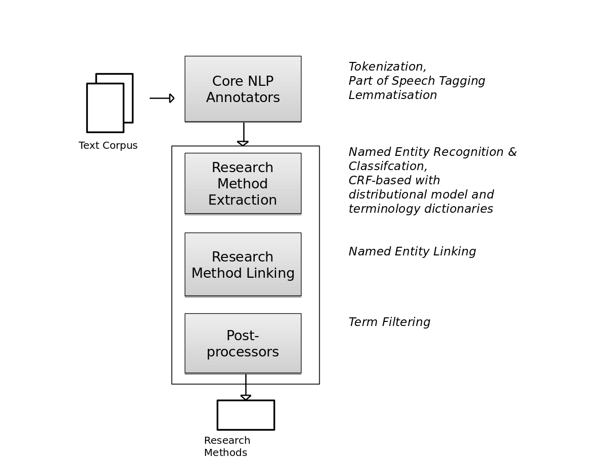

# Chapter 8 - Finding datasets in publications: The GESIS approach

## The contribution of GESIS to the Rich Context Competition

**Authors:** *Wolfgang Otto, Andrea Zielinski, Behnam Ghavimi, Dimitar Dimitrov, Narges Tavakolpoursaleh, Karam Abdulahhad, Katarina Boland, Stefan Dietze*
**Affiliation:** *GESIS – Leibniz Institute for the Social Sciences, Cologne, Germany*
**Corresponding author:** *wolfgang.otto@gesis.org*

Introduction
------------

GESIS - the Leibniz Institute for the Social Sciences (GESIS)[1] is the largest European research and infrastructure provider for the social sciences and offers research, data, services and infrastructures supporting all stages of the scientific process. The GESIS department *Knowledge Technologies for the Social Sciences (WTS)*[2] is responsible for developing all digital services and research data infrastructures at GESIS and aims at providing integrated access to social sciences data and services. Next to traditional social sciences research data, such as surveys and census data, an emerging focus is to build data infrastructures able to exploit novel forms of social sciences research data, such as large Web crawls and archives.

Research at WTS[3] addresses areas such as information retrieval, information extraction & Natural Language Processing (NLP), semantic technologies and human computer interaction and aims at ensuring access and use of social sciences research data along the FAIR principles, for instance, through interlinking of research data, established vocabularies and knowledge graphs and by facilitating semantic search across distinct platforms and datasets. Due to the increasing importance of Web- and W3C standards as well as Web-based research data platforms, in addition to traditional research data portals, findability and interoperability of research data across the Web constitutes one current challenge. In the context of Web-scale reuse of social sciences resources, the extraction of structured data about scholarly entities such as datasets and methods from unstructured and semi-structured text, as found in scientific publications or resource metadata, is crucial in order to be able to uniquely identify social sciences resources and to understand their inherent relations.

Prior works at WTS/GESIS addressing such challenges apply NLP and machine learning techniques to, for instance, extract and disambiguate mentions of datasets[4] (Boland et al., 2012; Ghavimi et al., 2016)), authors (Backes, 2018a, 2018b) or software tools (Boland and Krüger, 2019) from scientific publications or to extract and fuse scholarly data from large-scale Web crawls (Sahoo et al., 2017; Yu et al., 2019). Resulting pipelines and data are used to empower scholarly search engines such as the *GESIS-wide search*[5] (Hienert et al., 2019) which provides federated search for scholarly resources (datasets, publications etc.) across a range of GESIS information systems or the *GESIS DataSearch* platform[6] (Krämer et al., 2018), which enables search across a vast number of social sciences research datasets mined from the Web. Given the strong overlap of our research and development profile with the recent initiatives of the Coleridge Initiative to evolve this research field through the Rich Context Competition (RCC)[7], we are enthusiastic about having participated in the RCC2018 and are looking forward to continue this collaboration towards providing sound frameworks and tools which automate the process of interlinking and retrieving scientific resources.

The central tasks in the RCC are the extraction and disambiguation of mentions of datasets and research methods as well as the classification of scholarly articles into a discrete set of research fields. After the first phase, each team received feedback from the organizers of the RCC consisting of a quantitative and qualitative evaluation. Whereas quantitative results of our inital contribution throughout phase one have shown significant room for improvement, the qualitative assessement, conducted by four judges on a sample of ten documents, underlined the potential of our approach.

Since we have been shortlisted for the second phase of the RCC, this chapter describes our approaches, techniques, and additional data used to address all three tasks. As described in the following subsections, we decided to follow a module-based approach where each module or the entire pipeline can be reused. The remaining chapter is organised as follows. The following Section \[sec:overview\] provides an overview of our approach, used background data and preprocessing steps, whereas Sections  \[sec:dataset-extraction\],  \[sec:research\_method\_extraction\] and  \[sec:field\_classification\] describe our approaches in more detail, including results towards each of the tasks. Finally, we discuss our results in Section \[sec:discussion\] and provide an overview of future work in Section \[sec:conclusion\].

Approach, data and pre-processing
---------------------------------

This section describes the external data sources we used as well as our pre-processing steps.

### Approach overview and initial evaluation feedback

The central tasks in the RCC are the extraction of dataset mentions from text. Even so, we considered the discovery of research methods and research fields important. To this end, we decided to follow a module-based approach. Users could choose to use each specific module solely or as parts of a data processing pipeline. Figure \[figure:pipeline\] shows an overview of modules developed and their dependencies. Here, the upper three modules (which are in gray) describe the pre-processing steps (cf. Section \[sec:prepro\]). The lower four modules (blue) are used to generate the output in a predefined format as specified by the competition.

The pre-processing step consists of extracting metadata and raw text from PDF documents. The output of this step is then used by the software modules responsible for tackling the individual sub-tasks. These sub-tasks are to discover research datasets (cf. Section \[sec:dataset-extraction\]), methods (cf. Section \[sec:research\_method\_extraction\]) and fields (cf. Section \[sec:field\_classification\]). First, a Named Enity Recognition module is used to find dataset mentions. This module used a supervised approach trained on a weakly labled corpus. In the next step, we combine all recognized mentions for each publication and compare these mentions to the metadata from the list of datasets given by the competition. For this linking step the mentions and year information located in the same sentence are used. The corresponding sentence and extracted information are saved for debugging and potential usage in future pipeline components. The task of identifying research methods is done by an adjusted NER module trained on a corpus of scientific publications. For identifying research fields, we trained a classifier on openly available abstracts and metadata from the domain of social sciences crawled from the Social Science Open Access Repository[8] (SSOAR). We tried different classifiers and selected the best performing one, a classifier based on fasttext[9], i.e. a neural net based approach with a high performance(Joulin et al., 2017).

After the first phase, each team received feedback from the organizers of the RCC. The feedback is two folds, a quantitative and qualitative evaluation. Unfortunately, the quantitative assessment showed our algorithm for dataset mention retrieval did not perform well regarding precision and recall metrics. In contrast to this, our approach has been found convincing regarding the quality of results. The qualitative feedback is based on random sample of ten documents given to four judges. The judges were asked to manually extract dataset mentions. After this the overlap between their dataset extractions and the output of our algorithm was calculated. Other factors that judges took into consideration are specificity, uniqueness, and multiple occurrences of dataset mentions. As for the extraction of research methods and fields, no ground truth has been provided; these tasks were evaluated against the judges’ expert knowledge. Similarly to the extraction of dataset mentions, specificity and uniqueness have been considered for these two tasks. The feedback our team received acknowledged the fact that no ground truth has been provided and our efforts regarding the extraction of research methods and fields.

### External data sources

For developing our algorithms, we utilized two external data sources. For the discovery of research methods and fields, we resort to data from the Social Science Open Access Repository[10] (SSOAR). GESIS – Leibniz Institute for the Social Sciences maintains SSOAR by collecting and archiving literature of relevance to the social sciences.

In SSOAR, full texts are indexed using controlled social science vocabulary (Thesaurus[11], Classification[12]) and are assigned rich metadata. SSOAR offers documents in various languages. The corpus of English language publications that can be used for purposes of the competition consists of a total of 13,175 documents. All SSOAR documents can be accessed through the OAI-PMH[13] interface.

Another external source we have used to discover research methods is the ACL Anthology Reference Corpus (Bird et al., 2008). ACL ARC is a corpus of scholarly publications about computational linguistics. The corpus consists of a total of 22,878 articles.

### Pre-processing

Although the organizers of the RCC offered plain texts for the publication, we decided to build our own pre-processing pipeline. The extraction of text from PDF files is still an error prone process. To handle de-hyphenation and paragraph segmentation during extraction time and benefit from automatic metadata extraction (i.e. title, author, abstracts and references) we decided to use a third party extraction tool. The Cermine Extraction Tool[14](Tkaczyk et al., 2015) transforms the files into XML documents using the Journal Article Tag Suite[15](Jats). For the competition we identified two interesting elements of the Jats XML format, i.e., &lt;front&gt; and &lt;body&gt;. The &lt;front&gt; element contains the metadata of the publication, whereas the &lt;body&gt; contains the main textual and graphic content of the publication. As a last step of the pre-processing, we removed all linebreaks from the publication. The output of this step is a list of metadata fields and values, as shown in Table \[tab:example-paragraph\] for each publication paragraph.

|                   | Example Text Field Data         |
|:------------------|:--------------------------------|
| publication\_id   | 12744                           |
| label             | paragraph\_text                 |
| text              | A careful reading of text, word |
|                   | for word, was ...               |
| section\_title    | Data Analysis                   |
| annotations       | \[{’start’: 270, ’end’: 295,    |
|                   | ’type’: ’bibref’, ...           |
| section\_nr       | \[3, 2\]                        |
| text\_field\_nr   | 31                              |
| para\_in\_section | 1                               |

\[tab:example-paragraph\]

Dataset extraction
------------------

### Task description

In the scientific literature, datasets are cited to reference, for example, the data on which an analysis is performed or on which a particular result or claim is based. In this competition, we focus on (i) extracting and (ii) disambiguating dataset mentions from social science publications to a list of given dataset references. Identifying dataset mention in literature is a challenging problem due to the huge number of styles of citing datasets. Although there are proposed standards for dataset citation in full-texts, researchers still ignore or neglect such standards (see, e.g., (Altman and King, 2007)). Furthermore, in many research publication, a correct citation of datasets is often missing (Boland et al., 2012). The following two sentences exemplify the problem of the usage of an abbreviation to make a reference to an existing dataset. The first example illustrates the use of abbreviations that are known mainly in the author’s research domain. The latter illustrates the ambiguity of abbreviations. In this case, *WHO* identifies a dataset published by the World Health Organization and does not refer to the institution itself.
**Example 1**: *P-values are reported for the one-tail paired t-test on *Allbus* (dataset mention) and *ISSP* (dataset mention).*
**Example 2**: *We used *WHO data from 2001* (dataset mention) to estimate the spreading degree of AIDS in Uganda.*
We treat the problem of detecting dataset mentions in full-text as a Named Entity Recognition (NER) task.

#### Formal problem definition

Let *D* denote a set of existing datasets *d* and the knowledge base *K* as a set of known dataset references *k*. Furthermore, each element of *K* is referencing an existing dataset *d*. The Named Entity Recognition and Linking task is defined as (i) the identification of dataset mentions *m* in a sentence, where *m* references a dataset *d* and (ii) linking them, when possible, to one element in *K* (i.e., the reference dataset list given by the RCC).

### Challenges

We focus on the extraction of dataset mentions in the body of the full-text of scientific publications. There are three types if dataset mentions: (i) The full name of a dataset (”National Health and Nutrition Examination Survey“), (ii) an abbreviation (”NHaNES“) or (iii) a vague reference, e.g., ”the monthly statistic“. With all these these types, the NER task faces special challenges. In the first case, the used dataset name can vary in different publications. For instance one publication cites the dataset with ”National Health and Nutrition Examination Survey“ the other could use the words ”Health and Nutrition Survey“. In the case where abbreviations are used, a disambiguation problem occurs, e.g., in ”WHO data“. WHO may describe the World Health Organization or the White House Office. The biggest challenge is again the lack of annotted training data. In the following we describe how we have dealt with this lack of ground truth data.

### Phase one approach

Missing ground truth data is the main problem to handle during this competition. To this end, supervised learning methods for dataset mentions extraction from texts are not applicable without the identification of external training data or the creation of usefull labeled training data from information given by the competition. Because of the lack of existing training data for the task of dataset mention extraction we resort to the provided list of dataset mentions and publication pairs and re-annotate the particular sentences in the publication text. A list of identifying words is provided for some of the known links between publications and a datasets by the competition. These words represent the evidence of the linkage between publication and datasets and are extracted from the publication text. In the course of re-annotation, we search for each of the identifying words in the corresponding publication texts. For each match, we annotate the occurance in our raw text and use these annotations as ground truth. As described in the pre-processing section, our unit for processing the publication text are paragraphs. The re-annotated corpus consists of a list of paragraphs for each publication with stand-off annotations identifying the mentions of datasets (i.e. position of the start and end characters and the entity type for each mention: *dataset*). This re-annotation is then used to train Spacy’s neural network-based NER model[16]. We created a holdout set of 1,000 publications and a training set of size 4,000. Afterwards, we train our model with the paragraphs as a sampling unit. In the training set, 0.45 percent of the paragraphs contained mentions. For each positive training example, we have added one negative sample that contains no known dataset mentions and is randomly selected. We used a batch size of 25 and a dropout rate of 0.4. The model was trained for 300 iterations.

#### Evaluation

We evaluated our model with respect to four metrics: precision and recall, each for strict and for partial match. While the strict match metrics are standard evaluation metrics, the partial match metrics are their relaxed variants in which the degree to which dataset mentions have to match can vary. Consider the following partial match example: “National Health and Nutrition Examination Survey” is the extracted dataset mention, while “National Health and Nutrition Examination Survey (NHANES)” is the true dataset mention. In contrast to the strict version of the metrics, this overlapping match is considered a match for the partial version. The scores describe whether a model is able to find the correct positions of dataset mentions in the texts, even if the start and end positions of the characters are not the same, but the ranges overlap.

| Metric                    | Value |
|:--------------------------|:-----:|
| Precision (partial match) |  0.93 |
| Recall (strict match)     |  0.95 |
| Precision (strict match)  |  0.80 |
| Recall (strict match)     |  0.81 |

\[table:dataset-mention-eval\]

Table \[table:dataset-mention-eval\] show the results of the dataset mention extraction on the holdout set. The model can achieve high strict precision and recall values. As expected, the results are even better for the partial version of the metrics. It means that even if we couldn’t match the dataset mention in a text exactly, we can find the right context with very high precision.

### Phase two approach

In the second phase of the competition, additional 5,000 publications were provided by RCC. We extended our approach to consider the list with dataset names supplied by the organizers and re-annotated the complete corpus of 15,000 publications in the same manner as in phase one to obtain training data. This time we split the data in 80% for training and 20% for test.

#### Evaluation

We resort to the same evaluation metrics as in phase one. However, we calculate precision and recall on the full-text of the publication and not on the paragraphs as in the first phase. Table \[table:dataset-mention-eval-phase-two\] shows the results achieved by our model. We observe lower precision and recall values. Compared to phase one, there is also a smaller difference between the precision and recall values for the strict and partial version of the metrics.

| Metric                    | Value |
|:--------------------------|:-----:|
| Precision (partial match) |  0.51 |
| Recall (partial match)    |  0.90 |
| Precision (strict match)  |  0.49 |
| Recall (strict match)     |  0.87 |

\[table:dataset-mention-eval-phase-two\]

Research method extraction
--------------------------

### Task description

Inspired by a recent work of Nasar et al. (Nasar et al., 2018), we define a list of basic entity types that give key-insights into scholarly publications. We adapted the list of semantic entity types to the domain of the social sciences with a focus on *research methods*, but also including related entity types such as *Theory, Model, Measurement, Tool, Performance*. We suspect that the division into semantic types might be helpful to find *research methods*. The reason is that the related semantic entities types might provide clues or might be directly related to the research method itself.

For example, in order to achieve a certain research goal, an experiment is used in which a certain combination of *methods* is applied to a *dataset*. The methods can be specified as concepts or indirectly through the use of certain *software*. The result is then quantified with a *performance* using a specific measure. **Example**: *P-values* (measurement) are reported for the *one-tail paired t-test* (method) on *Allbus* (dataset) and *ISSP* (dataset).
We selected the entity types *Research Method*, *Research Theory*, *Research Tool* and *Research Measurement* as the target research method related entity types (see Table \[tab:entityTypes\]). This decision is based on an ecxamination of the SAGE ontology given by the RCC as a sample of how research method terms might look like.

|                                     |                   |                     |                                                 |
|:------------------------------------|:------------------|:-------------------:|:------------------------------------------------|
| \[tab:entityTypes\] **Entity type** | **Corresponding** | **Incl. statistic** | **Examples**                                    |
|                                     | **SAGE type**     |     **glossary**    |                                                 |
| Research Method                     | SAGE-METHOD       |                     | Bootstrapping, Active Interviews                |
| Research Measurement                | SAGE-MEASURE      |                     | Latent Variables, Phi coefficient, Z-score      |
| Research Theory                     | SAGE-THEORY       |                     | Frankfurt shool, Feminism, Actor network theory |
| Research Tool                       | SAGE-TOOL         |                     | SPSS, R statistical package                     |

#### Formal problem definition

The task of Named Entity Recognition and Linking is to (i) identify the mentions *m* of research-related entities in a sentence and (ii) link them, if possible, to a reference knowledge base *K* (i.e. the SAGE Thesaurus[17]) or (iii) assign a type to each entity, e.g. a *research method*, selected from a set of predefined types.

### Challenges

There are some major challenges that any named entity recognition, classification and linking system needs to handle. First, regarding NER, identifying the entities boundary is important, thus detecting the exact sequence span. Second, ambiguity errors might arise in classification. For instance,‘range’ might be a domain-specific term from the knowledge base or belong to the general domain vocabulary. This is a challenging task for which context information is required. In the literature, this relates to the problem of **domain adaptation** which includes fine-tuning to specific named entity classes[18]. With respect to entity linking, another challenge is detecting name variations, since entities can be referred to in many different ways. Semantically similar words, synonyms or related words, which might be lexically or syntactically different, are often not listed in the knowledge base (e.g., the lack of certain terms like ‘questioning’ but not ‘questionnaire’). This problem of automatically detecting these relationships is generally known as **linking problem**. Note that part of this problem also results from PDF-to-text conversion which is error-prone. Dealing with incomplete knowledge bases, i.e. **handling of out of vocabulary (OOV) items**, is also a major issue, since knowledge bases are often not exhaustive enough and do not cover specific terms or novel concepts from recent research. Last but not least, the combination of different semantic types gives a more coherent picture of a research article. We hypothesize that such information would be helpful and results in an insightful co-occurrence statistics, and provides additional detail directly related to entity resolution, and finally helps to assess the **relevance of terms** by means of a score.

### Our approach

Our research method extraction tool builds on Stanford’s CoreNLP and Named Entity Recognition System[19]. The information extraction process follows the workflow depicted in Figure \[fig:pipeline\], using separate modules for pre-processing, classification, linking and term filtering.

We envision the task of finding entities in scientific publications as a sequence labeling problem, where each input word is classified as being of a dedicated semantic type or not. In order to handle entities related to our domain, we train a CRF based machine learning classifier with major semantic classes, (see Table \[tab:entityTypes\]), using training material from the ACL RD-TEC 2.0 dataset (QasemiZadeh and Schumann, 2016). Apart from this, we follow a domain adaptation approach inspired by (Agerri and Rigau, 2016) and ingest semantic background knowledge extracted from external scientific corpora, in particular the ACL Anthology (Bird et al., 2008; Gildea et al., 2018). We perform entity linking by means of a new gazetteer based on a SAGE dictionary of Social Research Methods (Lewis-Beck et al., 2003), thus putting a special emphasis on the social sciences. The linking component addresses the synonymy problem and matches an entity despite name variations such as spelling variations. Finally, term filtering is carried out based on termhood and unithood, while scoring is achieved by calculating a relevance score based on TF-IDF (cf. Section \[para:relscore\]).

Our research experiments are based on publications from the Social Science Open Access Repository (SSOAR)[20] as well as the train and test data of the Rich Context Competition corpus[21]. Our work extends previous work on this topic (cf. (Eckle-Kohler et al., 2013)) in various ways: First, we do not limit our study to abstracts, but use the entire fulltext. Second, we focus on a broader range of semantic classes, i.e. *Research Method*, *Research Theory*, *Research Tool* and *Research Measurement*, tackling also the problem of identifying novel entities.

#### Distributed semantic models

For domain adaptation, we integrate further background knowledge. We use topical information from word embeddings trained on an scientific corpus as an additional feature to our NER model. For this, we use agglomerative clustering of the word embeddings to identify topical groups of words. The cluster number of each word is used as additional sequential input feature for our CRF model. Semantic representations of words are a successful extension of common features, resulting in higher NER performance (Turian et al., 2010) and can be trained offline. In this work, the word vectors were learned based on 22,878 documents of the scientific ACL Anthology Reference Corpus[22] using Gensim[23] with the skip gram model (cf. (Mikolov et al., 2013)) and a pre-clustering algorithm[24].

#### Features

The features incorporated into the linear chain CRF are shown in the Table \[tab:features\]. The features depend mainly on the observations and on pairs of adjacent labels, using a log-linear combination. However, since simple token level training of CRFs leads to poor performance, more effective text features such as word shape, orthographic, gazetteer, Part-Of-Speech (POS) tags, along with word clustering (see Section \[subsec:dist-model\]) have been used.

| **Type**                 |                                                    **Features**                                                    |
|:-------------------------|:------------------------------------------------------------------------------------------------------------------:|
| **Token unigrams**       | *w**i* − 2, *w**i* − 1, *w**i*, *w**i* + 1, *w**i* + 2, ... |
| **POS unigrams**         |                           *p**i*, *p**i* − 1, *p**i* − 2                          |
| **Shapes**               |                                              shape and capitalization                                              |
| **NE-Tag**               |                                    *t**i* − 1, *t**i* − 2                                    |
| **WordPair**             |                              (*p**i*, *w**i*, *c**i*)                             |
| **WordTag**              |                                       (*w**i*, *c**i*)                                       |
| **Gazetteer**            |                                                   SAGE Gazetteer                                                   |
| **Distributional Model** |                                                 ACL Anthology model                                                |

#### Knowledge resources

We use the SAGE thesaurus which includes well-defined concepts, an explicit taxonomic hierarchy between concepts as well as labels that specify synonyms of the same concept. A portion of terms is unique to the social science domain (e.g., ‘dependent interviewing’), while others are drawn from related disciplines such as statistics (e.g., ‘conditional likelihood ratio test’)[25]. However, since the thesaurus is not exhaustive and covers only the top-level concepts related to social science methods, our aim was to extend it by automatically extracting further terms from domain-specific texts, in particular from the Social Science Open Access Repository. More concretely, we carried out the following steps to extend SAGE as an off-line step. For step 2 and 3, candidate terms have been extracted by our pipeline for the entire SSOAR corpus.

1.  Assignment of semantic types to concepts (manual)

2.  Extracting terms variants such as abbreviations, synonyms, related terms from SSOAR (semi-automatic)

3.  Computation of term and document frequency scores for SSOAR (automatic)

#### Extracting term variants such as abbreviations, synonyms, and related terms

26,082 candidate terms have been recognized and classified by our pipeline and manually inspected to a) find synonyms and related words that could be linked to SAGE, and b) build a post-filter for incorrectly classified terms. Moreover, abbreviations have been extracted using the algorithm of Schwartz and Hearst (Schwartz and Hearst, 2003). This way, a Named Entity gazetteer could be built and is used at run-time. It comprises 1,111 terms from SAGE and 447 terms from the used glossary of statistical terms[26] as well as 54 previously unseen terms detected by the model-based classifier.

#### Computation of term and document frequency scores

Term frequency statistics have been calculated off-line for the entire SSOAR corpus. The term frequency at corpus level will be used at run time to determine the term relevance at the document level by calculating the TF-IDF scores. The most relevant terms from SAGE are listed in Table \[tab:SAGET\].

| \[tab:SAGET\] **SAGE Term** | **TF-IDF Score** | **Semantic Class** |
|:----------------------------|:-----------------|:-------------------|
| Fuzzy logic                 | 591,29           | Research Method    |
| arts-based research         | 547,21           | Research Method    |
| cognitive interviewing      | 521,13           | Research Method    |
| QCA                         | 463,13           | Research Method    |
| oral history                | 399,68           | Research Method    |
| market research             | 345,37           | Research Field     |
| life events                 | 186,61           | Research Field     |
| Realism                     | 314,34           | Research Theory    |
| Marxism                     | 206,77           | Research Theory    |
| ATLAS.ti                    | 544,51           | Research Tool      |
| GIS                         | 486,01           | Research Tool      |
| SPSS                        | 136,52           | Research Tool      |

#### Definition of a relevance score

Relevance of terminology is often assessed using the notion of *unithood*, i.e. ‘the degree of strength or stability of syntagmatic combinations of collections’, and *termhood*, i.e. ‘the degree that a linguistic unit is related to domain-specific concepts’ (Kageura and Umino, 1996). Regarding *unithood*, the NER model implicitly contains heuristics about legal POS tag sequences for candidate terms, consisting of at least one noun (NN), preceeded or followed by modifiers such as adjectives (JJ), participles (VB\*) or cardinal numbers (CD), complemented by wordshape features.

In order to find out if the candidate term also fulfills the *termhood* requirement, domain-specific term frequency statistics have been computed on the SSOAR repository, and set in contrast to general domain vocabulary terms. It has to be noted that only a small portion of the social science terms is actually unique to the domain (e.g., ‘dependent interviewing’), while others might be drawn from related disciplines such as statistics (e.g., ‘conditional likelihood ratio test’).

#### Preliminary results

Our method has been tested on 100 fulltext papers from SSOAR and ten documents from the Rich Context Competition (RCC), all randomly selected from a hold out corpus. In our experiments on SSOAR Social Science publications, we compared results to the given metadata information. The main finding was that while most entities from the SAGE thesaurus could be extracted and linked reliably (e.g., ’Paired t-test’), they could not be easily mapped to the SSOAR metadata terms, which consist of only a few abstract classes (e.g., ’quantitative analysis’). Furthermore, our tool was tested by the RCC organizer, were the judges reviewed ten random publications and generated qualitative scores for each document. In this evaluation, the research method extraction tool received the overall best results of all competitors for this task.[27]

Research field classification
-----------------------------

### Task description

The goal of this task is to identify the research fields covered in the social science publications. In general, two approaches could be applied to this task. One is the extraction of relevant terms of the publications. It means that this task could be seen as a keyword extraction task and the detected terms considered as descriptive terms regarding the research field. The second approach is to learn to classify publications research fields with the use of annotated data in a superviesed manner. The benifit of the second approach is that the classification scheme to describe the research field can be defined by experts of the domain. The disadvantage of supervised trained classifiers for this task is the lack of applicable training data. Furthermore, it must be ensured that the training data is comparable to the texts the research field classifier should be applied on.

#### Formal problem definition

Let *P* denote a set of publications of size *n*, *A* a set of corresponding abstracts of the same size and *L* a set of *k* defined class labels describing research fields. The task of research field classification is to select for each publication *p**i* ∈ *P* based on the information contained in the corresponding abstract *a**i* ∈ *A* a set of labels *C**i* = ⌀ ∩ {*c*1…*c**n*|*c**n* ∈ *L*} of *n* labels. The number of *n* denotes the number of labels from *L* describing the research field of *a**i* and can vary for each publication *p**i*. If there is no label *l**k* representing the information given by the abstract *a**i* the set of class labels is the empty set ⌀.

### Our approach

Since we didn’t receive any gold standard for this task during the competition we decided to make use of external resources. We decided to use an external labeled dataset to train a text classifier which is able to predict one or moreresearch label for a given abstract of a publication.

The publications given througout the competition belongs to the domain of social sciences we considered metadata from a open access repository for the social sciences called SSOAR. The advantages are twofold. On the one hand, we could rely on professional annotations in a given classification scheme covering the social sciences and related areas. On the other hand the source is openly available.[28]

The annotated data of SSOAR contains four different annotation schemes for research field related information. By reviewing these schemes, we decided to use the Classification Social Science (classoz) annotation scheme. The number of classes in each schema, coverage of each classification, and the distribution of data in each schema affected our decision. An exhausitve description of the used data can be found in \[sec:external\_data\_sources\].

#### Pre-processing and model architecture

SSOAR is a multilingual repository. Therefore, the available abstracts may vary in language and the language of the abstract may differ from the language of the article itself. We selected all English abstract with valid classification as our dataset. Mainly because of the language of the RCC corpus. However, it should be noted that the multilingual SSOAR abstract corpus has a skewed distribution of languages with English and German as the main languages. We count 22,453 English abstracts with valid classification after filtering. Due to the unequal distribution of labels in the dataset, we need to guaranty enough training data for each label. We selected only labels with frequency over 300 for training the model, which results in a total of 44 out of 154 classification labels representing research fields. For creating train and test set, 22,453 SSOAR publications with their assigned labels were split randomly. We used a train/validation/test split of 70/10/20. We decided to train a text classifier based on a fasttext (Joulin et al., 2017) model in the author’s implementation. The arguments to use this model was the speed in comparison to a more complex neural net architecture and the still comparable to state of the art performance (e.g.(Wang et al., 2018)). The model is trained with learning rate 1.0 for 150 epochs. Also, the negative sampling parameter is set to 25.

### Evaluation

Figure \[fig:fields\_precision\_recall\] shows the performance of the model regarding various evaluation metrics for different thresholds. A label is assigned to a publication if the model outputs a probability for the label above the defined threshold. In multi-label classification, this allows us to evaluate our model from different perspectives. As illustrated in figure \[fig:fields\_precision\_recall\], the intersection of the micro precision and the micro recall curves is at the threshold of 0.1, where the highest micro f1 score is achieved. By increasing the threshold from this point, the micro-precision score is increasing, but the micro recall is falling. By decreasing threshold, these trends are inverted. Also, the default threshold of 0.5 doesn’t look promising. In spite of micro-precision about 0.75, we have a problem with the very high number of items without any prediction. In respect to this observation it is advantageous to select a lower threshold in a productive environment. The curve named *without prediction* shows for a given threshold the share of publications in the test set without any prediction. If the selected threshold value is high, the number of publications for which the model cannot predict a research field increases. For example, a selected threshold value of 0.55 leads to 40% unclassified publications in the test set. The *one correct* named curve indicates the quality of the publication wise prediction. It shows the share of all publications in the test set where at least one of the predicted research field labels can be found in the ground truth data. For instance, if a threshold of 0.1 is selected for 75% of the publications in the test set, at least one of the model predictions are correct. This value decreases with increasing threshold simmilar to the recall metric. The final micro f1 value on the test set for our model and a selected threshold of 0.1 is 0.56 (precison 0.55, recall 0.56).

Discussions and Limitations
---------------------------

#### Dataset Extraction.

For the dataset extraction task, the proposed methods are only tested on social science related data. The performance measures we have introduced are based on a hold out data set of our automatically created dataset. Especially the recall may be biased given that our training as well as testing data is biased towards known datasets, where datasets not yet part of our reference set are not considered.

The results of the second phase presented during the RCC workshop[29] are showing good performance of our approach in comparison to the other finalist teams with the highest precision 52.2% (second: 47.0%) and second in recall (ours: 20.5, best: 34.8%). With respect to F1, our approach provides the second best performing system for this task (29.5%, 40.0% for first place). The results on the manually created hold out set underline, that our system performs better in respect to precision in comparison to the other finalist teams. Given that our models are supervised through a corpus of social sciences publications, we anticipate limited generalisability across other discipline and plan to investigate this aspect as part of future work. In this context, the focus of our training data towards survey data, also reflected in dataset titles such as *Current Population Survey*, could have biased the model to detect the survey as a specific type of research datasets better than other subtypes like e.g. text corpora in the NLP community. In general, however, our apporach to use a weakly labled corpus created using a list of datast names could be applied in other research domains.

#### Research method extraction.

We consider the extraction of research methods from full text as the most challenging task. This is because the sample vocabulary given by the RCC covers a large thematic areai. The task itself was defined as the identification of research methods associated with a specific publication, which in turn are drawn from a specific research field. Since no training data has been provided, we combined models from another research domain with a manually currated extension of known research method terms. The qualitative reviews during the two phases of the competiton attested that this approach works.

#### Research field classification.

Our supervised machine learning approach to handle the research field classification task performs well on the dataset created from social science publication metadata. A micro F1 measure of above 55% seems to indicate reasonable performance considering the small dataset with 44 labels and a mean number of keywords of three terms per publication. As one example of multilabel classification with a comparable size of labels we would like to mention the classification of texts in the domain of medicine presented in (Wang et al., 2018). The models tested by the authors on the task of multilabel prediction from 50 different labels leads to micro F1 values between 53% and 62%.
Considering the evaulation approach, focused on publications from the social sciences, the generalisability across other disciplines remains unclear and requires further research. Even though the used classification scheme may cover neighbouring disciplines, for instance, medicine, the numbers of samples of the training data covering other research fields than the social science is limited. Our pragmatic approach approach of basing our classifications on the abstract of the publications makes it applicable even in scenarios where the full-text of publications is not accessible.

Conclusion
----------

This chapter has provided an overview on our solutions submitted to the Rich Context Competition 2018. Aimed at improving search, discovery and interpretability of scholarly resources, we are addressing three distinct tasks all aimed at extracting structured information about research resources from scientitifc publications, namely the extraction of dataset mentions, the extraction of mentions of research methods and the classification of research fields.

In order to address all aforementioned challenges, our pipelines make use of a range of preprocessing technniques together with state-of-the-art NLP methods as well as supervised machine learning approaches tailored towards the specific nature of scholarly publications as well as the dedicated tasks. In addition, background datasets have been used to facilitate supervision of methods at larger scale.

Our results indicate both significant opportunities for automating the aforementioned three tasks but also their challenging nature, in particular given the lack of publicly available gold standards for training and testing. Aggregating and publishing such data has been identified as important activity for future work, and is a prerquisite for significantly advancing state-of-the-art methods.

Acknowledgments
---------------

This work has been partially funded by Deutsche Forschungsgemeinschaft (DFG) under grant number MA 3964/7-1.

References
----------

Agerri R and Rigau G (2016) Robust multilingual named entity recognition with shallow semi-supervised features. *Artificial Intelligence* 238. Elsevier: 63–82.

Altman M and King G (2007) A proposed standard for the scholarly citation of quantitative data. *D-lib Magazine* 13(3/4).

Backes T (2018a) Effective unsupervised author disambiguation with relative frequencies. In: *JCDL* (eds J Chen, MA Gonçalves, JM Allen, et al.), 2018, pp. 203–212. ACM. Available at: <http://dblp.uni-trier.de/db/conf/jcdl/jcdl2018.html#Backes18>.

Backes T (2018b) The impact of name-matching and blocking on author disambiguation. In: *CIKM* (eds A Cuzzocrea, J Allan, NW Paton, et al.), 2018, pp. 803–812. ACM. Available at: <http://dblp.uni-trier.de/db/conf/cikm/cikm2018.html#Backes18>.

Bird S, Dale R, Dorr BJ, et al. (2008) The acl anthology reference corpus: A reference dataset for bibliographic research in computational linguistics. In: *Proceedings of the sixth international conference on language resources and evaluation (lrec 2008)*, 2008. European Language Resources Association (ELRA).

Boland K and Krüger F (2019) Distant supervision for silver label generation of software mentions in social scientific publications. In: *Proceedings of the 4th joint workshop on bibliometric-enhanced information retrieval and natural language processing for digital libraries*, 2019, pp. 15–27.

Boland K, Ritze D, Eckert K, et al. (2012) Identifying references to datasets in publications. In: *International conference on theory and practice of digital libraries*, 2012, pp. 150–161. Springer.

Eckle-Kohler J, Nghiem T-D and Gurevych I (2013) Automatically assigning research methods to journal articles in the domain of social sciences. In: *Proceedings of the 76th asis&T annual meeting: Beyond the cloud: Rethinking information boundaries*, 2013, p. 44. American Society for Information Science.

Finkel JR, Grenager T and Manning C (2005) Incorporating non-local information into information extraction systems by gibbs sampling. In: *Proceedings of the 43rd annual meeting on association for computational linguistics*, 2005, pp. 363–370. Association for Computational Linguistics.

Ghavimi B, Mayr P, Lange C, et al. (2016) A semi-automatic approach for detecting dataset references in social science texts. *Information Services & Use* 36(3-4). IOS Press: 171–187.

Gildea D, Kan M-Y, Madnani N, et al. (2018) The acl anthology: Current state and future directions. In: *Proceedings of workshop for nlp open source software (nlp-oss)*, 2018, pp. 23–28.

Hienert D, Kern D, Boland K, et al. (2019) A digital library for research data and related information in the social sciences. In: *JCDL* (eds M Bonn, D Wu, JS Downie, et al.), 2019, pp. 148–157. IEEE. Available at: <http://dblp.uni-trier.de/db/conf/jcdl/jcdl2019.html#HienertKBZM19>.

Joulin A, Grave E, Bojanowski P, et al. (2017) Bag of tricks for efficient text classification. In: *Proceedings of the 15th conference of the european chapter of the association for computational linguistics: Volume 2, short papers*, April 2017, pp. 427–431. Association for Computational Linguistics.

Kageura K and Umino B (1996) Methods of automatic term recognition: A review. *Terminology. International Journal of Theoretical and Applied Issues in Specialized Communication* 3(2). John Benjamins Publishing Company: 259–289.

Krämer T, Klas C-P and Hausstein B (2018) A data discovery index for the social sciences. In: *Scientific data*, 2018.

Lewis-Beck M, Bryman AE and Liao TF (2003) *The Sage Encyclopedia of Social Science Research Methods*. Sage Publications.

Mikolov T, Sutskever I, Chen K, et al. (2013) Distributed representations of words and phrases and their compositionality. In: *Advances in neural information processing systems*, 2013, pp. 3111–3119.

Nasar Z, Jaffry SW and Malik MK (2018) Information extraction from scientific articles: A survey. *Scientometrics* 117(3). Springer: 1931–1990.

QasemiZadeh B and Schumann A-K (2016) The acl rd-tec 2.0: A language resource for evaluating term extraction and entity recognition methods. In: *LREC*, 2016.

Sahoo P, Gadiraju U, Yu R, et al. (2017) Analysing structured scholarly data embedded in web pages. *Lecture Notes in Computer Science* 9792. Springer.

Schwartz AS and Hearst MA (2003) A simple algorithm for identifying abbreviation definitions in biomedical text. In: *Pacific symposium on biocomputing*, 2003, pp. 451–462.

Tkaczyk D, Szostek P, Fedoryszak M, et al. (2015) CERMINE: Automatic extraction of structured metadata from scientific literature. *International Journal on Document Analysis and Recognition (IJDAR)* 18(4). Springer: 317–335.

Turian J, Ratinov L and Bengio Y (2010) Word representations: A simple and general method for semi-supervised learning. In: *Proceedings of the 48th annual meeting of the association for computational linguistics*, Stroudsburg, PA, USA, 2010, pp. 384–394. ACL ’10. Association for Computational Linguistics. Available at: <http://dl.acm.org/citation.cfm?id=1858681.1858721>.

Wang G, Li C, Wang W, et al. (2018) Joint embedding of words and labels for text classification. *arXiv preprint arXiv:1805.04174*.

Yu R, Gadiraju U, Fetahu B, et al. (2019) KnowMore - knowledge base augmentation with structured web markup. *Semantic Web* 10(1): 159–180. Available at: <http://dblp.uni-trier.de/db/journals/semweb/semweb10.html#YuGFLRD19>.

[1] <https://www.gesis.org/en/institute>

[2] [ https://www.gesis.org/en/institute/departments/knowledge-technologies-for-the-social-sciences/]( https://www.gesis.org/en/institute/departments/knowledge-technologies-for-the-social-sciences/)

[3] <https://www.gesis.org/en/research/applied-computer-science/labs/wts-research-labs>

[4] <https://www.gesis.org/en/research/external-funding-projects/archive/infolis-i-and-ii>

[5] [search.gesis.org](search.gesis.org)

[6] <https://datasearch.gesis.org/>

[7] <https://coleridgeinitiative.org/richcontextcompetition>

[8] <https://www.ssoar.info>

[9] <https://fasttext.cc/>

[10] <https://www.gesis.org/ssoar/home>

[11] <https://www.gesis.org/en/services/research/tools/thesaurus-for-the-social-sciences>

[12] <https://www.gesis.org/angebot/recherchieren/tools-zur-recherche/klassifikation-sozialwissenschaften> (in German)

[13] <http://www.openarchives.org>

[14] <https://github.com/CeON/CERMINE>

[15] <https://jats.nlm.nih.gov>

[16] [spacy.io](spacy.io)

[17] http://methods.sagepub.com

[18] apart from those used in traditional NER systems like *Person*, *Location*, or *Organization* with abundant training data, as covered in the Stanford NER system(Finkel et al., 2005)

[19] <https://nlp.stanford.edu/projects/project-ner.shtml>

[20] <https://www.ssoar.info>

[21] <https://coleridgeinitiative.org/richcontextcompetition> with a total of 5,000 English documents

[22] <https://acl-arc.comp.nus.edu.sg/>

[23] <https://radimrehurek.com/gensim/>

[24] Word embeddings are trained with a skip gram model using embedding size equal to 100, word window equal to 5, minimal occurrences of a word to be considered 10. Word embeddings are clustered using agglomerative clustering with a number of clusters set to 500, 600, 700. Ward linkage with Euclidean distance is used to minimize the variance within the clusters.

[25] A glossary of statistical terms as provided in <https://www.statistics.com/resources/glossary/> has been added as well.

[26] Based on <https://www.statistics.com/resources/glossary>

[27] Rank: 1,2,2,1,1 for judges 1-5.

[28] A script to download the metadata of SSOAR can be found in github/research-field-classifier

[29] Agenda of the Workshop: <https://coleridgeinitiative.org/richcontextcompetition/workshopagenda>. The results of the finalists are presented here: <https://youtu.be/PE3nFrEkwoU?t=9865>.
