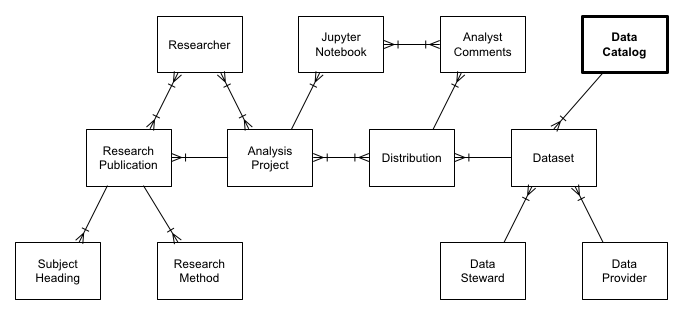
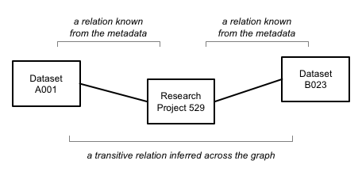
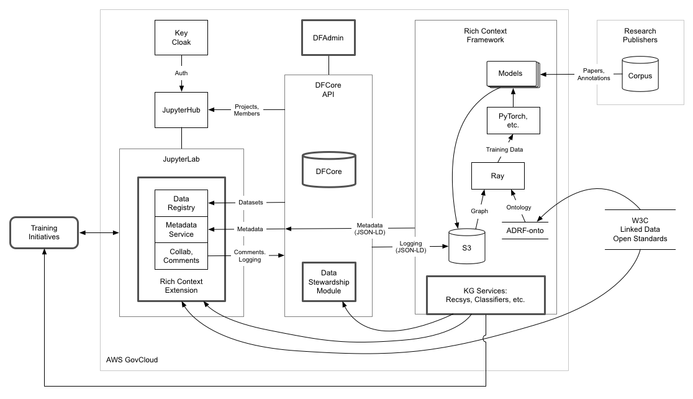

# Chapter 13 - The Future of AI in Rich Context

**Paco Nathan**

The setting for Rich Context originated in needs to analyze confidential micro-data for [evidence-based policymaking](https://en.wikipedia.org/wiki/Foundations_for_Evidence-Based_Policymaking_Act).
The nature of that work involves collaboration using [_linked data_](http://linkeddata.org/), with strict requirements for data privacy and security, plus provisions for data stewardship and dataset curation.
Due to the highly regulated environments, that data cannot be examined outside of its specific use cases.
In a world where public search engines crawl and index millions of terabytes, making search results available within milliseconds to anyone with a browser and an Internet connection, the setting for Rich Context may appear utterly alien.
Seemingly, a reasonable compromise would be to run queries of sensistive data within their secure environments, and otherwise leave the process unexamined.

However, there’s a broader scope to consider, far beyond the process of managing research projects or curating particular datasets.
The great challenges of our time are human in nature – climate change, terrorism, overuse of natural resources, the nature of work, and so on – and these require robust social science to understand their causes and consequences.
Effective use of data for social science research depends on understanding how datasets have been produced and how they’ve been used in previous works.
That understanding of data provenance is complicated by the fact that research often must link datasets from different data producers, different agencies, different organizations.

Other factors confound this situation.
On the one hand, the availability of inexpensive computing resources, ubiquitous connected mobile devices, social networks with global reach, etc., implies that researchers can acquire large, rich datasets.
Researchers can also fit statistical models that might have seemed intractably complex merely a decade ago.
On the other hand, accumulating important information about datasets, their provenance, and their usage has historically been a manual process.
Sharing this kind of information across organizations is difficult in general, and when datasets include confidential data about human subjects it becomes impossible to provide open access to the original data.
These issues combine to contribute to a lack of reproducibility and replicability in the study of human behavior, and threaten the legitimacy and utility of social science research.

The problems enumerated above make it difficult for people to understand about data usage, although at the same time they present opportunities for leveraging automation.
Consider how one of the major challenges in social science research is search and discovery: the vast majority of data and research results cannot be easily discovered by other researchers.
From one perspective, researchers are the users of micro data and its related [_metadata_](https://en.wikipedia.org/wiki/Metadata) – in other words, information about the structure of datasets, their provenance, etc. – and those researchers produce outcomes, often in the form of publications.
Publications accumulate expertise and nuances about datasets, including the data preparation required, research topics and methodology, what kinds of analyses were attempted and ultimately used, which information within the datasets was most valuable for the results obtained, and so on.
These details produced through publications represent _metadata about datasets_.
While the metadata within publications may be relatively unstructured – i.e., not explicitly articulated, nor shared outside of the current project – advances in machine learning provide means to extract metadata from unstructured sources.

The exchange of metadata plays another important role.
From the perspective of a data publisher (i.e., an agency) the many concerns about security and data privacy indicate use of _tiered access_ for sensitive data.
Datasets which do not contain sensitive data may be made freely available to the public as [_open data_](https://www.data.gov/).
Other datasets may require DUAs before researchers can access them.
So the data sharing may need to be organized in tiers.
Nonetheless, metadata for the private tiers in many cases may still be shared even though the data cannot be linked directly without explicit authorizations and stewardship.
So metadata provides a role of exchanging information about sensitive data, in ways that can be accumulated across a broader scope than individual research projects.

The opportunity at hand is to leverage machine learning advances to create feedback loops among the entities involved: researchers, datasets, data publishers, publications, and so on.
A new generation of tooling for search and discovery could leverage that to augment researchers: informing them about what datasets are being used, in which research fields, the tools involved, as well as the methods used and findings from the research.

## The Case for Rich Context

Consider the two most fundamental workflows within Rich Context, where analysts and other researchers interact among data providers, data stewards, training programs, security audits, etc.:

 -  **Collaboration and Workspace:** where researchers collaborate within a secured environment, having obtained authorizations via NDAs (non-disclosure agreements), DUAs (data use authorizations), etc.
 -  **Data Stewardship:** where data stewards can review and determine whether to approve requests for using the datasets that they curate, and then monitor and report on subsequent usage.

These components represent _explicitly_ linked feedback loops among the researchers, projects, datasets, and data stewards.
Researchers also use other _implicitly_ linked feedback loops externally to draw from published social science research.
Overall, the general category of linked data describes these interactions.

A large body of AI applications leverages linked data.
Related R&D efforts have focused mostly on public search engines, e-commerce platforms, and research in life sciences – while in social science research the use of this technology is relatively uncharted territory.
Also, given the security and compliance requirements involved with sensitive data, the process of leveraging linked data in social science research takes on nuanced considerations and compels novel solutions.

This area of focus represents the core of Rich Context: the interconnection of point solutions that facilitate research, as explicit feedback loops, along with means to leverage the implicit feedback loops that draw from published research.
Making use of AI applications to augment social science research is the goal of Rich Context work, and that interconnection of feedback loops, through a graph, creates a kind of _virtuous cycle_ for metadata – analogous to the famous [virtuous cycle of data](https://youtu.be/21EiKfQYZXc) required for AI applications in industry, as described Andrew Ng.

In general, guidance for Rich Context can be drawn from the FAIR[^1] data principles for data management and data stewardship in science.
The FAIR acronym stands for _Findable_, _Accessible_, _Interoperable_, and _Reusable_ data, addressing the issue of reproducibility in scientific research.
One observation from the original FAIR paper describes core tenets of Rich Context:

> Humans, however, are not the only critical stakeholders in the milieu of scientific data. Similar problems are encountered by the applications and computational agents that we task to undertake data retrieval and analysis on our behalf. These ‘computational stakeholders’ are increasingly relevant, and demand as much, or more, attention as their importance grows. One of the grand challenges of data-intensive science, therefore, is to improve knowledge discovery through assisting both humans, and their computational agents, in the discovery of, access to, and integration and analysis of, task-appropriate scientific data and other scholarly digital objects.

In other words, throughout the use cases for scientific data there are substantial opportunities for human-in-the-loop AI approaches, where the people involved increasingly have their work augmented by automated means, while the automation involved increasingly gets improved by incorporating human expertise.
One can use the metaphor of a _graph_ to represent the linkages: those that span across distinct research projects, those that require cross-agency collaboration with sensitive data, and those that integrate workflows beyond the scope of specific tools.
Specifically, this work entails the development of a [_knowledge graph_](https://en.wikipedia.org/wiki/Knowledge_base) to represent metadata about datasets, researchers, projects, agencies, etc., – including the computational agents involved – as distinct entities connected through relations that model their linkage.

Much of the intelligence in this kind of system is based on leveraging inference across the graph, insights which could not be inferred within the scope of a single research project or through the use of one particular tool.
Over time, the process accumulates a richer context of relations into that graph while clarifying and leveraging the feedback loops among the entities within the graph.
Rich Context establishes foundations for that work in social science research.

The [Rich Context Competition](https://coleridgeinitiative.org/richcontextcompetition#problemdescription) held during September 2018 through February 2019 invited AI research teams to compete in one aspect of Rich Context requirements.
Several teams submitted solutions to automate the discovery of research datasets along with associated research methods and fields, as identified in social science research publications.
Methods for machine learning and text analytics used by the four finalist teams provided complementary approaches, all focused on the problem of [_entity linking_](https://en.wikipedia.org/wiki/Entity_linking), with a corpus of social science research papers used as their training data.

The results of the competition provided metadata to describe links among datasets used in social science research. In other words, the outcome of the competition generated the basis for a moderately-sized knowledge graph.
There are many publication sources to analyze, and the project will pursue that work as an ongoing process to extract the implied metadata.
Meanwhile the increasing adoption and usage of the ADRF framework continues to accumulate metadata directly.

## Use Cases for Rich Context

Looking at potential use cases for Rich Context more formally, we can identify needs for leveraging a knowledge graph about research datasets and related entities.
For each of these needs, we can associate solutions based on open source software which have well-known use cases in industry.

As an example, consider a dataset _A001_ published by a data provider _XYZ Agency_ where _Jane Smith_ works as the data steward responsible for curating that dataset.
Over time, multiple research projects describe the use of _A001_ in their published results.
Some researchers note, on the one hand, that particular columns in data tables within _A001_ have some troubling data quality issues – inconsistent names and acronyms, identifiers that require transformations before they can be used to join with other datasets, and so on.
On the other hand, the body of research related to _A001_ illustrates how it gets joined frequently with another dataset _B023_ to support analysis using a particular research method.
The two datasets provide more benefits when used together.

While access to the _A001_ dataset gets managed through the _XYZ Agency_ and its use of the ADRF framework, other datasets such as _B023_ get used outside of that context.
A knowledge graph is used to accumulate information about the datasets, research projects, the resulting published papers, etc., and applications for augmenting research derive quite directly from that graph.
For example, feedback from researchers about how _A001_ gets combined with other datasets outside of the _XYZ Agency_ domain help guide _Jane Smith_ to resolve some of the data quality issues.
New columns get added with cleaner data for identifiers, which allows more effective linking.
Other feedback based on machine learning models that have classified published papers then helps recommend research methods and candidate datasets to new analysts – and also to agencies that have adjacent needs, but did not previously have visibility into the datasets published by _XYZ Agency_.

These are the kinds of applications that become enabled through Rich Context.
Search and discovery is clearly a need, although other use cases can help improve the discovery process and enhance social science research.
The following sections discuss specific use cases and their high-level requirements for the associated technologies.

### Search and Discovery

As described above, the vast majority of social science data and research results cannot be easily discovered by other researchers.
While public search engines based on keyword search have been popularized by e-commerce platforms such as Google and Bing, the more general problem of search and discovery can be understood best as a graph problem, and the needs in social science research are more formally understood as recommendations across a graph.

For example, starting with a given dataset, who else has worked with that data?
Which topics did they research?
Which methods did they use?
What were their results?
In other words, starting from one entity in a knowledge graph, what other neighboring entities are linked?

These kinds of capabilities may be implemented simply by users traversing directly through the links of the graph.
However, at scale, that volume of information can become tedious and overwhelming.
It’s generally more effective for user experience (UX) to have machine learning models summarize, then predict a set of the most likely paths through the graph from a particular starting point.

One good approach for this is the general case of _link prediction_[^2]: given a researcher starting with a particular dataset and goals for topics or methods, represent that as a local, smaller graph.
Then use link prediction to fill-in missing entities and relations, extending the local graph for that researcher.
In other words, what other datasets should be joined, how can particular fields be used, what research topics or methods are related, which published papers might become foundations for this work?
The most likely links inferred become top recommendations.
Also, this kind of recommendation is not limited to the start of projects, it can be leveraged at almost any stage of research.

### Entity Linking

The Rich Context Competition demonstrated how entities and relations used to construct a knowledge graph can be mined from a corpus of scientific papers.
Machine learning methods for _entity linking_[^3] used in the competition need to be generalized and extended, then used to analyze the ongoing stream of published social science research.
This work provides potential benefits for the publishers, for example helping them analyze and annotate newly published papers, developing dashboards about data impact metrics for journals or authors, and so on.

An additional benefit of entity linking is to help correct abbreviations, localized acronyms, or mistakes in linked data references.
This is an iterative process which will need integration and feedback with data stewardship workflows.

### Classifiers

As any researcher or librarian knows well, curating a large set of research papers by hand is labor-intensive and prone to errors.
Machine learning models based on _supervised learning_ or _semi-supervised learning_ (human-in-the-loop) can produce classifiers that annotate research papers automatically.

At some point, the ADRF framework may run classifiers on the workflows (e.g., Jupyter notebooks) for projects in progress.
By extension, classifiers may infer across the knowledge graph to add annotations for datasets as well.
This work can be considered a subset of link prediction, also related to entity linking.

### Transitive Inference

The metadata collected through the use of the ADRF framework or extracted from research publications includes relations that link entities in the graph.
Once a graph is constructed, additional relations may be inferred.
This is a case of [_transitive inference_](https://en.wikipedia.org/wiki/Transitive_relation), which can help add useful annotations to the graph, as shown in the following diagram:

In an example from Norse mythology, Torunn is the daughter of Thor, and Thor is the son of Gaea, therefore Torun is the _granddaughter_ of Gaea.
The same process can apply, for example, to relations that describe links between datasets and researchers.

Note that embeddings have proven to be a powerful approach for inference about patterns, based on deep learning.
On the current forefront of AI research, methods that leverage _reinforcement learning_[^4] are positioned to outperform embeddings soon, since they explore/exploit the graph structure instead of relying on a history of observed patterns.
This is especially useful for _knowledge graph completion_, where there are cases of incomplete metadata in the knowledge graph, which is essential for Rich Context work.

### Iterative Improvement of the Knowledge Graph

Most of the finalist teams in the Rich Context Competition made use of other existing graphs to bootstrap their machine learning development work, such as the [Microsoft Academic Graph](https://docs.microsoft.com/en-us/academic-services/graph/reference-data-schema), [Semantic Scholar](http://api.semanticscholar.org/corpus/), and others purpose-built for the competition.
Those teams cited how some graph would need to be extended in the future, to improve recognition accuracy.

Rich Context now subsumes that effort, making the iterative improvement of the knowledge graph an ongoing priority.
In lieu of those other graphs used for bootstrap purposes during the competition, the Rich Context knowledge graph provides the foundation for machine learning.

This process of accreting more entities into the graph and refining their relations leads to better training data and improved machine learning models.
Over time, as our models improve, the previously analyzed research papers can be re-evaluated to extract richer results.
That work in turn enhances social science research within the ADRF framework, along with data curation.
That overall dynamic represents the virtuous cycle of metadata, which continually improves Rich Context.

### Axioms for Dataset Curation

Another immediate use of Rich Context is to assist the data stewards to understand the broader scope of usage for the datasets that they curate.
For example, ontology _axioms_ used on the metadata in the graph can help analyze:

 - consistency checks for the incoming metadata
 - which data stewardship rules apply in a given case

In a way, that helps codify what would otherwise be “institutional lore” – instead that's now captured for others to study, use for training new staff, etc.

Note that the ADRF framework must provide means for customizing and configuring these kinds of axioms, so that data stewardship rules rules are not tightly coupled with the security audits and release cycle.
Those rules can change rapidly, depending on new legislation or other policy updates, or even due to different agency environments.

## Leveraging Open Standards and Open Source

Overall, the Rich Context portion of the ARDF framework represents a _data catalog_ along with associated _data governance_ practices.
As a first step in knowledge graph work, we can make use of existing open standards for metadata about data catalogs and datasets.
For example, the [W3C Data Activity](https://www.w3.org/2013/data/) coordinates a wide range of metadata standards, including:

- [DCAT](https://www.w3.org/TR/vocab-dcat/) – metadata about data catalogs
- [VoID](https://www.w3.org/TR/void/#dataset) – metadata about datasets
- [DCMI](http://dublincore.org/specifications/dublin-core/dcmi-terms/) – Dublin Core metadata terms
- [SKOS](https://www.w3.org/TR/swbp-skos-core-guide/) – “simple knowledge organization system”

These represent [controlled vocabularies](https://en.wikipedia.org/wiki/Controlled_vocabulary) described in [OWL](https://www.w3.org/OWL/) and based atop [RDF](https://www.w3.org/RDF/).
These standards can be combined and extended to suit the needs of specific use cases, such as within the ADRF framework.
In particular, the Rich Context knowledge graph is a superset of a [_DCAT-compliant data catalog_](https://www.w3.org/TR/vocab-dcat/#conformance).
Taken together, localized extensions of these open standards represent an [ontology](https://en.wikipedia.org/wiki/Ontology_(information_science)) – essentially as a specification for defining metadata that can be added into the knowledge graph and how that graph should be structured.
Development of that ontology along with example metadata plus Python code to validate the graph is managed in the public repository [adrf-onto](https://github.com/Coleridge-Initiative/adrf-onto/wiki) on GitHub.

The workflows within the ADRF framework represent use cases of data governance, and there is substantial overlap between Rich Context and emerging trends for data governance in industry.
There are open source projects which leverage knowledge graphs to collect metadata about datasets and their usage, where machine learning helps address the complexities[^5] of data governance in industry data science work.
For instance:

- [Amundsen](https://eng.lyft.com/amundsen-lyfts-data-discovery-metadata-engine-62d27254fbb9) from Lyft
- [Marquez](https://marquezproject.github.io/marquez/) from WeWork
- [WhereHows](https://github.com/linkedin/WhereHows) from LinkedIn
- [Databook](https://eng.uber.com/databook/) from Uber (pending release as open source)

Of course the Rich Context work addresses special considerations for sensitive data and compliance requirements.
Even so, much can be learned from these related open source projects in industry, which are pursuing similar kinds of use cases.
[TopQuadrant](https://www.topquadrant.com/) and [AstraZeneca](https://www.astrazeneca.com/) are examples of commercial vendors which construct knowledge graphs about datasets, also for data governance purposes – respectively in the Finance and Pharma business verticals.
These commercial solutions similarly make use of DCAT, VoID, DMCI, SKOS, and also the FAIR data principles.

In general, the subject of metadata exchange for data governance use cases is addressed by the [ODPi](https://www.odpi.org/) open standard [Egeria](https://www.odpi.org/projects/egeria) and related work by Mandy Chessell[^6], et al., including the [Apache Atlas](https://atlas.apache.org/) open source project.
Much of that work focuses on standards used to validate the exchange of metadata reliably across different frameworks.
This implies potential opportunities for Rich Context to interoperate with other data governance solutions or related metadata services.

To help establish open standards and open source implementations related to Rich Context, the ADRF team has collaborated with [Project Jupyter](https://jupyter.org/).
A new Rich Context feature set is being added to [JupyterLab](https://jupyterlab.readthedocs.io/en/stable/), which is one of the key open source projects used in the architecture of the ADRF framework, and these new features will be integrated into its future releases.
The new Rich Context features support projects as top-level entities, real-time collaboration and commenting, data registry, metadata handling, annotations, and usage tracking – as described in the Project Jupyter “press release” requests for comments: [data explorer](https://github.com/jupyterlab/jupyterlab-data-explorer/blob/master/press_release.md), [metadata explorer](https://github.com/jupyterlab/jupyterlab-metadata-service/blob/master/press_release.md), and [commenting](https://github.com/jupyterlab/jupyterlab-commenting/blob/master/press_release.md).
For example, a team of social science researchers working on a project could use the commenting feature in Jupyter to make an annotation about data quality issues encountered in a particular dataset.
That comment, as metadata about the dataset, would get imported into the knowledge graph, and could later be used for recommendations to a data steward or other researchers.

Note that most of the machine learning approaches referenced above are specific cases of [_deep learning_](https://en.wikipedia.org/wiki/Deep_learning), based on layered structures of artificial neural networks. In particular, _graph embedding_[^7] is an approach that vectorizes portions of graphs to use as training data for deep learning models.
Graph embedding can be used to perform entity linking, link prediction, etc.
In many of these cases, the resulting machine learning models become proxies for the graph data, such that the entire knowledge graph data is not required in production use cases.
That practice contrasts earlier and generally less effective approaches which relied on graph queries applied to the full data.
Note that the [winning team](https://ocean.sagepub.com/blog/an-interview-with-the-allen-institute-for-artificial-intelligence) in the Rich Context Competition was from [Allen AI](https://allenai.org/) which is a leader in the field of using embedded models for natural language.
Typical open source frameworks which are popular for deep learning research include [PyTorch](https://pytorch.org/) (from Facebook) and the more recent [Ray](https://ray.readthedocs.io/en/latest/distributed_training.html) (from UC Berkeley RISElab).

## System Architecture Overview

The following diagram illustrates a proposed system architecture for Rich Context as an additional module in the ADRF framework:

Building on the DFCore features plus the Data Stewardship module, Rich Context provides both a destination for metadata (logging events from components, or extracted metadata from analysis of publications) and a source for metadata ontology used in the ADRF framework.
Machine learning models get trained and updated based on the knowledge graph, then used for services (recommender system, classifiers, etc.) provided back into the ADRF framework, and additionally to support training initiatives – or for general purpose search and discovery by researchers.

The additional system components for implementing Rich Context are based primarily on open source software (e.g., PyTorch) and extensions of open standards (e.g., W3C), all within the security context of AWS GovCloud implementation of the ADRF framework.

## Trends, from origins to near-term future projections

Meanwhile, the development of Rich Context has followed a familiar progression, echoing how the history of IT and data analytics practices matured over decades -- albeit at a much faster pace.
That progression indicates likely directions for how AI applications will come into use for Rich Context.
Initial steps for Rich Context allowed researchers to analyze and report about sensistive data, while maintaining security and privacy compliance.
That's roughly analogous to data analytics during the heyday of _enterprise data warehouses_ and _business intelligence_ during the 1990s.
Subsequent work improved online workflows for data stewards, adding reports about usage along with some metadata derived as "exhaust" from logs.
That's roughly analogous to "data driven" organizations that emerged during the late 2000s after initial adoption of _data science_ practices.
Next steps, such as the Rich Context Competition, began to use _machine learning models_ to extract metadata that was embedded in unstructured data (i.e., research publication) to augment research efforts.
That's roughly analogous to the trends of machine learning adoption in industry during the mid 2010s.
In the immediate future, Rich Context applications begin to leverage  inference based on _knowledge graph_ representations about researchers, datasets, publications, data stewards, and so on.
Contemporary work in _deep learning_ promises AI-based applications that can leverage embeddings in the graph, to give social science researchers better recommendations for their work.
While that depends on historical patterns, current research on _reinforcement learning_ to explore/exploit the structure of graphs can move beyond history and patterns, effectively considering "what if" scenarios that suggest unexplored research opportunities.
That echoes the contemporary AI landscape, leading into the 2020s.

## Summary

Rich Context recognizes that social science research depends on _linked data_ usage of micro data and its metadata.
Effective management of that metadata is based on a graph that exists outside the context of component point solutions and specific workflows.
While there is substantial use of linked data for ecommerce platforms and research in life sciences, social science research presents nuances and new challenges that haven’t been addressed previously.

The Rich Context portions of the ADRF framework interconnect workflows that facilitate research – as explicit feedback loops in the graph – along with means to extract metadata from published research – as implicit feedback loops in the graph.
That process creates a kind of virtuous cycle for metadata, making use of AI applications to augment social science research, with continual improvement of the entities and relations represented within the graph.

A prerequisite was to create a corpus of research publications, used for training data during the Rich Context Competition, which demonstrated how to extract metadata from research publications.

The next step will be a formal implementation of the knowledge graph, based primarily on extensions of open standards and use of open source software.
That graph is represented as an extension of a DCAT-compliant data catalog. It will eventually incorporate the new Rich Context features going into Project Jupyter.
Immediate goals are to augment search and discovery in social science research, plus additional use cases that help improve the knowledge graph and augment research through the ADRF framework.

In the longer term, the process introduces human-in-the-loop AI into data curation, ultimately to reward researchers and data stewards whose work contributes additional information into the system.
With this latter step, in the broader sense Rich Context helps establish a community focused on contributing code plus knowledge into the research process.

## Notes

[^1]:
     Wilkinson, M. D. et al. [The FAIR Guiding Principles for scientific data management and stewardship](https://www.nature.com/articles/sdata201618). Sci. Data 3:160018 doi: 10.1038/sdata.2016.18 (2016)

[^2]:
     For a sample of recent research papers regarding link prediction through graph embedding, see [these Arxiv results](https://arxiv.org/search/?query=%22link+prediction%22+%22graph+embedding%22&searchtype=all&abstracts=show&order=&size=50).

[^3]:
     One of the better resources online for entity linking is [NLP-progress](http://nlpprogress.com/english/entity_linking.html) which specifically tracks the state-of-the-art (SOTA) papers, along with their scores on recognized benchmarks.

[^4]:
     between approaches based on RL vs. embedding, see  ["Multi-Hop Knowledge Graph Reasoning with Reward Shaping"](https://arxiv.org/abs/1808.10568); Xi Victoria Lin, Richard Socher, Caiming Xiong; _EMNLP 2018 _[arXiv:1808.10568 [cs.AI]](https://arxiv.org/abs/1808.10568)

[^5]:
     A good survey paper about these issues is given [Ground: A Data Context Service](http://cidrdb.org/cidr2017/papers/p111-hellerstein-cidr17.pdf), Hellerstein et al., _CIDR 2017_, based on research by [UC Berkeley RISElab](https://rise.cs.berkeley.edu/blog/publication/ground-data-context-service-2/).

[^6]:
     See [“The Case for Open Metadata”](https://zenodo.org/record/556504#.XSAUAJNKgWo), Mandy Chessell, _Frontiers in Data Science_, 2016-09-15.

[^7]:
     For an overview of graph embedding, see [“Graph Embedding for Deep Learning”](https://towardsdatascience.com/overview-of-deep-learning-on-graph-embeddings-4305c10ad4a4), Flawson Tong (2019-05-06).
